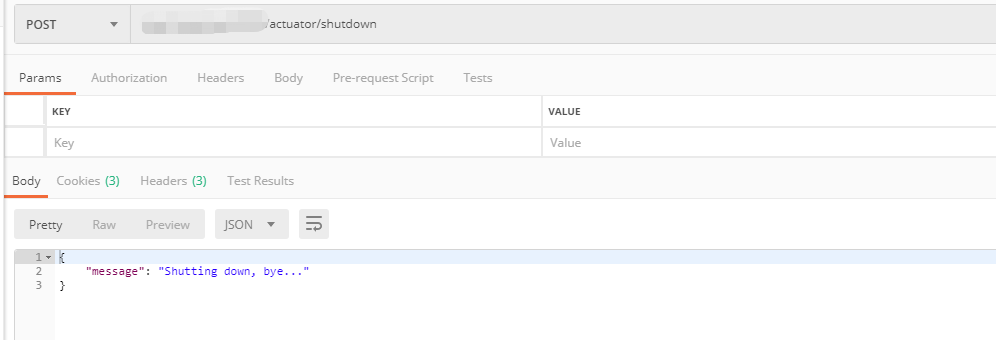
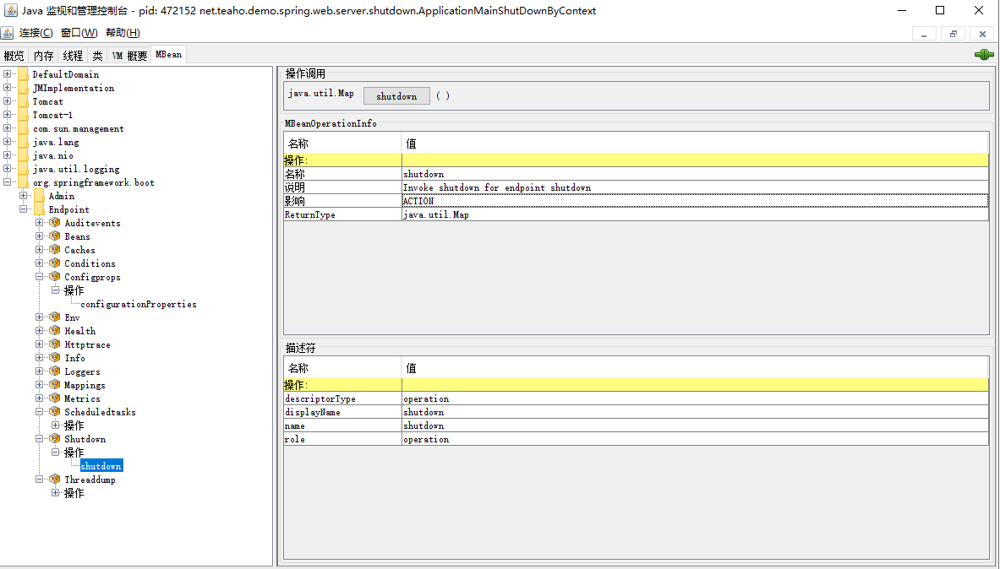
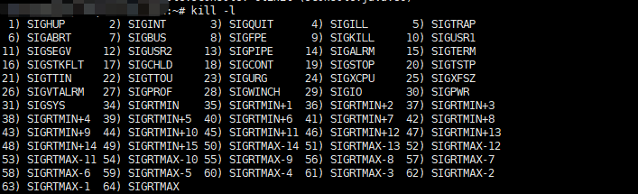

# Spring Boot应用关闭分析

## 前言

该篇介绍优雅关闭SpringBoot应用的方式，及一些分析。

## 应用关闭方式

### 使用spring容器的close方法关闭。

可通过在代码中获取SpringContext并调用close方法，去关闭容器。

### 使用SpringApplication的exit方法。

~~~ SpringApplication#exit

public static int exit(ApplicationContext context,
			ExitCodeGenerator... exitCodeGenerators) {
		Assert.notNull(context, "Context must not be null");
		int exitCode = 0;
		try {
			try {
                //获取ExitCodeGenerator的Bean并用ExitCodeGenerators管理
				ExitCodeGenerators generators = new ExitCodeGenerators();
				Collection<ExitCodeGenerator> beans = context
						.getBeansOfType(ExitCodeGenerator.class).values();
				generators.addAll(exitCodeGenerators);
				generators.addAll(beans);
				exitCode = generators.getExitCode();
				if (exitCode != 0) {
                    // 发布ExitCodeEvent事件
					context.publishEvent(new ExitCodeEvent(context, exitCode));
				}
			}
			finally {
				close(context);
			}
		}
		catch (Exception ex) {
			ex.printStackTrace();
			exitCode = (exitCode != 0) ? exitCode : 1;
		}
		return exitCode;
	}
~~~

上述代码，总的来说就是，获取ExitCodeGenerator的Bean并用ExitCodeGenerators管理，
注意getExitCode()的实现是取ExitCodeGenerator集合中最大的exitCode作为最终exitCode，

最后，关闭容器。

#### exitCode

SpringApplication#exit方法返回的exitCode还需要自行调用System#exit方法去指定。
该System#exit(int code)的参数，能被父进程获取并使用。一般按照惯例0为程序正常退出，非0位不正常退出。
我写了的运行demo：
~~~

@Slf4j
@SpringBootApplication
public class ApplicationMainShutDownBySpringApplication {

    public static void main(String[] args) {

        ConfigurableApplicationContext ctx = new SpringApplicationBuilder(ApplicationMainShutDownBySpringApplication.class).build().run(args);

        int exitCode = SpringApplication.exit(ctx);
        log.info("exitCode is {}!", exitCode);
        System.exit(exitCode);
    }

    @Bean
    public ExitCodeGenerator exitCodeGenerator() {
        return () -> 10;
    }
}
~~~

~~~ 
执行window bat:
java -jar spring-boot-mvc-shutdown-demo.jar & echo %ERRORLEVEL%

省略其他日志最终输出:
10

~~~

可以看最终输出是：10。

### 使用Actuator的shutdown http接口或JMX

可参考Actuator包的ShutdownEndpoint,实质上是调用spring容器的close方法关闭的。

http方式关闭：

JMX方式关闭：

### kill进程

一般的kill(kill -15)会触发应用在refreshContext时（并且SpringApplication实例的registerShutdownHook为true时）加上的注册到JVM的shutdownhook。

~~~ 注册shutdownhook代码
	public void registerShutdownHook() {
		if (this.shutdownHook == null) {
			// No shutdown hook registered yet.
			this.shutdownHook = new Thread() {
				@Override
				public void run() {
					synchronized (startupShutdownMonitor) {
						doClose();
					}
				}
			};
			Runtime.getRuntime().addShutdownHook(this.shutdownHook);
		}
	}
~~~

## spring容器close代码分析

这里对容器关闭进行一些分析，以注释的形式写在下面。
~~~

	/**
	 * Close this application context, destroying all beans in its bean factory.
	 * 
Delegates to {@code doClose()} for the actual closing procedure.
	 * Also removes a JVM shutdown hook, if registered, as it's not needed anymore.
	 * @see #doClose()
	 * @see #registerShutdownHook()
	 */
	@Override
	public void close() {
		synchronized (this.startupShutdownMonitor) {
            //委托给钩子方法doClose去做
			doClose();
			// If we registered a JVM shutdown hook, we don't need it anymore now:
			// We've already explicitly closed the context.
			if (this.shutdownHook != null) {
				try {
                    //去掉shutdown hook
					Runtime.getRuntime().removeShutdownHook(this.shutdownHook);
				}
				catch (IllegalStateException ex) {
					// ignore - VM is already shutting down
				}
			}
		}
	}

~~~

~~~
	protected void doClose() {
		// Check whether an actual close attempt is necessary...
		if (this.active.get() && this.closed.compareAndSet(false, true)) {
			if (logger.isDebugEnabled()) {
				logger.debug("Closing " + this);
			}

			LiveBeansView.unregisterApplicationContext(this);

			try {
				// Publish shutdown event.
                //发布事件，有需要，可写ApplicationListener对ContextClosedEvent事件进行监听，在容器关闭时执行自定义的操作
				publishEvent(new ContextClosedEvent(this));
			}
			catch (Throwable ex) {
				logger.warn("Exception thrown from ApplicationListener handling ContextClosedEvent", ex);
			}

			// Stop all Lifecycle beans, to avoid delays during individual destruction.
            //触发lifecycle bean的关闭周期
			if (this.lifecycleProcessor != null) {
				try {
					this.lifecycleProcessor.onClose();
				}
				catch (Throwable ex) {
					logger.warn("Exception thrown from LifecycleProcessor on context close", ex);
				}
			}

			// Destroy all cached singletons in the context's BeanFactory.
            // 期间会触发@PreDestroy、DisposableBean接口方法、@Bean的destroyMethod等等，具体执行顺序请参照BeanFactory接口的JavaDoc，里面定义了初始化和销毁期的方法执行顺序。
			destroyBeans();

			// Close the state of this context itself.
            //目前没做什么操作
			closeBeanFactory();

			// Let subclasses do some final clean-up if they wish...
            // 模板方法，比如，AnnotationConfigServletApplicationContext会触发tomcat服务器的关闭和释放
			onClose();

			// 重置listeners为初始状态，因为在容器启动过程中会对ApplicationListener做了一些更改
			if (this.earlyApplicationListeners != null) {
				this.applicationListeners.clear();
				this.applicationListeners.addAll(this.earlyApplicationListeners);
			}

			// 将容器的激活状态设为false
			this.active.set(false);
		}
~~~

## 示例

请参考https://github.com/teaho2015-blog/spring-source-code-learning-demo 的spring boot mvc shutdown模块，
我分别将上述关闭方式和拓展点（事件，LifeCycleProcessor等）写了demo。

## 容器关闭拓展点

上面的示例，容器关闭时的日志如下，
~~~ 日志输出
  INFO 241764 --- [           main] .w.s.s.ApplicationMainShutDownByActuator : Actuator shutdown result: {"message":"Shutting down, bye..."}
  INFO 241764 --- [      Thread-25] s.s.ApplicationContextCloseEventListener : event: org.springframework.context.event.ContextClosedEvent[source=org.springframework.boot.web.servlet.context.AnnotationConfigServletWebServerApplicationContext@2f48b3d2, started on Sat Jun 27 01:22:57 CST 2020], source: org.springframework.boot.web.servlet.context.AnnotationConfigServletWebServerApplicationContext@2f48b3d2, started on Sat Jun 27 01:22:57 CST 2020
  INFO 241764 --- [      Thread-25] n.t.d.s.w.s.s.spring.LoggingLifeCycle    : In Life cycle bean stop().
  INFO 241764 --- [      Thread-25] o.s.s.concurrent.ThreadPoolTaskExecutor  : Shutting down ExecutorService 'applicationTaskExecutor'
  INFO 241764 --- [      Thread-25] n.t.d.s.w.s.shutdown.bean.SimpleBean     : @PreDestroy!
  INFO 241764 --- [      Thread-25] n.t.d.s.w.s.shutdown.bean.SimpleBean     : DisposableBean is destroying!
  INFO 241764 --- [      Thread-25] n.t.d.s.w.s.shutdown.bean.SimpleBean     : On my way to destroy!
~~~

可看到的是一般可供使用的容器关闭时的拓展点不多，分别有这两个：
* 监听ContextClosedEvent事件，对应例子是demo中的ApplicationContextCloseEventListener类。
* LifeCycle/SmartLifeCycle的stop()方法，对应例子是demo中的LoggingLifeCycle类。

他们的触发时机在上面的close代码的分析中有注释。

## 拓展：kill与kill -9的区别

为什么说这个呢，作为开发一般我们知道kill的时候，Spring Boot程序可以执行应用退出相关的代码，而kill -9则不能。任意使用kill -9，有时会造成一些问题，
比如，一些执行中的数据不能就是保存等等。

上面已经说到了，kill可以触发java程序的shutdownhook，从而触发spring容器的优雅关闭。
这里，我不仅想讨论shutdownhook怎么注册，怎样触发，我把问题放大了一点：kill和kill -9在操作系统和JVM层面来看分别有什么不同，各自做了什么？

先看看命令的意思，以Ubuntu为例，执行kill -l，如下：

kill命令不带参数，默认是-15（SIGTERM），而kill -9是SIGKILL。

了解操作系统的话，会知道进程间能通过信号通信，SIGTERM、SIGKILL信号的含义是[维基百科|Signal][1]
>SIGTERM
> The SIGTERM signal is sent to a process to request its termination. Unlike the SIGKILL signal, it can be caught and interpreted or ignored by the process. This allows the process to perform nice termination releasing resources and saving state if appropriate. SIGINT is nearly identical to SIGTERM.
>SIGKILL
> The SIGKILL signal is sent to a process to cause it to terminate immediately (kill). In contrast to SIGTERM and SIGINT, this signal cannot be caught or ignored, and the receiving process cannot perform any clean-up upon receiving this signal. The following exceptions apply:
> Zombie processes cannot be killed since they are already dead and waiting for their parent processes to reap them.
> Processes that are in the blocked state will not die until they wake up again.
> The init process is special: It does not get signals that it does not want to handle, and thus it can ignore SIGKILL.[10] An exception from this rule is while init is ptraced on Linux.[11][12]
> An uninterruptibly sleeping process may not terminate (and free its resources) even when sent SIGKILL. This is one of the few cases in which a UNIX system may have to be rebooted to solve a temporary software problem.
> SIGKILL is used as a last resort when terminating processes in most system shutdown procedures if it does not voluntarily exit in response to SIGTERM. To speed the computer shutdown procedure, Mac OS X 10.6, aka Snow Leopard, will send SIGKILL to applications that have marked themselves "clean" resulting in faster shutdown times with, presumably, no ill effects.[13] The command killall -9 has a similar, while dangerous effect, when executed e.g. in Linux; it doesn't let programs save unsaved data. It has other options, and with none, uses the safer SIGTERM signal.

想了解信号的生命周期，如何写写信号处理器等等，详细描述可以看这本书：
[Rout Susant K.|Learning and Building Business and System Applications][2]

### 那么一个进程（包括Java进程）是怎么处理信号的呢？

* [当执行kill -9 PID时系统发生了什么](http://zyearn.github.io/blog/2015/03/22/what-happens-when-you-kill-a-process/)
* [魅族内核团队|Linux Signal](http://kernel.meizu.com/linux-signal.html)

第一篇文章从内核源码的跟踪，陈述了kill -9的操作系统执行机制。

信号是异步的，信号的接收不是由用户进程来完成的，而是由内核代理。
当一个进程P2向另一个进程P1发送信号后，内核接受到信号，并将其放在P1的信号队列当中。当P1再次陷入内核态时，会检查信号队列，并根据相应的信号调取相应的信号处理函数。

特别说下，一个点：  
在如下信号处理代码中可知，  
如果是强制信号（比如SIGKILL（kill -9）），不走挂载pending队列的流程，直接快速路径优先处理。
然后，在内核层面就给处理掉，不会发送到进程。
~~~ kernel/signal.c
static int __send_signal(int sig, struct siginfo *info, struct task_struct *t,
			int group, int from_ancestor_ns)
{
	struct sigpending *pending;
	struct sigqueue *q;
	int override_rlimit;
	int ret = 0, result;

	assert_spin_locked(&t->sighand->siglock);

	result = TRACE_SIGNAL_IGNORED;
	// (1)判断是否可以忽略信号
	if (!prepare_signal(sig, t,
			from_ancestor_ns || (info == SEND_SIG_FORCED)))
		goto ret;

	// (2)选择信号pending队列
	// 线程组共享队列(t->signal->shared_pending) or 进程私有队列(t->pending)
	pending = group ? &t->signal->shared_pending : &t->pending;
	/*
	 * Short-circuit ignored signals and support queuing
	 * exactly one non-rt signal, so that we can get more
	 * detailed information about the cause of the signal.
	 */
	result = TRACE_SIGNAL_ALREADY_PENDING;
	// (3)如果信号是常规信号(regular signal)，且已经在pending队列中，则忽略重复信号；
	// 另外一方面也说明了，如果是实时信号，尽管信号重复，但还是要加入pending队列；
	// 实时信号的多个信号都需要能被接收到。
	if (legacy_queue(pending, sig))
		goto ret;

	result = TRACE_SIGNAL_DELIVERED;
	/*
	 * fast-pathed signals for kernel-internal things like SIGSTOP
	 * or SIGKILL.
	 */
	// (4)如果是强制信号(SEND_SIG_FORCED)，不走挂载pending队列的流程，直接快速路径优先处理。
	if (info == SEND_SIG_FORCED)
		goto out_set;

	/*
	 * Real-time signals must be queued if sent by sigqueue, or
	 * some other real-time mechanism.  It is implementation
	 * defined whether kill() does so.  We attempt to do so, on
	 * the principle of least surprise, but since kill is not
	 * allowed to fail with EAGAIN when low on memory we just
	 * make sure at least one signal gets delivered and don't
	 * pass on the info struct.
	 */
	// (5)符合条件的特殊信号可以突破siganl pending队列的大小限制(rlimit)
	// 否则在队列满的情况下，丢弃信号
	// signal pending队列大小rlimit的值可以通过命令"ulimit -i"查看
	if (sig < SIGRTMIN)
		override_rlimit = (is_si_special(info) || info->si_code >= 0);
	else
		override_rlimit = 0;

	// (6)没有ignore的信号，加入到pending队列中。
	q = __sigqueue_alloc(sig, t, GFP_ATOMIC | __GFP_NOTRACK_FALSE_POSITIVE,
		override_rlimit);
	if (q) {
		list_add_tail(&q->list, &pending->list);
		switch ((unsigned long) info) {
		case (unsigned long) SEND_SIG_NOINFO:
			q->info.si_signo = sig;
			q->info.si_errno = 0;
			q->info.si_code = SI_USER;
			q->info.si_pid = task_tgid_nr_ns(current,
							task_active_pid_ns(t));
			q->info.si_uid = from_kuid_munged(current_user_ns(), current_uid());
			break;
		case (unsigned long) SEND_SIG_PRIV:
			q->info.si_signo = sig;
			q->info.si_errno = 0;
			q->info.si_code = SI_KERNEL;
			q->info.si_pid = 0;
			q->info.si_uid = 0;
			break;
		default:
			copy_siginfo(&q->info, info);
			if (from_ancestor_ns)
				q->info.si_pid = 0;
			break;
		}

		userns_fixup_signal_uid(&q->info, t);

	} else if (!is_si_special(info)) {
		if (sig >= SIGRTMIN && info->si_code != SI_USER) {
			/*
			 * Queue overflow, abort.  We may abort if the
			 * signal was rt and sent by user using something
			 * other than kill().
			 */
			result = TRACE_SIGNAL_OVERFLOW_FAIL;
			ret = -EAGAIN;
			goto ret;
		} else {
			/*
			 * This is a silent loss of information.  We still
			 * send the signal, but the *info bits are lost.
			 */
			result = TRACE_SIGNAL_LOSE_INFO;
		}
	}

out_set:
	signalfd_notify(t, sig);
	// (7)更新pending->signal信号集合中对应的bit
	sigaddset(&pending->signal, sig);
	// (8)选择合适的进程来响应信号，如果需要并唤醒对应的进程
	complete_signal(sig, t, group);
ret:
	trace_signal_generate(sig, info, t, group, result);
	return ret;
}
| →
static bool prepare_signal(int sig, struct task_struct *p, bool force)
{
	struct signal_struct *signal = p->signal;
	struct task_struct *t;
	sigset_t flush;

	if (signal->flags & (SIGNAL_GROUP_EXIT | SIGNAL_GROUP_COREDUMP)) {
		// (1.1)如果进程正在处于SIGNAL_GROUP_COREDUMP，则当前信号被忽略
		if (signal->flags & SIGNAL_GROUP_COREDUMP) {
			pr_debug("[%d:%s] is in the middle of doing coredump so skip sig %d\n", p->pid, p->comm, sig);
			return 0;
		}
		/*
		 * The process is in the middle of dying, nothing to do.
		 */
	} else if (sig_kernel_stop(sig)) {
		// (1.2)如果当前是stop信号，则移除线程组所有线程pending队列中的SIGCONT信号
		/*
		 * This is a stop signal.  Remove SIGCONT from all queues.
		 */
		siginitset(&flush, sigmask(SIGCONT));
		flush_sigqueue_mask(&flush, &signal->shared_pending);
		for_each_thread(p, t)
			flush_sigqueue_mask(&flush, &t->pending);
	} else if (sig == SIGCONT) {
		unsigned int why;
		// (1.3)如果当前是SIGCONT信号，则移除线程组所有线程pending队列中的stop信号，并唤醒stop进程
		/*
		 * Remove all stop signals from all queues, wake all threads.
		 */
		siginitset(&flush, SIG_KERNEL_STOP_MASK);
		flush_sigqueue_mask(&flush, &signal->shared_pending);
		for_each_thread(p, t) {
			flush_sigqueue_mask(&flush, &t->pending);
			task_clear_jobctl_pending(t, JOBCTL_STOP_PENDING);
			if (likely(!(t->ptrace & PT_SEIZED)))
				wake_up_state(t, __TASK_STOPPED);
			else
				ptrace_trap_notify(t);
		}

		/*
		 * Notify the parent with CLD_CONTINUED if we were stopped.
		 *
		 * If we were in the middle of a group stop, we pretend it
		 * was already finished, and then continued. Since SIGCHLD
		 * doesn't queue we report only CLD_STOPPED, as if the next
		 * CLD_CONTINUED was dropped.
		 */
		why = 0;
		if (signal->flags & SIGNAL_STOP_STOPPED)
			why |= SIGNAL_CLD_CONTINUED;
		else if (signal->group_stop_count)
			why |= SIGNAL_CLD_STOPPED;

		if (why) {
			/*
			 * The first thread which returns from do_signal_stop()
			 * will take ->siglock, notice SIGNAL_CLD_MASK, and
			 * notify its parent. See get_signal_to_deliver().
			 */
			signal->flags = why | SIGNAL_STOP_CONTINUED;
			signal->group_stop_count = 0;
			signal->group_exit_code = 0;
		}
	}

	// (1.4)进一步判断信号是否会被忽略
	return !sig_ignored(p, sig, force);
}
|| →
static int sig_ignored(struct task_struct *t, int sig, bool force)
{
	/*
	 * Blocked signals are never ignored, since the
	 * signal handler may change by the time it is
	 * unblocked.
	 */
	// (1.4.1)如果信号被blocked，不会被忽略
	if (sigismember(&t->blocked, sig) || sigismember(&t->real_blocked, sig))
		return 0;

	// (1.4.2)进一步判断信号的忽略条件
	if (!sig_task_ignored(t, sig, force))
		return 0;

	/*
	 * Tracers may want to know about even ignored signals.
	 */
	// (1.4.3)信号符合忽略条件，且没有被trace，则信号被忽略
	return !t->ptrace;
}
||| →
static int sig_task_ignored(struct task_struct *t, int sig, bool force)
{
	void __user *handler;

	// (1.4.2.1)提取信号的操作函数
	handler = sig_handler(t, sig);

	// (1.4.2.2)如果符合条件，信号被忽略
	if (unlikely(t->signal->flags & SIGNAL_UNKILLABLE) &&
			handler == SIG_DFL && !force)
		return 1;

	// (1.4.2.3)
	return sig_handler_ignored(handler, sig);
}
|||| →
static int sig_handler_ignored(void __user *handler, int sig)
{
	/* Is it explicitly or implicitly ignored? */
	// (1.4.2.3.1)如果信号操作函数是忽略SIG_IGN，或者操作函数是默认SIG_DFL但是默认动作是忽略
	// 默认动作是忽略的信号包括：
	// #define SIG_KERNEL_IGNORE_MASK (\
	//    rt_sigmask(SIGCONT)   |  rt_sigmask(SIGCHLD)   | \
	//    rt_sigmask(SIGWINCH)  |  rt_sigmask(SIGURG)    )
	// 忽略这一类信号
	return handler == SIG_IGN ||
		(handler == SIG_DFL && sig_kernel_ignore(sig));
}
| →
static void complete_signal(int sig, struct task_struct *p, int group)
{
	struct signal_struct *signal = p->signal;
	struct task_struct *t;

	/*
	 * Now find a thread we can wake up to take the signal off the queue.
	 *
	 * If the main thread wants the signal, it gets first crack.
	 * Probably the least surprising to the average bear.
	 */
	// (8.1)判断当前线程是否符合响应信号的条件
	if (wants_signal(sig, p))
		t = p;
	else if (!group || thread_group_empty(p))
		// (8.2)如果信号是发给单线程的，直接返回
		/*
		 * There is just one thread and it does not need to be woken.
		 * It will dequeue unblocked signals before it runs again.
		 */
		return;
	else {
		/*
		 * Otherwise try to find a suitable thread.
		 */
		// (8.3)在当前线程组中挑出一个符合响应信号条件的线程
		// 从signal->curr_target线程开始查找
		t = signal->curr_target;
		while (!wants_signal(sig, t)) {
			t = next_thread(t);
			if (t == signal->curr_target)
				/*
				 * No thread needs to be woken.
				 * Any eligible threads will see
				 * the signal in the queue soon.
				 */
				return;
		}
		signal->curr_target = t;
	}

	/*
	 * Found a killable thread.  If the signal will be fatal,
	 * then start taking the whole group down immediately.
	 */
	if (sig_fatal(p, sig) &&
	    !(signal->flags & (SIGNAL_UNKILLABLE | SIGNAL_GROUP_EXIT)) &&
	    !sigismember(&t->real_blocked, sig) &&
	    (sig == SIGKILL || !t->ptrace)) {
		/*
		 * This signal will be fatal to the whole group.
		 */
		if (!sig_kernel_coredump(sig)) {
			/*
			 * Start a group exit and wake everybody up.
			 * This way we don't have other threads
			 * running and doing things after a slower
			 * thread has the fatal signal pending.
			 */
			signal->flags = SIGNAL_GROUP_EXIT;
			signal->group_exit_code = sig;
			signal->group_stop_count = 0;
			t = p;
			do {
				task_clear_jobctl_pending(t, JOBCTL_PENDING_MASK);
				sigaddset(&t->pending.signal, SIGKILL);
				signal_wake_up(t, 1);
			} while_each_thread(p, t);
			return;
		}
	}

	/*
	 * The signal is already in the shared-pending queue.
	 * Tell the chosen thread to wake up and dequeue it.
	 */
	// (8.4)唤醒挑选出的响应信号的线程
	signal_wake_up(t, sig == SIGKILL);
	return;
}
|| →
static inline void ptrace_signal_wake_up(struct task_struct *t, bool resume)
{
	signal_wake_up_state(t, resume ? __TASK_TRACED : 0);
}
||| →
void signal_wake_up_state(struct task_struct *t, unsigned int state)
{
	// (8.4.1)设置thread_info->flags中的TIF_SIGPENDING标志
	// ret_to_user()时会根据此标志来调用do_notify_resume()
	set_tsk_thread_flag(t, TIF_SIGPENDING);
	/*
	 * TASK_WAKEKILL also means wake it up in the stopped/traced/killable
	 * case. We don't check t->state here because there is a race with it
	 * executing another processor and just now entering stopped state.
	 * By using wake_up_state, we ensure the process will wake up and
	 * handle its death signal.
	 */
	// (8.4.2)唤醒阻塞状态为TASK_INTERRUPTIBLE的信号响应线程
	if (!wake_up_state(t, state | TASK_INTERRUPTIBLE))
		kick_process(t);
}

~~~

### JDK处理信号的相关代码分析

由上一节可知，kill -9就不会到进程这里。kill -15（默认的kill）是JVM可是接收到的。这里说下JDK的支持。

JDK在linux里用到的信号及用途有这些：
[Signals Used in Oracle Solaris and Linux | Java Platform, Standard Edition Troubleshooting Guide](https://docs.oracle.com/javase/8/docs/technotes/guides/troubleshoot/signals006.html#sthref55)
其中，SIGTERM, SIGINT, SIGHUP支持了ShutdownHook。

JDK的挂载信号处理函数在这里。[openjdk8|jsig.c](http://hg.openjdk.java.net/jdk8u/jdk8u/hotspot/file/tip/src/os/bsd/vm/jsig.c)

#### JDK挂载Shutdownhook的代码分析

我们可以通过sun.misc.Signal类挂载信号处理器。
~~~
Signal.handle(new Signal("INT"), System.out::println);
~~~

其实，JDK就是通过挂载信号处理器去执行shutdownhook的。

留意，Terminator类针对SIGINT、SIGTERM挂载了两个信号处理器。
~~~ java.lang.Terminator
class Terminator {

    private static SignalHandler handler = null;

    /* Invocations of setup and teardown are already synchronized
     * on the shutdown lock, so no further synchronization is needed here
     */

    static void setup() {
        if (handler != null) return;
        SignalHandler sh = new SignalHandler() {
            public void handle(Signal sig) {
                Shutdown.exit(sig.getNumber() + 0200);
            }
        };
        handler = sh;

        // When -Xrs is specified the user is responsible for
        // ensuring that shutdown hooks are run by calling
        // System.exit()
        try {
            Signal.handle(new Signal("INT"), sh);
        } catch (IllegalArgumentException e) {
        }
        try {
            Signal.handle(new Signal("TERM"), sh);
        } catch (IllegalArgumentException e) {
        }
    }

    static void teardown() {
        /* The current sun.misc.Signal class does not support
         * the cancellation of handlers
         */
    }

}

~~~

在存在对应信号而触发执行时，实际执行Shutdown#exit()方法。
进一步跟踪，在sequence()的runHooks()会执行Runtime#addShutdownHook(Thread hook)添加进来的Shutdownhook。

btw，我们可以看到Shutdown有两个方法，一个是Shutdown#exit(int status), Shutdown#shutdown()。
当最后一条非Daemon线程已经执行完了，JVM会通过JNI调用Shutdown#shutdown()方法。

所以，触发shutdownhook执行有两个契机，
* 一是JAVA程序收到SIGINT、SIGTERM信号量。
* 或者当非Daemon线程都已经执行完了。

## 总结

本文挖掘了Spring Boot的关闭方式，并列举了关闭方式，从原理、源码的角度阐述了Spring Boot的关闭代码及扩展点。同时，额外说明了一些系统特性
和原理，比如，程序退出码和信号机制。

[1]: https://en.m.wikipedia.org/wiki/Signal_(IPC)
[2]: https://books.google.com/books?id=t0JsyboZjP0C&pg=PA236&lpg=PA236&dq=sigaddset(%26t-%3Epending.signal,+SIGKILL)&source=bl&ots=WdECa1xSGp&sig=ACfU3U2lxZGJHDp4gBoZBrdI-tke51T35g&hl=zh-CN&sa=X&ved=2ahUKEwj6jIjPzaLqAhXCaN4KHRBZCfkQ6AEwAHoECAoQAQ#v=onepage&q&f=false