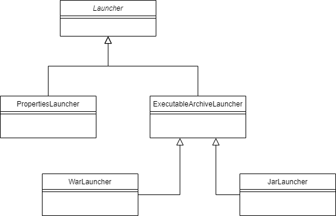

# Spring Boot Loader分析

## 引言

以往我们开发java应用常见的打包执行方式是，  
比如我开发过JavaFX桌面应用，会有一堆的jar包（lib）在目录底下，通过manifest文件去引导。  
比如在SpringBoot之前，我们一般开发tomcat web应用，会打一个war包到tomcat容器中，通过tomcat instance容器执行。  
而SpringBoot通过spring-boot-maven-plugin打成一个jar包，java -jar就能启动web应用。

还有，我们在build的时候用spring-boot-maven-plugin插件去build，究竟build出来的jar（Spring Boot文档称为Fat Jar）有什么特别呢？

## executable-jar组织分析

> Spring Boot also provides an optional Maven plugin to create executable jars.

Spring Boot文档的getting-start如上描述，Spring Boot提供可选的spring-boot-maven-plugin maven插件帮助我们创建可执行jar包。

当我们使用该插件，打包出来的jar包可直接通过java -jar启动。
我把这个可执行jar包进行解压（jar包的打包格式是zip），组织结构如下（以该demo为例[spring-boot-none-startup](https://github.com/teaho2015-blog/spring-source-code-learning-demo/tree/master/spring-boot-none-startup) ）：
~~~

$ tree -h
.
├── [   0]  BOOT-INF
│   ├── [   0]  classes
│   │   ├── [ 198]  application-dev.yml
                    ......
│   │   ├── [ 123]  application.yml
│   │   ├── [ 471]  logback.xml
│   │   └── [   0]  net
│   │       └── [   0]  teaho
│   │           └── [   0]  demo
│   │               └── [   0]  spring
│   │                   └── [   0]  boot
│   │                       └── [   0]  startup
│   │                           └── [   0]  none
│   │                               ├── [1.0K]  ApplicationMain.class
                                    ......
│   └── [   0]  lib
│       ├── [ 26K]  javax.annotation-api-1.3.2.jar
         ......
│       └── [ 23K]  spring-jcl-5.1.5.RELEASE.jar
├── [   0]  META-INF
│   ├── [ 634]  MANIFEST.MF
│   ├── [   0]  maven
│   │   └── [   0]  net.teaho.demo
│   │       └── [   0]  spring-boot-startup-none-demo
│   │           ├── [ 122]  pom.properties
│   │           └── [1.2K]  pom.xml
│   └── [1.0K]  spring.factories
└── [   0]  org
    └── [   0]  springframework
        └── [   0]  boot
            └── [   0]  loader
                ├── [3.5K]  ExecutableArchiveLauncher.class
                ├── [1.5K]  JarLauncher.class
                ├── [5.6K]  LaunchedURLClassLoader.class
                ├── [4.6K]  Launcher.class
                ├── [1.5K]  MainMethodRunner.class
                ├── [ 19K]  PropertiesLauncher.class
                ├── [1.7K]  WarLauncher.class
                ......

30 directories, 96 files
~~~

结合Java官方文档的Jar文件规范[Oracle|Java SE 8 doc|JAR File Specification](https://docs.oracle.com/javase/8/docs/technotes/guides/jar/jar.html)
说说上面文件或目录功能：
* BOOT-INF顾名思义，是放Spring Boot的应用文件的。
  BOOT-INF目录的lib：是存放第三方类库。
* META-INF目录：Java会识别并解释了META-INF目录中的文件/目录，用以配置应用程序、拓展、类加载器、服务。
* Spring Boot loader的代码。

我们来看MANIFEST.MF文件的内容：
~~~
Manifest-Version: 1.0
Implementation-Title: Spring Boot(none web应用)启动demo
Implementation-Version: 1.0.0-SNAPSHOT
Built-By: teash
Implementation-Vendor-Id: net.teaho.demo
Spring-Boot-Version: 2.1.3.RELEASE
Main-Class: org.springframework.boot.loader.JarLauncher
Start-Class: net.teaho.demo.spring.boot.startup.none.ApplicationMain
Spring-Boot-Classes: BOOT-INF/classes/
Spring-Boot-Lib: BOOT-INF/lib/
Created-By: Apache Maven 3.6.3
Build-Jdk: 1.8.0_251
Implementation-URL: https://projects.spring.io/spring-boot/#/spring-bo
 ot-starter-parent/spring-source-code-learning-parent/spring-boot-star
 tup-none-demo
~~~
Main-Class是`org.springframework.boot.loader.JarLauncher`，
也就是java -jar的启动类，启动jar包会执行该类(JarLauncher)的main方法，JarLauncher执行过程中会调用到`Start-Class: net.teaho.demo.spring.boot.startup.none.ApplicationMain`。

截取JarLauncher代码：
~~~
public class JarLauncher extends ExecutableArchiveLauncher {
    
    //省略其他代码

    public static void main(String[] args) throws Exception {
        (new JarLauncher()).launch(args);
    }
}

~~~

JarLauncher类包括Spring Boot loader究竟起到什么作用？

## Spring Boot loader分析

上面我提出了疑问。那么先抛开接下来的Spring-Boot-loader模块的源码分析，我们试图从外围高处看看Spring Boot loader的作用。

在使用Spring Boot部署启动和往常我们启动一般java应用有什么区别？
在引言中，我说到传统方法的java打应用jar包会出现一堆jar包，发布的时候也要发布一堆jar包。而Spring Boot就一个大jar包。
前者我认为是易于拓展的，我们能便利的替换目录中某些jar达到更新，不过缺点是，更多时候我们不知道哪个jar的代码对应的是版本管理上的哪个版本。

整体来说，没有哪种是更好的说法，具体场景具体应用。
就我了解，某些公司的基础架构部反而是采用前者，因为采用前者的jar包组织方式，
能够轻松更新基础组件的包（对业务团队透明），而不是推动所有业务部进行重新打包和重启。

### Spring Boot loader的一些概念

抽象类Laucher：一个抽象类用于启动应用程序，跟Archive配合使用；目前有3种实现，分别是JarLauncher、WarLauncher以及PropertiesLauncher。

Archive：归档文件的基础抽象类。JarFileArchive就是jar包文件支持的归档实现。它提供了一些方法比如getUrl会返回这个Archive对应的URL；getManifest方法会获得Manifest数据等。

JarFile：jar文件的抽象，每个JarFileArchive都会对应一个JarFile。JarFile被构造的时候会解析内部结构，去获取jar包里的各个文件或文件夹，这些文件或文件夹会被封装到Entry中。

比如一个JarFileArchive对应的URL为：
~~~

jar:file:/D:/.m2/repository/net/teaho/demo/spring-boot-startup-none-demo/1.0.0-SNAPSHOT/spring-boot-startup-none-demo-1.0.0-SNAPSHOT.jar!/BOOT-INF/lib/spring-boot-2.1.3.RELEASE.jar!/

~~~
JarFileArchive还能解析内部的jarFarArchive(比如fat jar内部的jar)。

jar：是Spring Boot Loader拓展出来的URL协议。

### 执行分析

入口代码，实例化JarLauncher并调用`.launch(args)`。
~~~

public class JarLauncher extends ExecutableArchiveLauncher {
    
    //省略其他代码

    public static void main(String[] args) throws Exception {
        (new JarLauncher()).launch(args);
    }
}
~~~

JarLauncher实例化时会调用父类ExecutableArchiveLauncher的构造方法，
最终调用父类Launcher的`createArchive()`该方法先找到启动类的所在位置，判断是目录创建ExplodedArchive，是文件则创建JarFileArchive。

接着看launch方法和一些核心方法分析.
~~~
    //Launcher.launch
    protected void launch(String[] args) throws Exception {
        //在系统属性中设置自定义URL协议处理器所在包，增加处理器所在包org.springframework.boot.loader，处理器（Handler）类的命名模式为 [包路径].[协议].Handler。
        JarFile.registerUrlProtocolHandler();
        //根据getClassPathArchives得到的JarFileArchive集合去创建类加载器ClassLoader。这里会构造一个LaunchedURLClassLoader类加载器，这个类加载器继承URLClassLoader，并使用这些JarFileArchive集合的URL构造成URLClassPath
        ClassLoader classLoader = this.createClassLoader(this.getClassPathArchives());
        //getMainClass方法会去项目自身的Archive中的Manifest中找出key为Start-Class的类，调用重载方法launch
        this.launch(args, this.getMainClass(), classLoader);
    }

    //Launcher.launch
    protected void launch(String[] args, String mainClass, ClassLoader classLoader) throws Exception {
        //将classLoader设置到当前线程，子线程隐性使用父线程classLoader
        Thread.currentThread().setContextClassLoader(classLoader);
        //用classloader加载Start-Class，并用反射调用其main方法，开始启动
        createMainMethodRunner(mainClass, args, classLoader).run();
    }
    
    //ExecutableArchiveLauncher.getClassPathArchives
    protected List<Archive> getClassPathArchives() throws Exception {
        // 找到内部的归档文件集，BOOT_INF_CLASSES目录和以BOOT_INF_LIB为前缀的文件
        List<Archive> archives = new ArrayList(this.archive.getNestedArchives(this::isNestedArchive));
        //暂无实现
        this.postProcessClassPathArchives(archives);
        return archives;
    }

~~~

最后执行MainMethodRunner的run方法，
MainMethodRunner是Launcher用来调用main方法的工具类，使用线程上下文类加载器加入带有main方法的启动类（即Start-Class）。

~~~

public class MainMethodRunner {
    //省略

    public void run() throws Exception {
        //获取线程上下文类加载器
        Class<?> mainClass = Thread.currentThread().getContextClassLoader().loadClass(this.mainClassName);
        //找到main方法并反射调用
        Method mainMethod = mainClass.getDeclaredMethod("main", String[].class);
        mainMethod.invoke((Object)null, this.args);
    }
}
~~~

流程分析了，值得注意在上面的createClassLoader方法会创建一个LaunchedURLClassLoader.

### Spring Boot Loader自定义的classloader--LaunchedURLClassLoader

LaunchedURLClassLoader是Spring Boot Loader自定义的classloader，用于应用类加载。LaunchedURLClassLoader拓展URLClassLoader，通过URL加载类。

这里分析LaunchedURLClassLoader重写的加载类方法：
~~~

public class LaunchedURLClassLoader extends URLClassLoader {
    
    //省略

	/**
	 * Create a new {@link LaunchedURLClassLoader} instance.
	 * @param urls the URLs from which to load classes and resources
	 * @param parent the parent class loader for delegation
	 */
	public LaunchedURLClassLoader(URL[] urls, ClassLoader parent) {
		super(urls, parent);
	}

    //省略

	@Override
	protected Class<?> loadClass(String name, boolean resolve) throws ClassNotFoundException {
		//当一个url不能连接时通用静态异常是否能被抛出。在类加载期间使用此优化选项来保存创建的大量异常，然后将其吞噬。
        Handler.setUseFastConnectionExceptions(true);
		try {
			try {
                //在进行findClass调用之前定义一个包。
                //这是必要的，以确保对嵌套的JAR相应manifest与包相关联。
				definePackageIfNecessary(name);
			}
			catch (IllegalArgumentException ex) {
				// Tolerate race condition due to being parallel capable
				if (getPackage(name) == null) {
					// This should never happen as the IllegalArgumentException indicates
					// that the package has already been defined and, therefore,
					// getPackage(name) should not return null.
					throw new AssertionError(
							"Package " + name + " has already been " + "defined but it could not be found");
				}
			}
			return super.loadClass(name, resolve);
		}
		finally {
			Handler.setUseFastConnectionExceptions(false);
		}
	}

    //省略

}

~~~

### 加载文件

我们启动可执行的jar包（Spring Boot应用）时，会发现不用解压缩jar就加载了目标类。原理是什么呢？
（举个不一样的例子，以往打war包发布到tomcat中，我们会发现tomcat会explode解压war包再执行）

用于支持加载嵌套jar的核心类是org.springframework.boot.loader.jar.JarFile它使你可以从标准jar文件或嵌套的子jar中加载jar内容。
首次加载时，每个JarEntry的位置都映射到外部jar的物理文件偏移量，我们可以通过查找外部jar的适当部分来加载特定的嵌套条目。
~~~
myapp.jar
+-------------------+-------------------------+
| /BOOT-INF/classes | /BOOT-INF/lib/mylib.jar |
|+-----------------+||+-----------+----------+|
||     A.class      |||  B.class  |  C.class ||
|+-----------------+||+-----------+----------+|
+-------------------+-------------------------+
 ^                    ^           ^
 0063                 3452        3980
~~~

## 总结

Spring Boot通过Spring Boot Loader和spring-boot-maven-plugin插件打包成可执行的Fat Jar。
其定义了一套规则，
上面说到的Fat Jar的目录结构，将应用的代码和配置和第三方库放到同一个jar包中，并通过Spring Boot Loader加载。
Loader通过自定义的URLClassLoader和URL处理器`org.springframework.boot.loader.jar.Handler`去加载类。

## Reference

[1][Spring Boot doc|The Executable Jar Format](https://docs.spring.io/spring-boot/docs/2.1.14.RELEASE/reference/htmlsingle/#executable-jar-jarfile)  
[2][esingchan|ZIP压缩算法详细分析及解压实例解释](https://www.cnblogs.com/esingchan/p/3958962.html)

