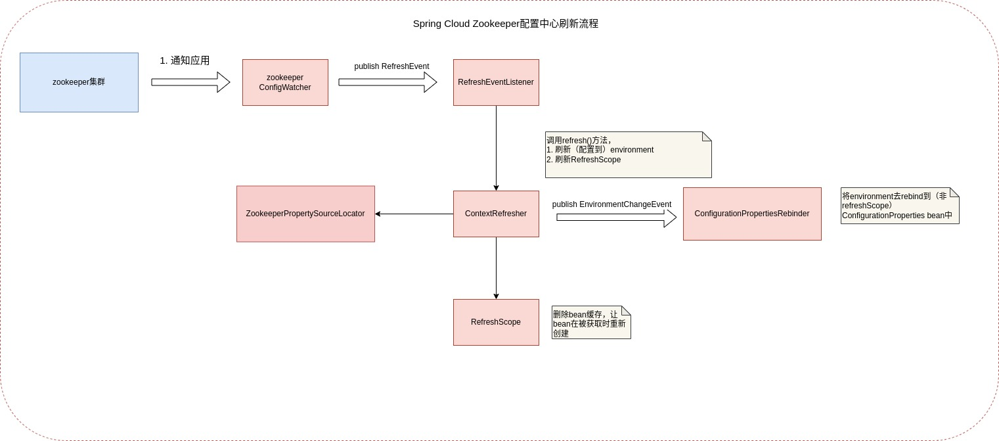

# Spring Cloud远程配置中心--Spring Cloud Context、Spring Cloud Zookeeper Config的实现分析

## 简介

Spring Cloud Context是Spring Cloud应用上下文的实现。

谈到Spring Cloud应用如何加载和刷新远程配置，就绕不开分析Spring Cloud Context（上下文）的启动和刷新，
而分析Spring Cloud Context的源码，又会有大量的篇幅是分析源码中大量加载配置，处理environment的部分。
所以我将Spring Cloud应用上下文的启动合并到这里分析。

Spring Cloud Context的一些组件，在这里先简单说说他们的作用：
* BootstrapApplicationListener
* PropertySourceBootstrapConfiguration
* PropertySourceLocator
* RefreshEventListener
* ContextRefresher
* RefreshEvent
* RefreshScope
* @RefreshScope

## Spring Cloud Context启动

Spring Cloud Context初始化是跟随Spring Boot启动，首先会初始化类`BootstrapApplicationListener`。
`BootstrapApplicationListener`的执行时机是，应用初始化时接受到EnvironmentParented事件后。
~~~

	@Override
	public void onApplicationEvent(ApplicationEnvironmentPreparedEvent event) {
	    //获取environment，注意此时application.yml尚未加载，BootstrapApplicationListener的order高于ConfigFileApplicationListener。
		ConfigurableEnvironment environment = event.getEnvironment();
		if (!environment.getProperty("spring.cloud.bootstrap.enabled", Boolean.class,
				true)) {
			return;
		}
		// 已经加载了bootstrap配置的话，则跳过
		if (environment.getPropertySources().contains(BOOTSTRAP_PROPERTY_SOURCE_NAME)) {
			return;
		}
		ConfigurableApplicationContext context = null;
		//配置文件名默认bootstrap(.yml/.properties)
		String configName = environment
				.resolvePlaceholders("${spring.cloud.bootstrap.name:bootstrap}");
        //查找当前应用是否已通过ParentContextApplicationContextInitializer去存储了parent。
		for (ApplicationContextInitializer<?> initializer : event.getSpringApplication()
				.getInitializers()) {
			if (initializer instanceof ParentContextApplicationContextInitializer) {
				context = findBootstrapContext(
						(ParentContextApplicationContextInitializer) initializer,
						configName);
			}
		}
		
		if (context == null) {
		//1. 设置相关cloud配置属性, 比如spring.config.name=bootstrap
		//2. 启动一个WebApplicationType=NONE的SpringApplication应用，用于加载bootstrap(.yml/.properties)
		//3. 加载BootstrapConfiguration配置类
		//4. 将加载的应用上下文作为父上下文
			context = bootstrapServiceContext(environment, event.getSpringApplication(),
					configName);
            //加上CloseContextOnFailureApplicationListener，通过监听器在Context关闭时，关闭父context
			event.getSpringApplication().addListeners(new CloseContextOnFailureApplicationListener(context));
		}
        // 将cloud context的ApplicationContextInitializer加到子应用中
        // 添加配置解密初始化器
		apply(context, event.getSpringApplication(), environment);
	}
 
~~~

### 加载远程配置的加载器--PropertySourceLocator和PropertySourceBootstrapConfiguration

PropertySourceLocator是Spring Cloud Context加载或拉取配置的一个配置加载器。
在应用启动和刷新时，PropertySourceBootstrapConfiguration通过调用`PropertySourceLocator`去加载配置到environment。  
下面，我们来看看重点方法的分析：
~~~
	@Override
	public void initialize(ConfigurableApplicationContext applicationContext) {
	    //创建Spring Cloud的CompositePropertySource
		CompositePropertySource composite = new CompositePropertySource(
				BOOTSTRAP_PROPERTY_SOURCE_NAME);
		AnnotationAwareOrderComparator.sort(this.propertySourceLocators);
		boolean empty = true;
		ConfigurableEnvironment environment = applicationContext.getEnvironment();
		//遍历PropertySourceLocator，并找出PropertySource
		for (PropertySourceLocator locator : this.propertySourceLocators) {
			PropertySource<?> source = null;
			source = locator.locate(environment);
			if (source == null) {
				continue;
			}
			logger.info("Located property source: " + source);
			composite.addPropertySource(source);
			empty = false;
		}
		//如果PropertySourceLocator成功加载了相关配置
		//1. 删除原bootstrap配置
		//2. 更新LoggingSystem，更改logLevel
		//3. 对active的profile做更新
		if (!empty) {
			MutablePropertySources propertySources = environment.getPropertySources();
			String logConfig = environment.resolvePlaceholders("${logging.config:}");
			LogFile logFile = LogFile.get(environment);
			if (propertySources.contains(BOOTSTRAP_PROPERTY_SOURCE_NAME)) {
				propertySources.remove(BOOTSTRAP_PROPERTY_SOURCE_NAME);
			}
			insertPropertySources(propertySources, composite);
			reinitializeLoggingSystem(environment, logConfig, logFile);
			setLogLevels(applicationContext, environment);
			handleIncludedProfiles(environment);
		}
	}

~~~

## 总结

以上，笔者分析了Spring Cloud Context的启动过程。刷新配置的过程是通过ContextRefresher然后进行类似的应用上下文刷新去做的，
不在上面描述了。

下面通过启动流程图和刷新流程图来做一个总结。

###

### 配置刷新流程--以Spring Cloud Zookeeper Config为例

## Reference

[1][源码分析一下spring的scoped-proxy（一）](https://juejin.cn/post/6869402006017507335)