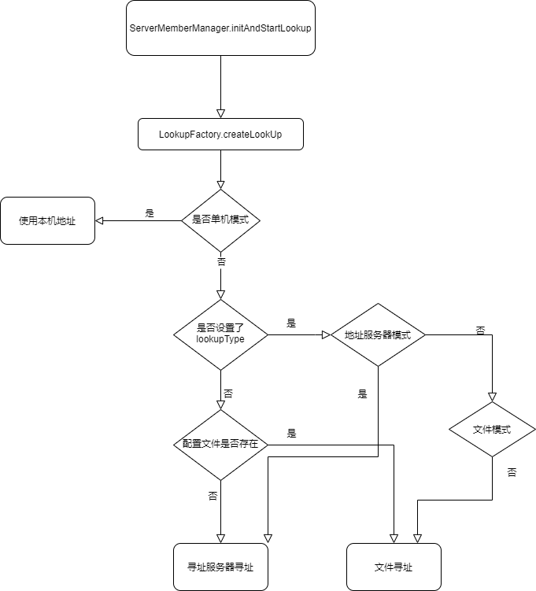
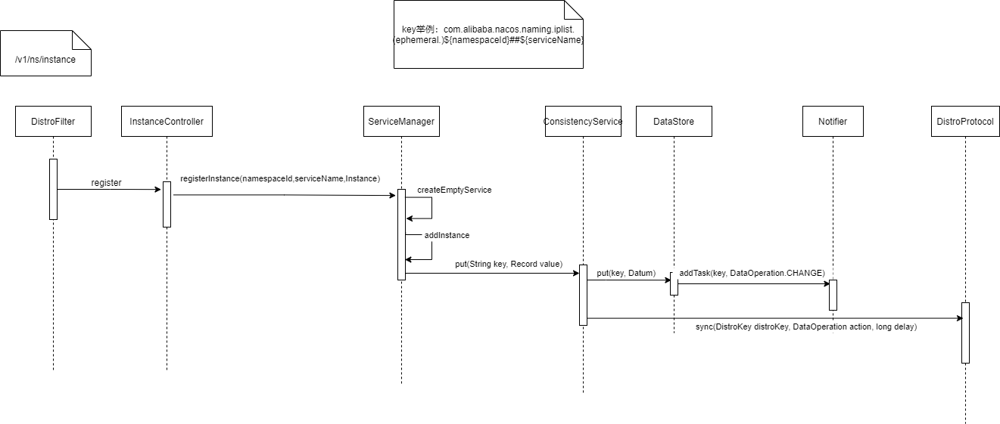
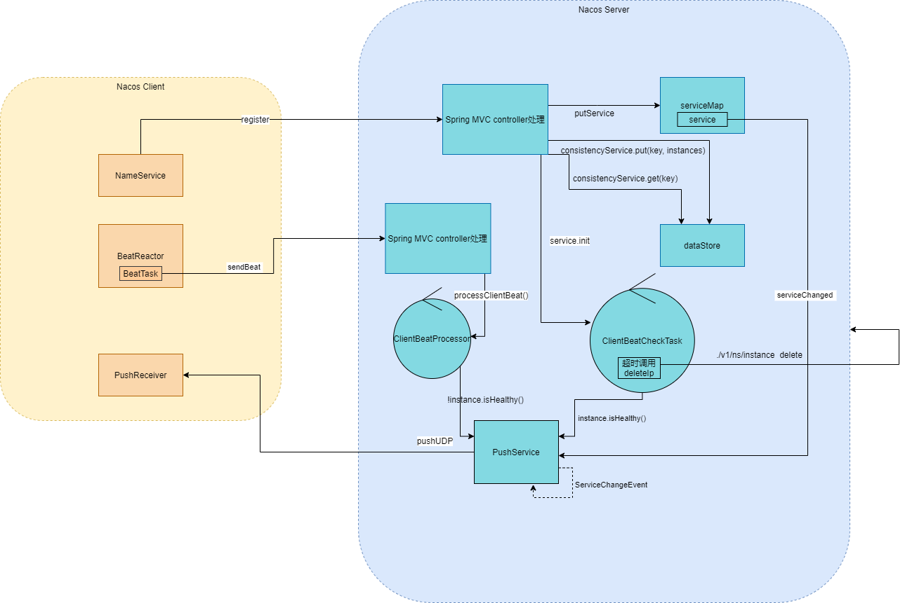
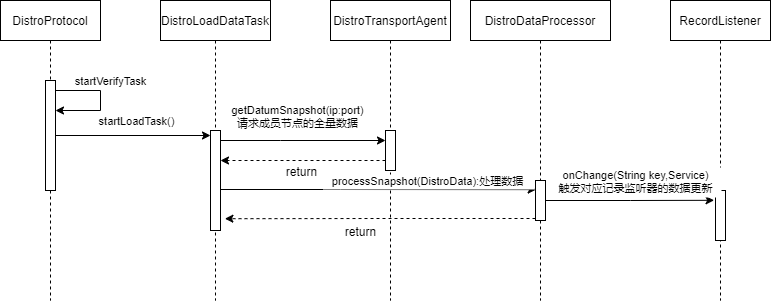
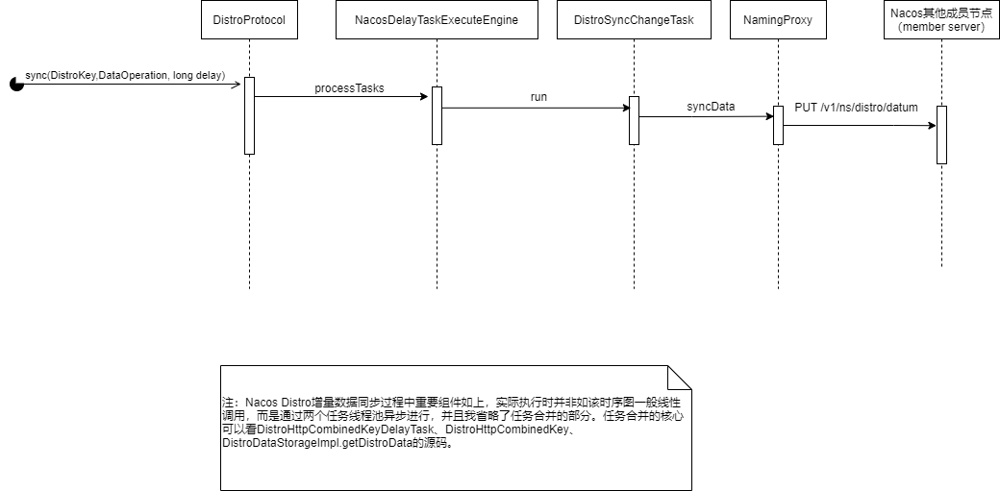

# Nacos分析

nacos全称Dynamic Naming and Configuration Service。
看Nacos的项目源码可知，其核心模块nacos-naming等是基于Spring Boot上编写的。
本节关注Nacos整合Spring Cloud的注册发现。
我们使用Nacos会导入nacos-discovery包，我们来看看它是如何实现上一节[Spring Cloud Commons discovery和registry模块组件](./spring-cloud-serivce-registry-and-discovery.md#Spring Cloud Commons discovery和registry模块组件)
分析的Spring Cloud Commons服务注册发现组件。

我们分三部分分析：
* nacos-discovery的自动装配(`NacosDiscoveryClientAutoConfiguration`、`NacosDiscoveryEndpointAutoConfiguration`、`NacosDiscoveryAutoConfiguration`)引入了什么组件
* Nacos服务注册流程
* Nacos集群一致性算法

<!--
nacos应用启动。

nacos集群同步算法。

NacosDiscoveryClientAutoConfiguration
NacosDiscoveryProperties

NacosDiscoveryEndpointAutoConfiguration

NacosDiscoveryAutoConfiguration

NamingProxy
-->

## nacos-discovery的自动装配组件

## Nacos Naming server启动

首先说说Nacos各模块。
* address：地址服务
* api:主要是把naming和config的api进行了抽取,具体是现在config和naming项目中
* client：Nacos客户端的代码
* cmdb:服务的同地域优先访问,要求第三方CMDB插件必须实现的接口
* common:工具类模块
* core：核心模块，代码简单，建设中
* config：配置服务项目
* console：控制台项目
* distribution：部署打包的配置项目
* doc：nacos一些图片
* example:配置示例，注册示例
* logs：日志
* naming：名称服务
* style：代码规范
* test：测试项目
* work：空

正如我在介绍中说到Nacos Server是一个基于Spring Boot之上的应用。
在分析Nacos的distribution打包后，我们可知naming、core为我关注重点。
所以，分析Nacos命名服务器（Nacos Naming server）的启动，可分为三点：
* Nacos对Spring Boot的生命周期拓展
* Spring ioc factory的拓展点（各种PostProcessor等）
* Nocos定义的@Component、@Service组件的初始化（@PostConstruct、InitializingBean等）。
  btw, Nacos Server的启动使用`@SpringBootApplication(scanBasePackages = "com.alibaba.nacos")`做扫描，我个人认为是一个美中不足的用法。

那么，我会说说Nacos对Spring Boot的生命周期拓展，其他部分具体Component具体分析即可。

Nacos core在`com.alibaba.nacos.core.code.SpringApplicationRunListener`类做了些初始化工作。
我们来看其实际调用的`StartingApplicationListener`类。

~~~
public class StartingApplicationListener implements NacosApplicationListener {
    //省略    

    //设置为true供打印启动日志，在started后设置为false
    @Override
    public void starting() {
        starting = true;
    }
    
    @Override
    public void environmentPrepared(ConfigurableEnvironment environment) {
        //确保Nacos home的"logs", "conf", "data"目录存在
        makeWorkDir();
        //将environment设置到EnvUtil的static属性中
        injectEnvironment(environment);
        //加载Nacos指定的配置文件并用FileWatcher监听变更
        loadPreProperties(environment);
        //初始化系统变量
        initSystemProperty();
    }
    
    @Override
    public void contextPrepared(ConfigurableApplicationContext context) {
        // 打印cluster.conf
        logClusterConf();
        //启动打印Nacos is starting...的任务
        logStarting();
    }
    
    @Override
    public void contextLoaded(ConfigurableApplicationContext context) {
    
    }
    
    @Override
    public void started(ConfigurableApplicationContext context) {
        starting = false;
        //停止打印线程
        closeExecutor();
        //判定存储模式
        judgeStorageMode(context.getEnvironment());
    }
    
    @Override
    public void running(ConfigurableApplicationContext context) {
    }
    
    @Override
    public void failed(ConfigurableApplicationContext context, Throwable exception) {
        starting = false;
        //确保Nacos home的"logs", "conf", "data"目录存在
        makeWorkDir();
        
        LOGGER.error("Startup errors : {}", exception);
        //关闭线程池
        ThreadPoolManager.shutdown();
        //关闭监听文件的任务
        WatchFileCenter.shutdown();
        //关闭EventPublisher
        NotifyCenter.shutdown();
        
        //停止打印线程
        closeExecutor();
        //关闭上下文
        context.close();
        
        LOGGER.error("Nacos failed to start, please see {} for more details.",
                Paths.get(EnvUtil.getNacosHome(), "logs/nacos.log"));
    }
    
    private void injectEnvironment(ConfigurableEnvironment environment) {
        EnvUtil.setEnvironment(environment);
    }
    
    private void loadPreProperties(ConfigurableEnvironment environment) {
        try {
            SOURCES.putAll(EnvUtil.loadProperties(EnvUtil.getApplicationConfFileResource()));
            environment.getPropertySources()
                    .addLast(new OriginTrackedMapPropertySource(NACOS_APPLICATION_CONF, SOURCES));
            registerWatcher();
        } catch (Exception e) {
            throw new NacosRuntimeException(NacosException.SERVER_ERROR, e);
        }
    }
    
    private void registerWatcher() throws NacosException {
        
        WatchFileCenter.registerWatcher(EnvUtil.getConfPath(), new FileWatcher() {
            @Override
            public void onChange(FileChangeEvent event) {
                try {
                    Map<String, ?> tmp = EnvUtil.loadProperties(EnvUtil.getApplicationConfFileResource());
                    SOURCES.putAll(tmp);
                } catch (IOException ignore) {
                    LOGGER.warn("Failed to monitor file {}", ignore);
                }
            }
            
            @Override
            public boolean interest(String context) {
                return StringUtils.contains(context, "application.properties");
            }
        });
        
    }
    
    private void initSystemProperty() {
        if (EnvUtil.getStandaloneMode()) {
            System.setProperty(MODE_PROPERTY_KEY_STAND_MODE, "stand alone");
        } else {
            System.setProperty(MODE_PROPERTY_KEY_STAND_MODE, "cluster");
        }
        if (EnvUtil.getFunctionMode() == null) {
            System.setProperty(MODE_PROPERTY_KEY_FUNCTION_MODE, "All");
        } else if (EnvUtil.FUNCTION_MODE_CONFIG.equals(EnvUtil.getFunctionMode())) {
            System.setProperty(MODE_PROPERTY_KEY_FUNCTION_MODE, EnvUtil.FUNCTION_MODE_CONFIG);
        } else if (EnvUtil.FUNCTION_MODE_NAMING.equals(EnvUtil.getFunctionMode())) {
            System.setProperty(MODE_PROPERTY_KEY_FUNCTION_MODE, EnvUtil.FUNCTION_MODE_NAMING);
        }
        
        System.setProperty(LOCAL_IP_PROPERTY_KEY, InetUtils.getSelfIP());
    }
    
    private void logClusterConf() {
        if (!EnvUtil.getStandaloneMode()) {
            try {
                List<String> clusterConf = EnvUtil.readClusterConf();
                LOGGER.info("The server IP list of Nacos is {}", clusterConf);
            } catch (IOException e) {
                LOGGER.error("read cluster conf fail", e);
            }
        }
    }
    
    private void closeExecutor() {
        if (scheduledExecutorService != null) {
            scheduledExecutorService.shutdownNow();
        }
    }
    
    private void makeWorkDir() {
        String[] dirNames = new String[] {"logs", "conf", "data"};
        for (String dirName : dirNames) {
            LOGGER.info("Nacos Log files: {}", Paths.get(EnvUtil.getNacosHome(), dirName).toString());
            try {
                DiskUtils.forceMkdir(new File(Paths.get(EnvUtil.getNacosHome(), dirName).toUri()));
            } catch (Exception e) {
                throw new RuntimeException(e);
            }
        }
    }
    
    private void logStarting() {
        if (!EnvUtil.getStandaloneMode()) {
            
            scheduledExecutorService = ExecutorFactory
                    .newSingleScheduledExecutorService(new NameThreadFactory("com.alibaba.nacos.core.nacos-starting"));
            
            scheduledExecutorService.scheduleWithFixedDelay(() -> {
                if (starting) {
                    LOGGER.info("Nacos is starting...");
                }
            }, 1, 1, TimeUnit.SECONDS);
        }
    }
    
    private void judgeStorageMode(ConfigurableEnvironment env) {
        
        // External data sources are used by default in cluster mode
        boolean useExternalStorage = ("mysql".equalsIgnoreCase(env.getProperty("spring.datasource.platform", "")));
        
        // must initialize after setUseExternalDB
        // This value is true in stand-alone mode and false in cluster mode
        // If this value is set to true in cluster mode, nacos's distributed storage engine is turned on
        // default value is depend on ${nacos.standalone}
        
        if (!useExternalStorage) {
            boolean embeddedStorage = EnvUtil.getStandaloneMode() || Boolean.getBoolean("embeddedStorage");
            // If the embedded data source storage is not turned on, it is automatically
            // upgraded to the external data source storage, as before
            if (!embeddedStorage) {
                useExternalStorage = true;
            }
        }
        
        LOGGER.info("Nacos started successfully in {} mode. use {} storage",
                System.getProperty(MODE_PROPERTY_KEY_STAND_MODE), useExternalStorage ? "external" : "embedded");
    }
}

~~~

接着我们来谈谈com.alibaba.nacos.naming.web.NamingConfig定义的组件。
* DistroFilter 用于转发Distro协议下非本节点负责的请求。
* TrafficReviseFilter 用于根据请求url做请求限制及根据节点的健康状态做请求处理（如果当前服务器节点不是健康状态则根据请求是否请求成员节点、请求是否是读请求等做请求降级）。

<!--
com.alibaba.nacos.core.code.SpringApplicationRunListener

com.alibaba.nacos.core.code.StandaloneProfileApplicationListener

com.alibaba.nacos.naming.core.SubscribeManager

@Deprecated com.alibaba.nacos.naming.consistency.persistent.raft.RaftConsistencyServiceImpl

com.alibaba.nacos.naming.consistency.DelegateConsistencyServiceImpl

com.alibaba.nacos.naming.cluster.ServerStatusManager

com.alibaba.nacos.naming.consistency.persistent.PersistentConsistencyService和PersistentConsistencyServiceDelegateImpl

ConsistencyService和DelegateConsistencyServiceImpl

com.alibaba.nacos.naming.healthcheck.HealthCheckProcessorDelegate

getPushService().serviceChanged(service)
-->

#### 节点寻址

作为分布式系统中的Nacos集群，Nacos集群节点本身是如何相互发现的呢。

`ServerMemberManager`类是Nacos中管理Nacos集群节点的组件。
在该类初始化时会调用initAndStartLookup方法。

~~~

    private void initAndStartLookup() throws NacosException {
        //创建寻址组件
        this.lookup = LookupFactory.createLookUp(this);
        //启动寻址
        this.lookup.start();
    }

~~~

来看寻址工厂的`createLookUp`方法。
~~~
    public static MemberLookup createLookUp(ServerMemberManager memberManager) throws NacosException {
        //看配置是否设置了单机模式
        if (!EnvUtil.getStandaloneMode()) {
            //两种lookupType--FILE_CONFIG和ADDRESS_SERVER
            String lookupType = EnvUtil.getProperty(LOOKUP_MODE_TYPE);
            //如果cluster.conf文件或nacos.member.list配置有值，则使用文件配置（FILE_CONFIG）寻址模式，否则采用地址服务器（ADDRESS_SERVER）寻址
            LookupType type = chooseLookup(lookupType);
            //初始化
            LOOK_UP = find(type);
            currentLookupType = type;
        } else {
            //实例化单机寻址
            LOOK_UP = new StandaloneMemberLookup();
        }
        //把集群成员管理器设置到寻址组件中
        LOOK_UP.injectMemberManager(memberManager);
        Loggers.CLUSTER.info("Current addressing mode selection : {}", LOOK_UP.getClass().getSimpleName());
        return LOOK_UP;
    }

~~~

最后，`this.lookup.start()`启动寻址。
几个寻址组件的实现都比较简单，不一一列出源码，感兴趣可自行查阅：
* StandaloneMemberLookup 把自己的地址包装成列表，并调用`ServerMemberManager`的`memberChange`方法，最终解析到`ServerMemberManager`的`serverList`中。
* FileConfigMemberLookup 读取cluster.conf文件（如果文件不存在使用nacos.member.list配置项的值）的节点列表，同上最终解析到`ServerMemberManager`的`serverList`中，并启动FileWatcher监听配置文件变动。
* AddressServerMemberLookup 用restTemplate请求配置的地址服务器接口，最终解析到`ServerMemberManager`的`serverList`中，并启动定时任务每5秒重复执行一次请求地址服务器和解析。

流程图如下：

### 服务注册、发现和注销

#### 服务注册

##### Nacos Client

我们来看spring-cloud-alibaba-nacos-discovery库的`NacosAutoServiceRegistration`实现了AbstractAutoServiceRegistration抽象类。
在触发ServiceRegistry的实现类NacosServiceRegistry。

我们来看NacosServiceRegistry注册服务。
~~~
public class NacosServiceRegistry implements ServiceRegistry<Registration> {

	private static final Logger log = LoggerFactory.getLogger(NacosServiceRegistry.class);

	private final NacosDiscoveryProperties nacosDiscoveryProperties;

	private final NamingService namingService;

	public NacosServiceRegistry(NacosDiscoveryProperties nacosDiscoveryProperties) {
		this.nacosDiscoveryProperties = nacosDiscoveryProperties;
        //1.用nacosDiscoveryProperties初始化NacosNamingService，NacosNamigService会初始化NamingProxy、EventDispatcher、BeatReactor、HostReactor
		this.namingService = nacosDiscoveryProperties.namingServiceInstance();
	}

	@Override
	public void register(Registration registration) {
        //2.校验service id
		if (StringUtils.isEmpty(registration.getServiceId())) {
			log.warn("No service to register for nacos client...");
			return;
		}
        //3.获取service id ${spring.cloud.nacos.discovery.service:${spring.application.name:}}
		String serviceId = registration.getServiceId();
        //4.获取分组
		String group = nacosDiscoveryProperties.getGroup();
        //5.生成com.alibaba.nacos.api.naming.pojo.Instance对象，是对当前服务实例的信息封装。发送注册请求时用到。
		Instance instance = getNacosInstanceFromRegistration(registration);

		try {
            //6.注册实例
			namingService.registerInstance(serviceId, group, instance);
			log.info("nacos registry, {} {} {}:{} register finished", group, serviceId,
					instance.getIp(), instance.getPort());
		}
		catch (Exception e) {
			log.error("nacos registry, {} register failed...{},", serviceId,
					registration.toString(), e);
		}
	}

	@Override
	public void deregister(Registration registration) {

		log.info("De-registering from Nacos Server now...");

		if (StringUtils.isEmpty(registration.getServiceId())) {
			log.warn("No dom to de-register for nacos client...");
			return;
		}

		String serviceId = registration.getServiceId();
		String group = nacosDiscoveryProperties.getGroup();

		try {
			namingService.deregisterInstance(serviceId, group, registration.getHost(),
					registration.getPort(), nacosDiscoveryProperties.getClusterName());
		}
		catch (Exception e) {
			log.error("ERR_NACOS_DEREGISTER, de-register failed...{},",
					registration.toString(), e);
		}

		log.info("De-registration finished.");
	}

	@Override
	public void close() {

	}

    //省略

}
~~~

NacosNamingService会启动心跳任务并注册服务实例。
~~~NacosNamingService
    //NacosNamingService

    public void registerInstance(String serviceName, String groupName, Instance instance) throws NacosException {

        if (instance.isEphemeral()) {
            BeatInfo beatInfo = new BeatInfo();
            beatInfo.setServiceName(NamingUtils.getGroupedName(serviceName, groupName));
            beatInfo.setIp(instance.getIp());
            beatInfo.setPort(instance.getPort());
            beatInfo.setCluster(instance.getClusterName());
            beatInfo.setWeight(instance.getWeight());
            beatInfo.setMetadata(instance.getMetadata());
            beatInfo.setScheduled(false);
            long instanceInterval = instance.getInstanceHeartBeatInterval();
            //默认发送心跳周期为5秒
            beatInfo.setPeriod(instanceInterval == 0 ? DEFAULT_HEART_BEAT_INTERVAL : instanceInterval);
            //添加beanInfo，并用任务线程池（ScheduledExecutorService）启动该实例的心跳任务，
            //向/v1/ns/instance/beat接口发送心跳。具体逻辑简明，不过多分析，请看 com.alibaba.nacos.client.naming.beat.BeatReactor$BeatTask
            beatReactor.addBeatInfo(NamingUtils.getGroupedName(serviceName, groupName), beatInfo);
        }
        //请求API /v1/ns/instance 进行实例注册
        serverProxy.registerService(NamingUtils.getGroupedName(serviceName, groupName), groupName, instance);
    }

~~~

其他组件说明：
* BeatReactor  
BeatReactor用于向Nacos服务端发送已注册服务的心跳。成员变量Map<String, BeatInfo> dom2Beat中保存了需要发送的BeatInfo，key为{serviceName}#{ip}#{port}，value为对应的BeatInfo。
BeatReactor会启动名为com.alibaba.nacos.naming.beat.sender的线程来发送心跳，默认线程数为1~CPU核心数的一半，可由namingClientBeatThreadCount参数指定。默认情况下每5秒发送一次心跳，
可根据Nacos服务端返回的clientBeatInterval的值调整心跳间隔。

* HostReactor  
HostReactor用于获取、保存、更新各Service实例信息。成员变量Map<String, ServiceInfo> serviceInfoMap中保存了已获取到的服务的信息，key为{服务名}@@{集群名}。
HostReactor会启动名为com.alibaba.nacos.client.naming.updater的线程来更新服务信息，默认线程数为1~CPU核心数的一半，可由namingPollingThreadCount参数指定。
定时任务UpdateTask会根据服务的cacheMillis值定时更新服务信息，默认值为10秒。该定时任务会在获取某一服务信息时创建，保存在成员变量Map<String, ScheduledFuture<?>> futureMap中。

* PushReceiver
processServiceJSON方法会对比将接收到serviceInfo与本地对比，然后判断是否变更，
并在需要的时候更新本地的serviceInfo并回调eventDispatcher.serviceChanged(serviceInfo)以及DiskCache.write(serviceInfo, cacheDir)；
HostReactor的构造器有个loadCacheAtStart参数(默认为false)，如果为true则会使用DiskCache.read(this.cacheDir)从本地文件读取serviceInfo信息来初始化serviceInfoMap。

##### Nacos Server

我们来看Nacos Server是如何注册服务的。

时序图如下：

先经过，DistroFilter是一个Tomcat Filter。检查有CanDistro注解的请求mapping，用distroMapper来检查当前节点是否是健康节点，是否需要把请求转发到健康的集群节点。

~~~
    /**
     * 注册实例
     * @return 'ok' if success
     */
    @CanDistro
    @PostMapping
    @Secured(parser = NamingResourceParser.class, action = ActionTypes.WRITE)
    public String register(HttpServletRequest request) throws Exception {
        //获取namespaceId
        final String namespaceId = WebUtils
                .optional(request, CommonParams.NAMESPACE_ID, Constants.DEFAULT_NAMESPACE_ID);
        //获取必须的serviceName
        final String serviceName = WebUtils.required(request, CommonParams.SERVICE_NAME);
        NamingUtils.checkServiceNameFormat(serviceName);
        //解析出Instance对象，将metadata、ip、port、weight、ephemeral、cluster等信息解析出来
        final Instance instance = parseInstance(request);
        //注册实例
        serviceManager.registerInstance(namespaceId, serviceName, instance);
        return "ok";
    }

~~~
ServiceManager的核心属性是serviceMap，结构：Map(namespace, Map(group::serviceName, Service))

接下来看这个方法
`serviceManager.registerInstance(namespaceId, serviceName, instance)`
~~~

    public void registerInstance(String namespaceId, String serviceName, Instance instance) throws NacosException {
        //创建服务
        //1. 获取serviceMap的value
        //2. 为空则组装Service实例，放到serviceMap中，启动ClientBeatCheckTask任务定时检查服务的实例的存活
        //3. 放到listeners（数据更改监听器）中
        createEmptyService(namespaceId, serviceName, instance.isEphemeral());
        //获取服务
        Service service = getService(namespaceId, serviceName);
        
        if (service == null) {
            throw new NacosException(NacosException.INVALID_PARAM,
                    "service not found, namespace: " + namespaceId + ", service: " + serviceName);
        }
        //添加instance
        //1. 更新instance数据
        //2. 组装Datum<Instances>放到DataStore，
        //key是com.alibaba.nacos.naming.iplist.(ephemeral.)${namespaceId}##${serviceName}，value是服务的Instances
        //3. Notifier添加task（DataOperation为CHANGE）
        //4. RecordListener.onChange处理变更，service.updateIPs，PushService发布ServiceChangeEvent事件
        //5. PushService处理ServiceChangeEvent事件，广播服务更新的UDP包到各Nacos client
        addInstance(namespaceId, serviceName, instance.isEphemeral(), instance);
    }
~~~

以上就是Nacos Server Naming模块的服务注册逻辑。

分析一下重点方法：
在首次创建Service时会执行ServiceManager的createServiceIfAbsent。
~~~
    public void createServiceIfAbsent(String namespaceId, String serviceName, boolean local, Cluster cluster)
            throws NacosException {
        Service service = getService(namespaceId, serviceName);
        //服务为空，是新服务
        if (service == null) {
            
            Loggers.SRV_LOG.info("creating empty service {}:{}", namespaceId, serviceName);
            //实例化及一些属性设置
            service = new Service();
            service.setName(serviceName);
            service.setNamespaceId(namespaceId);
            service.setGroupName(NamingUtils.getGroupName(serviceName));
            // now validate the service. if failed, exception will be thrown
            service.setLastModifiedMillis(System.currentTimeMillis());
            service.recalculateChecksum();
            if (cluster != null) {
                cluster.setService(service);
                service.getClusterMap().put(cluster.getName(), cluster);
            }
            service.validate();
            //将service放到serviceMap中，并启动ClientBeatCheckTask任务，定时检测和更新服务实例节点状态
            putServiceAndInit(service);
            //如果是持久节点，替换数据
            if (!local) {
                addOrReplaceService(service);
            }
        }
    }

~~~

在新加实例后，DistroConsistencyServiceImpl.Notifier会执行任务并通知RecordListener，那么Service（RecordListener接口实现者）的updateIps会执行。
就是根据新数据去更新模型service --> cluster --> instance中的数据。
~~~Service

    /**
     * Update instances.
     *
     * @param instances instances
     * @param ephemeral whether is ephemeral instance
     */
    public void updateIPs(Collection<Instance> instances, boolean ephemeral) {
        Map<String, List<Instance>> ipMap = new HashMap<>(clusterMap.size());
        for (String clusterName : clusterMap.keySet()) {
            ipMap.put(clusterName, new ArrayList<>());
        }
        
        for (Instance instance : instances) {
            try {
                if (instance == null) {
                    Loggers.SRV_LOG.error("[NACOS-DOM] received malformed ip: null");
                    continue;
                }
                //集群名为空，则设置默认集群名
                if (StringUtils.isEmpty(instance.getClusterName())) {
                    instance.setClusterName(UtilsAndCommons.DEFAULT_CLUSTER_NAME);
                }
                //不存在集群，则新建集群，注意，数据结构是service --> cluster --> instance
                if (!clusterMap.containsKey(instance.getClusterName())) {
                    Loggers.SRV_LOG
                            .warn("cluster: {} not found, ip: {}, will create new cluster with default configuration.",
                                    instance.getClusterName(), instance.toJson());
                    Cluster cluster = new Cluster(instance.getClusterName(), this);
                    cluster.init();
                    getClusterMap().put(instance.getClusterName(), cluster);
                }
                //
                List<Instance> clusterIPs = ipMap.get(instance.getClusterName());
                if (clusterIPs == null) {
                    clusterIPs = new LinkedList<>();
                    ipMap.put(instance.getClusterName(), clusterIPs);
                }
                
                clusterIPs.add(instance);
            } catch (Exception e) {
                Loggers.SRV_LOG.error("[NACOS-DOM] failed to process ip: " + instance, e);
            }
        }
        
        for (Map.Entry<String, List<Instance>> entry : ipMap.entrySet()) {
            //make every ip mine
            List<Instance> entryIPs = entry.getValue();
            clusterMap.get(entry.getKey()).updateIps(entryIPs, ephemeral);
        }
        //设置修改时间
        setLastModifiedMillis(System.currentTimeMillis());
        //推送更改
        getPushService().serviceChanged(this);
        StringBuilder stringBuilder = new StringBuilder();
        
        for (Instance instance : allIPs()) {
            stringBuilder.append(instance.toIpAddr()).append("_").append(instance.isHealthy()).append(",");
        }
        //打Service更新日志
        Loggers.EVT_LOG.info("[IP-UPDATED] namespace: {}, service: {}, ips: {}", getNamespaceId(), getName(),
                stringBuilder.toString());
        
    }
~~~

来看PushService最后将新增的instance数据通过udp推送出去。

~~~PushService

    @Override
    public void onApplicationEvent(ServiceChangeEvent event) {
        Service service = event.getService();
        //获取service基础信息，用于获取client
        String serviceName = service.getName();
        String namespaceId = service.getNamespaceId();
        
        Future future = GlobalExecutor.scheduleUdpSender(() -> {
            try {
                Loggers.PUSH.info(serviceName + " is changed, add it to push queue.");
                ConcurrentMap<String, PushClient> clients = clientMap
                        .get(UtilsAndCommons.assembleFullServiceName(namespaceId, serviceName));
                if (MapUtils.isEmpty(clients)) {
                    return;
                }
                
                Map<String, Object> cache = new HashMap<>(16);
                long lastRefTime = System.nanoTime();
                //遍历pushClient
                for (PushClient client : clients.values()) {
                    //检测状态
                    if (client.zombie()) {
                        Loggers.PUSH.debug("client is zombie: " + client.toString());
                        clients.remove(client.toString());
                        Loggers.PUSH.debug("client is zombie: " + client.toString());
                        continue;
                    }
                    //组装ackEntry
                    Receiver.AckEntry ackEntry;
                    Loggers.PUSH.debug("push serviceName: {} to client: {}", serviceName, client.toString());
                    String key = getPushCacheKey(serviceName, client.getIp(), client.getAgent());
                    byte[] compressData = null;
                    Map<String, Object> data = null;
                    if (switchDomain.getDefaultPushCacheMillis() >= 20000 && cache.containsKey(key)) {
                        org.javatuples.Pair pair = (org.javatuples.Pair) cache.get(key);
                        compressData = (byte[]) (pair.getValue0());
                        data = (Map<String, Object>) pair.getValue1();
                        
                        Loggers.PUSH.debug("[PUSH-CACHE] cache hit: {}:{}", serviceName, client.getAddrStr());
                    }
                    
                    if (compressData != null) {
                        ackEntry = prepareAckEntry(client, compressData, data, lastRefTime);
                    } else {
                        ackEntry = prepareAckEntry(client, prepareHostsData(client), lastRefTime);
                        if (ackEntry != null) {
                            cache.put(key, new org.javatuples.Pair<>(ackEntry.origin.getData(), ackEntry.data));
                        }
                    }
                    
                    Loggers.PUSH.info("serviceName: {} changed, schedule push for: {}, agent: {}, key: {}",
                            client.getServiceName(), client.getAddrStr(), client.getAgent(),
                            (ackEntry == null ? null : ackEntry.key));
                    //udp推送ackEntry.origin
                    udpPush(ackEntry);
                }
            } catch (Exception e) {
                Loggers.PUSH.error("[NACOS-PUSH] failed to push serviceName: {} to client, error: {}", serviceName, e);
                
            } finally {
                futureMap.remove(UtilsAndCommons.assembleFullServiceName(namespaceId, serviceName));
            }
            
        }, 1000, TimeUnit.MILLISECONDS);
        
        futureMap.put(UtilsAndCommons.assembleFullServiceName(namespaceId, serviceName), future);
        
    }
~~~

#### 总结

我根据源码整理的交互图：

结合时序图、交互图我们可以看到Nacos注册服务的工作流程。

### Nacos一致性算法

#### Distro

我们来研究下Nacos中使用的alibaba自研的AP协议--Distro。目前没有公开的Distro协议资料，只能通过Nacos源码一探究竟。

Nacos的协议（Distro、JRaft）都经历过大重构，我看的是1.4.1版本的Nacos。
首先简单介绍各组件：
包路径`com.alibaba.nacos.core.distributed.distro`
* DistroProtocol Distro协议核心组件，类中定义了全量同步和增量同步的操作。
* DistroDataProcessor Distro的数据处理器，唯一实现类DistroConsistencyServiceImpl。
* DistroDataStorage Distro协议数据存储抽象
* DistroFailedTaskHandler 单方法组件接口，方法retry供distro同步任务失败时构建重试任务。
* DistroCallback Distro任务执行回调接口

来看DistroProtocol的源码执行。

DistroProtocol实例化时会调用如下方法，启动任务。
~~~
    private void startDistroTask() {
        //单机模式就退出
        if (EnvUtil.getStandaloneMode()) {
            isInitialized = true;
            return;
        }   
        //启动验证任务，将自己负责的全量数据的checksum作为请求体请求其他节点的/v1/ns/distro/checksum接口，
        //其他节点启动验证，如果版本不一致，则删除数据并向本机获取最新数据完成更新
        startVerifyTask();
        //启动全量同步任务
        startLoadTask();
    }
~~~

我们来看全量数据同步任务`DistroLoadDataTask`。
~~~
public class DistroLoadDataTask implements Runnable {

    //省略
    
    @Override
    public void run() {
        try {
            load();
            if (!checkCompleted()) {
                GlobalExecutor.submitLoadDataTask(this, distroConfig.getLoadDataRetryDelayMillis());
            } else {
                //执行成功回调
                loadCallback.onSuccess();
                Loggers.DISTRO.info("[DISTRO-INIT] load snapshot data success");
            }
        } catch (Exception e) {
            //执行失败回调
            loadCallback.onFailed(e);
            Loggers.DISTRO.error("[DISTRO-INIT] load snapshot data failed. ", e);
        }
    }
    
    //省略
    
    private boolean loadAllDataSnapshotFromRemote(String resourceType) {
        //目前只有一种resourceType--KeyBuilder.INSTANCE_LIST_KEY_PREFIX
        DistroTransportAgent transportAgent = distroComponentHolder.findTransportAgent(resourceType);
        DistroDataProcessor dataProcessor = distroComponentHolder.findDataProcessor(resourceType);
        if (null == transportAgent || null == dataProcessor) {
            Loggers.DISTRO.warn("[DISTRO-INIT] Can't find component for type {}, transportAgent: {}, dataProcessor: {}",
                    resourceType, transportAgent, dataProcessor);
            return false;
        }
        //获取兄弟节点，获取并处理全量数据
        for (Member each : memberManager.allMembersWithoutSelf()) {
            try {
                Loggers.DISTRO.info("[DISTRO-INIT] load snapshot {} from {}", resourceType, each.getAddress());
                //请求兄弟节点的/v1/ns/distro/datums接口，获取所有数据（返回的是dataStore的Map<String, Datum<Instances>> dataMap的jackson序列化byte[]）
                DistroData distroData = transportAgent.getDatumSnapshot(each.getAddress());
                //处理数据
                boolean result = dataProcessor.processSnapshot(distroData);
                Loggers.DISTRO
                        .info("[DISTRO-INIT] load snapshot {} from {} result: {}", resourceType, each.getAddress(),
                                result);
                if (result) {
                    return true;
                }
            } catch (Exception e) {
                Loggers.DISTRO.error("[DISTRO-INIT] load snapshot {} from {} failed.", resourceType, each.getAddress(), e);
            }
        }
        return false;
    }    
    
    //省略

}
~~~

我们来分析一下获取全量数据后，处理数据逻辑。
~~~
    private boolean processData(byte[] data) throws Exception {
        if (data.length > 0) {
            //反序列化
            Map<String, Datum<Instances>> datumMap = serializer.deserializeMap(data, Instances.class);

            for (Map.Entry<String, Datum<Instances>> entry : datumMap.entrySet()) {
                //存到dataStore中
                dataStore.put(entry.getKey(), entry.getValue());

                if (!listeners.containsKey(entry.getKey())) {
                    // pretty sure the service not exist:
                    if (switchDomain.isDefaultInstanceEphemeral()) {
                        // create empty service 创建新的空服务
                        Loggers.DISTRO.info("creating service {}", entry.getKey());
                        Service service = new Service();
                        String serviceName = KeyBuilder.getServiceName(entry.getKey());
                        String namespaceId = KeyBuilder.getNamespace(entry.getKey());
                        service.setName(serviceName);
                        service.setNamespaceId(namespaceId);
                        service.setGroupName(Constants.DEFAULT_GROUP);
                        // now validate the service. if failed, exception will be thrown
                        service.setLastModifiedMillis(System.currentTimeMillis());
                        //计算checksum
                        service.recalculateChecksum();

                        // The Listener corresponding to the key value must not be empty
                        RecordListener listener = listeners.get(KeyBuilder.SERVICE_META_KEY_PREFIX).peek();
                        if (Objects.isNull(listener)) {
                            return false;
                        }
                        listener.onChange(KeyBuilder.buildServiceMetaKey(namespaceId, serviceName), service);
                    }
                }
            }
            //触发对应RecordListener的onchange方法，进行记录更新和初始化
            for (Map.Entry<String, Datum<Instances>> entry : datumMap.entrySet()) {

                if (!listeners.containsKey(entry.getKey())) {
                    // Should not happen:
                    Loggers.DISTRO.warn("listener of {} not found.", entry.getKey());
                    continue;
                }

                try {
                    for (RecordListener listener : listeners.get(entry.getKey())) {
                        listener.onChange(entry.getKey(), entry.getValue().value);
                    }
                } catch (Exception e) {
                    Loggers.DISTRO.error("[NACOS-DISTRO] error while execute listener of key: {}", entry.getKey(), e);
                    continue;
                }

                // Update data store if listener executed successfully:
                dataStore.put(entry.getKey(), entry.getValue());
            }
        }
        return true;
    }

~~~

全量数据同步的流程图如下：

处理增量数据时，`DistroProtocol`的`sync(DistroKey distroKey, DataOperation action, long delay)`将被调用。
我在前面分析Nacos Server服务注册源码时简单谈到这里。
现在以注册服务为例时分析。

首先，注册服务请求的接口会有@CanDistro注解标注，在接受请求后，会经过DistroFilter（一个Tomcat Filter）。实现了Distro协议的节点对于不是自己负责的服务会转发请求到负责的成员节点。
DistroFilter通过`if (method.isAnnotationPresent(CanDistro.class) && !distroMapper.responsible(groupedServiceName))`
进行判断，我们来看看`DistroMapper`的`responsible`方法是如何判断当前请求的负责成员节点的。
~~~
    public boolean responsible(String serviceName) {
        final List<String> servers = healthyList;
        //如果Distro没有启动或者是单节点模式返回true，不做转发
        if (!switchDomain.isDistroEnabled() || EnvUtil.getStandaloneMode()) {
            return true;
        }
        
        if (CollectionUtils.isEmpty(servers)) {
            // means distro config is not ready yet
            return false;
        }
        //
        int index = servers.indexOf(EnvUtil.getLocalAddress());
        int lastIndex = servers.lastIndexOf(EnvUtil.getLocalAddress());
        if (lastIndex < 0 || index < 0) {
            return true;
        }
        //用serviceName的hashcode除server数取余数作为转发节点index
        int target = distroHash(serviceName) % servers.size();
        //确保本机地址只配置了一项，并看target的值是否为本机
        return target >= index && target <= lastIndex;
    }
~~~

DistroProtocol.sync方法。
~~~

    public void sync(DistroKey distroKey, DataOperation action, long delay) {
        for (Member each : memberManager.allMembersWithoutSelf()) {
            //组装DistroKey，在最终发送数据时用于数据获取
            DistroKey distroKeyWithTarget = new DistroKey(distroKey.getResourceKey(), distroKey.getResourceType(),
                    each.getAddress());
            //把任务放到NacosDelayTaskExecuteEngine中
            DistroDelayTask distroDelayTask = new DistroDelayTask(distroKeyWithTarget, action, delay);
            distroTaskEngineHolder.getDelayTaskExecuteEngine().addTask(distroKeyWithTarget, distroDelayTask);
            if (Loggers.DISTRO.isDebugEnabled()) {
                Loggers.DISTRO.debug("[DISTRO-SCHEDULE] {} to {}", distroKey, each.getAddress());
            }
        }
    }

~~~

流程图如下：

正如我在图中说明，Nacos Distro增量数据同步到成员节点过程如上，我标注了重要组件的执行。实际执行时并非如该时序图一般线性调用，而是通过两个任务线程池异步进行，并且我省略了任务合并的部分。
任务合并的核心可以看DistroHttpCombinedKeyDelayTask、DistroHttpCombinedKey、DistroDataStorageImpl.getDistroData的源码。

我这里在谈谈NacosDelayTaskExecuteEngine的作用，NacosDelayTaskExecuteEngine会合并未执行的任务，做到批量增量同步的作用。
在实例化NacosDelayTaskExecuteEngine时其属性defaultDelayTaskProcessor为DistroDelayTaskProcessor。
任务处理过程中会根据DistroKey获取不同的Processor。
DistroHttpDelayTaskProcessor会组装DistroHttpCombinedKeyExecuteTask，
而DistroHttpCombinedKeyExecuteTask会往NacosDelayTaskExecuteEngine提交任务，NacosDelayTaskExecuteEngine会将提交的任务进行合并。
而最终处理经过合并的任务会被DistroDelayTaskProcessor处理组装成DistroSyncChangeTask提交给NacosExecuteTaskExecuteEngine，最后在TaskExecuteWorker.InnerWorker中执行。

##### 总结

由上面分析，Distro是一个AP的一致性算法。

## Eureka服务原理

 
## 附录一 Nacos源码本地启动伪集群
 
假设启动3个集群实例：
1. 新建多个nacos.home目录，分别命名为nacos-server{1-3}
2. 将Nacos源码distribution目录下的conf目录及文件在多个nacos.home目录中复制一份。
3. 将cluster.conf.example改名为cluster.conf，修改cluster文件，将三个实例的ip:port填里面。
4. 修改conf目录下的application.properties文件，找到里面的mysql配置项并填上本地的mysql连接。
~~~
db.num=1
db.url.0=jdbc:mysql://127.0.0.1:3306/nacos?characterEncoding=utf8&connectTimeout=1000&socketTimeout=3000&autoReconnect=true&useUnicode=true&useSSL=false&serverTimezone=UTC
db.user.0=nacos
db.password.0=nacos
~~~
5. 执行nacos.sql文件，初始化mysql。
6. 在IDEA的启动参数（Run Configuration）中新建三个启动配置，分别加上如下参数：
`-Dserver.port={nacos-port} -Dserver.ip=127.0.0.1 -Dnacos.home={path-to-node}`
7. 启动

<!--
 
 Spring Cloud Eureka源码分析 --- client 注册流程 https://www.cnblogs.com/rickiyang/p/11802434.html
 -->

