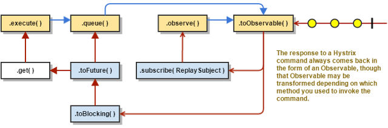

# Spring Cloud的断路器--Spring Cloud Commons定义、Netflix Hystrix实现分析

## 介绍

像我前面说的，
Spring Cloud项目（或Spring Cloud中间件）无一例外都引入了Spring Cloud Context和Spring Cloud Commons模块。他们定义了Spring Cloud项目的约定用法和通用组件。

在此，我来谈谈Spring Cloud Commons中定义的断路器规范及其实现。

## Spring Cloud Commons断路器定义

我们来看`@SpringCloudApplication`
~~~
//省略
@SpringBootApplication
@EnableDiscoveryClient
@EnableCircuitBreaker
public @interface SpringCloudApplication {
}
~~~
相当于@SpringBootApplication加上`@EnableDiscoveryClient`、`@EnableCircuitBreaker`。

EnableCircuitBreaker此注解定义在`org.springframework.cloud.client.circuitbreaker`包下。
改包定义了两各类，另一个是`EnableCircuitBreakerImportSelector`。

~~~
/**
 * Imports a single circuit breaker implementation configuration.
 * @author Spencer Gibb
 */
@Order(Ordered.LOWEST_PRECEDENCE - 100)
public class EnableCircuitBreakerImportSelector extends
		SpringFactoryImportSelector<EnableCircuitBreaker> {

	@Override
	protected boolean isEnabled() {
		return getEnvironment().getProperty(
				"spring.cloud.circuit.breaker.enabled", Boolean.class, Boolean.TRUE);
	}

}

~~~

继承了SpringFactoryImportSelector，SpringFactoryImportSelector此类
先判断isEnabled是否为true（即`spring.cloud.circuit.breaker.enabled`）是否开启，
使用Spring SPI（SpringFactoriesLoader）去找META-INF/factories中key为`org.springframework.cloud.client.circuitbreaker.EnableCircuitBreaker`
的类集。

所以，Spring Cloud Commons只定义了断路器的加载机制，组件接口、抽象类组件一概没有定义。

## Netflix Hystrix原理

Netflix Hystrix是Netflix Oss中的断路器实现。
spring-cloud-starter-netflix-hystrix中定义了断路器结合Spring Cloud的组件加载逻辑：
~~~
org.springframework.cloud.client.circuitbreaker.EnableCircuitBreaker=\
org.springframework.cloud.netflix.hystrix.HystrixCircuitBreakerConfiguration
~~~

下面我们来看看断路器Hystrix的原理。
首先说一点，Hystrix的wiki文档对其原理实现的解析十分详尽（流程图、时序图等都很清晰），
我这里不采用以往把源码罗列并一行行注释的方式，而是列出官网某些核心陈述，并列出源码出处。

注：看Hystrix源码前建议先了解响应式编程或阅读[project-reactor原理](../webflux/project-reactor原理.md)

Hystrix command执行总体流程图：

1. 构造HystrixCommand或者HystrixObservableCommand
2. 执行Command
3. 响应是否缓存？
4. 熔断是否开启
5. 线程池/信号量是否拒绝
6. 执行HystrixCommand.run()或者HystrixObservableCommand.construct()
7. 计算熔断是否健康
8. 获得Fallback（降级结果）
9. 返回响应

在第2步，执行Command中，Hystrix有**四种**执行方式：
~~~
K             value   = command.execute();
Future<K>     fValue  = command.queue();
Observable<K> ohValue = command.observe();         //hot observable
Observable<K> ocValue = command.toObservable();    //cold observable
~~~

在源码上他们是想通的，

* command.execute()底层是执行`queue().get()`。
* command.queue()底层是执行`toObservable().toBlocking().toFuture()`。
* command.observe()底层是马上订阅到Observable开始执行Command，并返回Observable。
* command.toObservable()底层返回Observable。注意，不同于`.observe()`，此时Command流程还未执行，
用户（开发者）执行subscribe代码后才真正开始执行Command。所以，文档称该执行方式为cold observable（冷RxJava里的概念）。

接着来看第4步，熔断如何计算是否开启？

由上面分析，我们知道，Hystrix执行Command后，底层源码都是经过toObservable()，构建Observable去运行。
在`toObservable`中，我们看到会构造`applyHystrixSemantics`这一核心方法。

~~~
    private Observable<R> applyHystrixSemantics(final AbstractCommand<R> _cmd) {
        // mark that we're starting execution on the ExecutionHook
        // if this hook throws an exception, then a fast-fail occurs with no fallback.  No state is left inconsistent
        executionHook.onStart(_cmd);

        
        //1.判断断路器是否接受请求
        if (circuitBreaker.allowRequest()) {
            //2. 获取信号量实例，如果隔离策略不是信号量，则返回一个无操作的Tryable信号量
            final TryableSemaphore executionSemaphore = getExecutionSemaphore();
            final AtomicBoolean semaphoreHasBeenReleased = new AtomicBoolean(false);
            final Action0 singleSemaphoreRelease = new Action0() {
                @Override
                public void call() {
                    if (semaphoreHasBeenReleased.compareAndSet(false, true)) {
                        executionSemaphore.release();
                    }
                }
            };

            final Action1<Throwable> markExceptionThrown = new Action1<Throwable>() {
                @Override
                public void call(Throwable t) {
                    eventNotifier.markEvent(HystrixEventType.EXCEPTION_THROWN, commandKey);
                }
            };
            //3. 尝试获取信号量
            if (executionSemaphore.tryAcquire()) {
                try {
                    /* used to track userThreadExecutionTime */
                    executionResult = executionResult.setInvocationStartTime(System.currentTimeMillis());
                    //该方法里面会调用executeCommandWithSpecifiedIsolation，如果是线程池隔离会在这里组装相关逻辑
                    return executeCommandAndObserve(_cmd)
                            .doOnError(markExceptionThrown)
                            .doOnTerminate(singleSemaphoreRelease)
                            .doOnUnsubscribe(singleSemaphoreRelease);
                } catch (RuntimeException e) {
                    return Observable.error(e);
                }
            } else {
                //4. 拒绝逻辑
                return handleSemaphoreRejectionViaFallback();
            }
        } else {
            //5. 处理失败
            return handleShortCircuitViaFallback();
        }
    }
~~~

重点说说上面代码第1小点：
1. 判断断路器是否接受请求
   1.1. 判断是否circuitBreakerForceOpen属性是否开启
   1.2. 执行HystrixCircuitBreaker的默认实现类的`!HystrixCircuitBreakerImpl.isOpen() || HystrixCircuitBreakerImpl.allowSingleTest()`，**注意，该行代码是判断断路器是否开启的核心代码**。
    * isOpen是Hystrix检测断路器是否开启的手段。该方法的执行逻辑用表达式表达如下：
        **`总请求>circuitBreakerRequestVolumeThreshold && (（失败请求）/ (成功+失败请求) > circuitBreakerErrorThresholdPercentage)`**  
        注：circuitBreakerRequestVolumeThreshold为配置项，默认20，表示断路器开始计算断路逻辑的请求数门槛值。  
        circuitBreakerErrorThresholdPercentage为配置项，默认50，表示触发断路器的错误百分比门槛值。
    * allowSingleTest是Hystrix发生断路后判断是否让请求通过以检测断路器是否能关闭的手段。逻辑表达式如下：
      `(当前断路器是否开启) && 当前时间 >（断路开启或最后测试时间 + circuitBreakerSleepWindowInMilliseconds）`  
      注：circuitBreakerSleepWindowInMilliseconds为配置项，默认5000，表示触发断路后允许重新验证断路器是否开启的时间间隔。

接下来，说说第5步，线程池和信号量的组装逻辑上面已经提及，我重点说说Hystrix的线程池和信号量隔离两者的差异。
模型：

* 线程池：
    * 优点：简而言之，线程池提供的隔离允许客户端库和子系统性能特征的不断变化和动态组合得到优雅处理，而不会造成中断。
    * 缺点：线程池的主要缺点是它们增加了计算开销。每个命令执行都涉及在单独的线程上运行命令所涉及的队列，调度和上下文切换。
* 信号量：
    * 优点：相对线程池隔离，资源消耗计算消耗比较低。
    * 缺点：信号量不能隔离这种情况，如果client调用被信号量隔离，然后如果请求client服务处于延迟状态，则父线程（即当前服务处理用户请求逻辑的线程）将保持阻塞状态，直到底层网络调用超时为止。

目前Netflix选择的方案是线程池，因为他们评估认为优点远大于缺点。

### Hystrix停止开发分析

Hystrix ReadMe有提及他们会转移到诸如Resilience4j之类的库。
而Resilience4j文档有谈到Resilience4j与Hystrix的区别。
[Resilience4j-Guides-Chinese|Comparison-to-Netflix-Hystrix](https://github.com/lmhmhl/Resilience4j-Guides-Chinese/blob/main/getting-start/Comparison-to-Netflix-Hystrix.md)

由我自己使用Hystrix以及结合Hystrix源码来看，  
Hystrix的优点：关键功能齐全，且经过大流量验证。  
而Hystrix的缺点还是挺明显：给我的使用体验其实是累赘的，它要求开发者要自行实现HystrixCommand，
并且它的功能是基于配置的，运行时不能变更的，假如我们希望断路器能在运行时基于控制台又或者是当前请求状况动态变更，
那么Hystrix是无法做到的。

