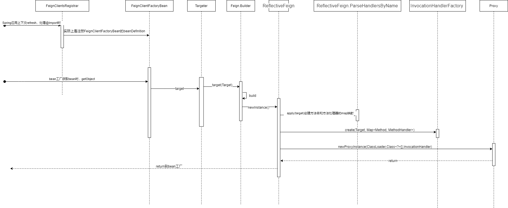
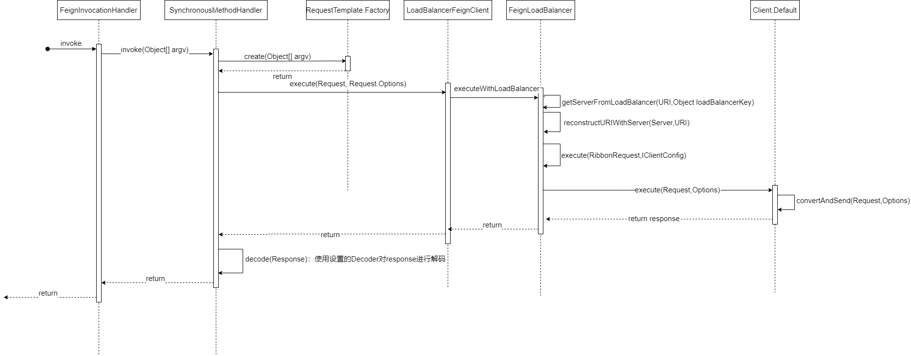
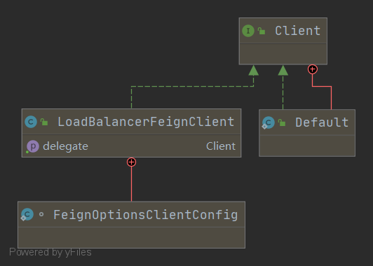
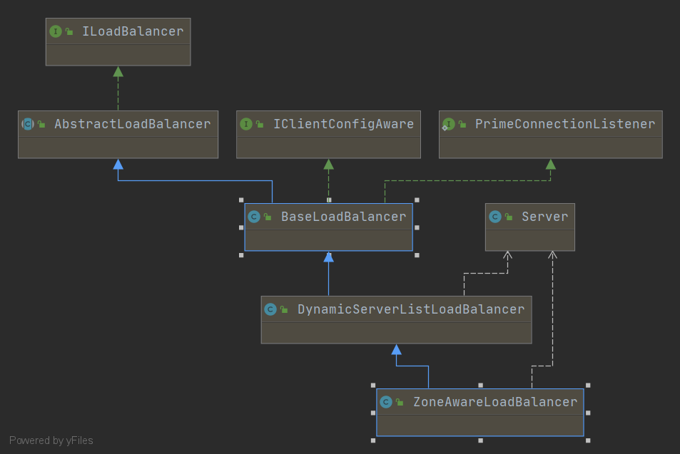
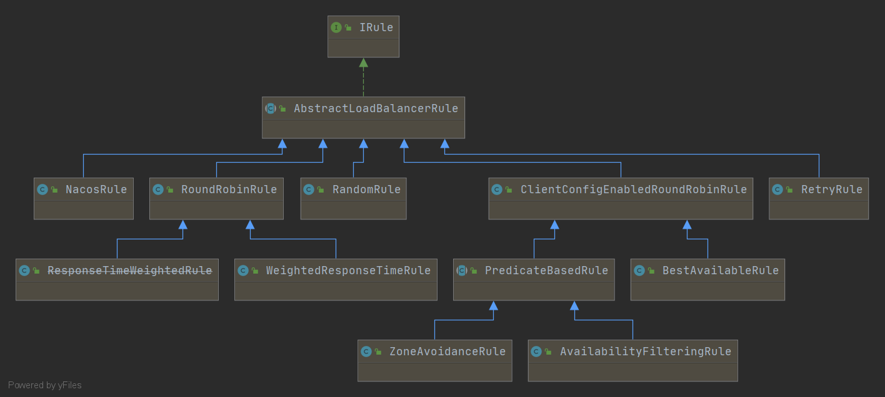
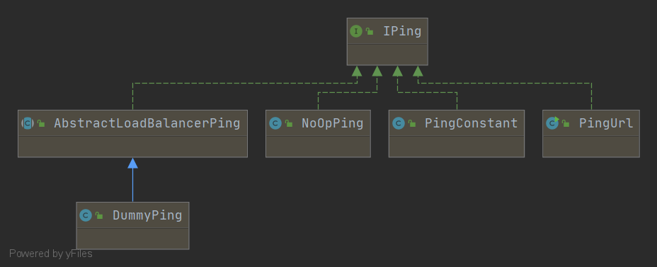

# Spring Cloud负载均衡器--Spring Cloud Commons、RestTemplate、Open Feign、Ribbon的实现分析

## 简介

Spring Cloud项目（或Spring Cloud中间件）无一例外都引入了Spring Cloud Context和Spring Cloud Commons模块。他们定义了Spring Cloud项目的约定用法和通用组件。
在此，我来谈谈Spring Cloud Commons中定义的客户端负载均衡组件及其实现。

我先介绍spring cloud commons 负载均衡（LoadBalancerAutoConfiguration）引入的组件。  
然后介绍RestTemplate和Open Feign各自在什么地方应用了spring cloud commons和ribbon。  
接着介绍ribbon,  
最后说说客户端负载均衡和几种负载均衡算法。

注：目前分析基于Spring MVC，且不考虑Spring Retry模块的引入。

## LoadBalancerAutoConfiguration和Spring Cloud Commons的loadbalancer模块

Spring Cloud Commons的负载均衡代码皆定义在loadbalancer模块中。  
自动装配会扫描到的配置类是，LoadBalancerAutoConfiguration、AsyncLoadBalancerAutoConfiguration、ReactiveLoadBalancerAutoConfiguration。

说说LoadBalancerAutoConfiguration中的配置项。
~~~

@Configuration
@ConditionalOnClass(RestTemplate.class)
@ConditionalOnBean(LoadBalancerClient.class)
@EnableConfigurationProperties(LoadBalancerRetryProperties.class)
public class LoadBalancerAutoConfiguration {
    

    // 将配置中标注了@LoadBalanced的RestTemplate注入到这里
	@LoadBalanced
	@Autowired(required = false)
	private List<RestTemplate> restTemplates = Collections.emptyList();

    //将注册的RestTemplateCustomizer（RestTemplate自定义器）集合处理上面的restTemplates集合
	@Bean
	public SmartInitializingSingleton loadBalancedRestTemplateInitializerDeprecated(
			final ObjectProvider<List<RestTemplateCustomizer>> restTemplateCustomizers) {
		return () -> restTemplateCustomizers.ifAvailable(customizers -> {
            for (RestTemplate restTemplate : LoadBalancerAutoConfiguration.this.restTemplates) {
                for (RestTemplateCustomizer customizer : customizers) {
                    customizer.customize(restTemplate);
                }
            }
        });
	}

    //LoadBalancerRequestFactory构造了HttpRequest后，会用LoadBalancerRequestTransformer和ServiceInstance对HttpRequest做转换
	@Autowired(required = false)
	private List<LoadBalancerRequestTransformer> transformers = Collections.emptyList();

    //为LoadBalancerInterceptor创建LoadBalancerRequest，主要做了重组请求URI（比如, http://service-id/getResource-> http://192.168.1.103:8080/getResource）
	@Bean
	@ConditionalOnMissingBean
	public LoadBalancerRequestFactory loadBalancerRequestFactory(
			LoadBalancerClient loadBalancerClient) {
		return new LoadBalancerRequestFactory(loadBalancerClient, transformers);
	}

	@Configuration
	@ConditionalOnMissingClass("org.springframework.retry.support.RetryTemplate")
	static class LoadBalancerInterceptorConfig {
        //使用LoadBalancerClient和LoadBalancerRequestFactory做一些处理
		@Bean
		public LoadBalancerInterceptor ribbonInterceptor(
				LoadBalancerClient loadBalancerClient,
				LoadBalancerRequestFactory requestFactory) {
			return new LoadBalancerInterceptor(loadBalancerClient, requestFactory);
		}

        //一个restTemplateCustomizer，能够为RestTemplate增加自定义特性
		@Bean
		@ConditionalOnMissingBean
		public RestTemplateCustomizer restTemplateCustomizer(
				final LoadBalancerInterceptor loadBalancerInterceptor) {
			return restTemplate -> {
                List<ClientHttpRequestInterceptor> list = new ArrayList<>(
                        restTemplate.getInterceptors());
                list.add(loadBalancerInterceptor);
                restTemplate.setInterceptors(list);
            };
		}
	}

    //省略
}

~~~

### LoadBalancerRequest

LoadBalancerClient用作生成metric或者在负载请求的前后作一些处理。
~~~
public interface LoadBalancerRequest<T> {

	public T apply(ServiceInstance instance) throws Exception;

}
~~~

### ServiceInstance

一对一关系，对应注册发现中心的服务实例抽象。

### LoadBalancerInterceptor和LoadBalancerRequestFactory

LoadBalancerInterceptor为ClientHttpRequestInterceptor的实现类。  
ClientHttpRequestInterceptor为客户端发送请求用到的拦截器，我们一般自定义RestTemplate会用到。
来看看LoadBalancerInterceptor核心方法intercept。

~~~
public class LoadBalancerInterceptor implements ClientHttpRequestInterceptor {

	private LoadBalancerClient loadBalancer;
	private LoadBalancerRequestFactory requestFactory;

	public LoadBalancerInterceptor(LoadBalancerClient loadBalancer, LoadBalancerRequestFactory requestFactory) {
		this.loadBalancer = loadBalancer;
		this.requestFactory = requestFactory;
	}

	public LoadBalancerInterceptor(LoadBalancerClient loadBalancer) {
		// for backwards compatibility
		this(loadBalancer, new LoadBalancerRequestFactory(loadBalancer));
	}

	@Override
	public ClientHttpResponse intercept(final HttpRequest request, final byte[] body,
			final ClientHttpRequestExecution execution) throws IOException {
        //获取原始URI，并从URI中获取约定俗称设置的service id，如http://spring-cloud-web-demo/user/detail中的spring-cloud-web-demo
		final URI originalUri = request.getURI();
		String serviceName = originalUri.getHost();
		Assert.state(serviceName != null, "Request URI does not contain a valid hostname: " + originalUri);
		//执行LoadBalancerClient.execute，期间会通过计算选取合适的ServiceInstance，将请求做一些处理并转换成向目标实例发送的请求
		return this.loadBalancer.execute(serviceName, requestFactory.createRequest(request, body, execution));
	}
}

~~~

~~~

public class LoadBalancerRequestFactory {

	private LoadBalancerClient loadBalancer;
	private List<LoadBalancerRequestTransformer> transformers;

	public LoadBalancerRequestFactory(LoadBalancerClient loadBalancer,
			List<LoadBalancerRequestTransformer> transformers) {
		this.loadBalancer = loadBalancer;
		this.transformers = transformers;
	}

	public LoadBalancerRequestFactory(LoadBalancerClient loadBalancer) {
		this.loadBalancer = loadBalancer;
	}

	public LoadBalancerRequest<ClientHttpResponse> createRequest(final HttpRequest request,
			final byte[] body, final ClientHttpRequestExecution execution) {
		return instance -> {
            //ServiceRequestWrapper通过loadBalancer.reconstructURI方法将uri重组（比如替换service-id，比如如果目标是注册的HTTPS则修改为HTTPS）成请求目标ServiceInstance的请求
            HttpRequest serviceRequest = new ServiceRequestWrapper(request, instance, loadBalancer);
            if (transformers != null) {
                for (LoadBalancerRequestTransformer transformer : transformers) {
                    serviceRequest = transformer.transformRequest(serviceRequest, instance);
                }
            }
            //Spring MVC的组件。执行ClientHttpRequestExecution请求链，去触发下一个ClientHttpRequestInterceptor如果没有拦截器了执行请求
            return execution.execute(serviceRequest, body);
        };
	}

}

~~~

### RestTemplate分析

#### 例子

[代码在这 | spring-cloud-web-demo](https://github.com/teaho2015-blog/spring-source-code-learning-demo/tree/master/spring-cloud-web-demo)

在该模块下，子模块spring-cloud-web-demo-client写了具有客户端负载均衡能力的RestTemplate的请求代码。

类似这样定义：
~~~
    @Bean
    @LoadBalanced
    public RestTemplate restTemplate() {
        return new RestTemplate();
    }

~~~

#### 实现分析

RestTemplate究竟是如何利用注册中心实现客户端负载均衡的呢？

实现方式：
就是将上面所说的LoadBalancerInterceptor负载均衡拦截器加到标注了@LoadBalanced的RestTemplate实例中。
LoadBalancerInterceptor拦截器会在执行过程中获取并设置适合的目标请求实例，重新构造请求URI。

~~~

    // 将配置中标注了@LoadBalanced的RestTemplate注入到这里
	@LoadBalanced
	@Autowired(required = false)
	private List<RestTemplate> restTemplates = Collections.emptyList();

    //将注册的RestTemplateCustomizer（RestTemplate自定义器）集合处理上面的restTemplates集合
	@Bean
	public SmartInitializingSingleton loadBalancedRestTemplateInitializerDeprecated(
			final ObjectProvider<List<RestTemplateCustomizer>> restTemplateCustomizers) {
		return () -> restTemplateCustomizers.ifAvailable(customizers -> {
            for (RestTemplate restTemplate : LoadBalancerAutoConfiguration.this.restTemplates) {
                for (RestTemplateCustomizer customizer : customizers) {
                    customizer.customize(restTemplate);
                }
            }
        });
	}

~~~

## Spring Cloud Feign分析

Feign是另外一种客户端负载均衡实现。

### 例子

[代码在这 | spring-cloud-web-demo](https://github.com/teaho2015-blog/spring-source-code-learning-demo/tree/master/spring-cloud-web-demo)

我在该模块写了Feign Client的示例代码。

* spring-cloud-web-demo-api为服务的sdk模块  
* spring-cloud-web-demo-service为提供接口服务的模块
* spring-cloud-web-demo-client为模拟调用服务的模块  

首先在spring-cloud-web-demo-api模块，定义Feign API。spring-cloud-web-demo为spring-cloud-web-demo-service暴露的服务名。
~~~

@FeignClient(value = "spring-cloud-web-demo")
public interface UserFeign {

    @GetMapping(value = "/user/getUserById", produces = "application/json;charset=utf-8")
    Object getUserById(@RequestParam(value = "id", required = false) Long id);

    //省略
}
~~~

然后通过ClientAutoConfiguration自动装配。（client直接引入api包就可以使用，不需要再EnableFeignClients）

~~~

@Configuration
@EnableFeignClients("net.teaho.demo.spring.cloud.web.api")
public class ClientAutoConfiguration {
}

org.springframework.boot.autoconfigure.EnableAutoConfiguration=\
net.teaho.demo.spring.cloud.web.api.config.ClientAutoConfiguration

~~~

在service模块如以往Spring MVC般实现api模块接口即可。

~~~
@RestController
public class UserController implements UserFeign {

    private static final Logger logger = LoggerFactory.getLogger(UserController.class);

    @Override
    public Object getUserById(Long id) {
        return "{\"id\":1, \"name\": \"test\"}";
    }
 
    //省略
}
~~~

在Client模块，注入bean后直接调用。

~~~
@Component
@Slf4j
public class TestService {
    @Autowired
    private RestTemplate restTemplate;

    public Object getOneUser(){
        return userController.getUserById(1L);
    }
}
~~~

### 源码分析

和RestTemplate比起来，OpenFeign显得更适合Spring Boot微服务。
1. Open Feign相当于（HTTP）RPC，相比起RestTemplate，它直接显式将API声明以JAVA接口形式标识出来。
   并且因为底层用的动态代理，它还可以（无感知地）替换底层实现。比如，github上就有替换底层逻辑的repo -- Open Feign+Dubbo的RPC实现。
2. 通过sdk包的形式，方便了调用，不需要像RestTemplate一样，客户端自行拼接上一串请求参数。在代码编写上也清晰。

我们不禁要问，OpenFeign是怎么实现的呢？  

#### 初始化分析

流程图如下：

看看前面例子里我们引入的OpenFeign的东西
* `@EnableFeignClients("net.teaho.demo.spring.cloud.web.api")`
* `@FeignClient(value = "spring-cloud-web-demo")`
还有自动装配引入的
* FeignRibbonClientAutoConfiguration
* FeignClientsConfiguration

我们就从这两个注解开始分析源码。

首先看@FeignClient注解。
~~~
//给接口标注成一个REST调用方
@Target(ElementType.TYPE)
@Retention(RetentionPolicy.RUNTIME)
@Documented
public @interface FeignClient {
    //服务名，可以带协议前缀，也可以用${property.name}关联一个配置值。
	@AliasFor("name")
	String value() default "";

	@Deprecated
	String serviceId() default "";

    //bean name
	String contextId() default "";

	@AliasFor("value")
	String name() default "";
	
	/**
	 * Sets the <code>@Qualifier</code> value for the feign client.
	 */
	String qualifier() default "";
    //直接指定一个地址，比如http://localhost:12345，一般用于调试
	String url() default "";

	boolean decode404() default false;

	/**
	 * A custom <code>@Configuration</code> for the feign client. Can contain override
	 * <code>@Bean</code> definition for the pieces that make up the client, for instance
	 * {@link feign.codec.Decoder}, {@link feign.codec.Encoder}, {@link feign.Contract}.
	 *
	 * @see FeignClientsConfiguration for the defaults
	 */
    //可用于覆盖FeignClient默认设置
	Class<?>[] configuration() default {};
    //回滚类，像我的例子中定义的回滚类必须实现UserFeign接口，看https://cloud.spring.io/spring-cloud-static/Greenwich.SR5/single/spring-cloud.html#spring-cloud-feign-hystrix-fallback
	Class<?> fallback() default void.class;
    //如果需要对异常做诊断可用此属性，https://cloud.spring.io/spring-cloud-static/Greenwich.SR5/single/spring-cloud.html#spring-cloud-feign-hystrix-fallback
	Class<?> fallbackFactory() default void.class;
    //路径前缀
	String path() default "";
    //标记bean是否为primary
	boolean primary() default true;
}
~~~

接下来重点关注`@EnableFeignClients`注解是如何扫描`FeignClient`接口的。
~~~
@Retention(RetentionPolicy.RUNTIME)
@Target(ElementType.TYPE)
@Documented
@Import(FeignClientsRegistrar.class)
public @interface EnableFeignClients {

    //省略
}
~~~

嗯，发现没有，就是FeignClientsRegistrar做处理的。  
来分析下重点方法registerFeignClients和registerFeignClient
~~~

class FeignClientsRegistrar implements ImportBeanDefinitionRegistrar,
		ResourceLoaderAware, EnvironmentAware {

	public void registerFeignClients(AnnotationMetadata metadata,
			BeanDefinitionRegistry registry) {
        //classPath扫描器
		ClassPathScanningCandidateComponentProvider scanner = getScanner();
		scanner.setResourceLoader(this.resourceLoader);
        //ClassPathScanningCandidateComponentProvider扫描的basePackage集合
		Set<String> basePackages;

		Map<String, Object> attrs = metadata
				.getAnnotationAttributes(EnableFeignClients.class.getName());
        //扫描器用于扫描标注了@FeignClient类的拦截器
		AnnotationTypeFilter annotationTypeFilter = new AnnotationTypeFilter(
				FeignClient.class);
		final Class<?>[] clients = attrs == null ? null
				: (Class<?>[]) attrs.get("clients");
        //clients属性为空，以@EnableFeignClients的value、basePackage等为根包扫描
		if (clients == null || clients.length == 0) {
			scanner.addIncludeFilter(annotationTypeFilter);
			basePackages = getBasePackages(metadata);
		}
        //@EnableFeignClients的clients属性不为空，解析clients的类和根包
		else {
			final Set<String> clientClasses = new HashSet<>();
			basePackages = new HashSet<>();
			for (Class<?> clazz : clients) {
				basePackages.add(ClassUtils.getPackageName(clazz));
				clientClasses.add(clazz.getCanonicalName());
			}
			AbstractClassTestingTypeFilter filter = new AbstractClassTestingTypeFilter() {
				@Override
				protected boolean match(ClassMetadata metadata) {
					String cleaned = metadata.getClassName().replaceAll("\\$", ".");
					return clientClasses.contains(cleaned);
				}
			};
			scanner.addIncludeFilter(
					new AllTypeFilter(Arrays.asList(filter, annotationTypeFilter)));
		}
        
        //1.根据basePackage找到目标@FeignClient接口
        //2.检查是否为接口
        //3.将找到的接口注册为FeignClientFactoryBean
		for (String basePackage : basePackages) {
			Set<BeanDefinition> candidateComponents = scanner
					.findCandidateComponents(basePackage);
			for (BeanDefinition candidateComponent : candidateComponents) {
				if (candidateComponent instanceof AnnotatedBeanDefinition) {
					// verify annotated class is an interface
					AnnotatedBeanDefinition beanDefinition = (AnnotatedBeanDefinition) candidateComponent;
					AnnotationMetadata annotationMetadata = beanDefinition.getMetadata();
					Assert.isTrue(annotationMetadata.isInterface(),
							"@FeignClient can only be specified on an interface");

					Map<String, Object> attributes = annotationMetadata
							.getAnnotationAttributes(
									FeignClient.class.getCanonicalName());

					String name = getClientName(attributes);
					registerClientConfiguration(registry, name,
							attributes.get("configuration"));

					registerFeignClient(registry, annotationMetadata, attributes);
				}
			}
		}
	}

	private String getClientName(Map<String, Object> client) {
		if (client == null) {
			return null;
		}
		String value = (String) client.get("contextId");
		if (!StringUtils.hasText(value)) {
			value = (String) client.get("value");
		}
		if (!StringUtils.hasText(value)) {
			value = (String) client.get("name");
		}
		if (!StringUtils.hasText(value)) {
			value = (String) client.get("serviceId");
		}
		if (StringUtils.hasText(value)) {
			return value;
		}

		throw new IllegalStateException("Either 'name' or 'value' must be provided in @"
				+ FeignClient.class.getSimpleName());
	}

	private void registerFeignClient(BeanDefinitionRegistry registry,
			AnnotationMetadata annotationMetadata, Map<String, Object> attributes) {
		String className = annotationMetadata.getClassName();
		BeanDefinitionBuilder definition = BeanDefinitionBuilder
				.genericBeanDefinition(FeignClientFactoryBean.class);
		validate(attributes);
		definition.addPropertyValue("url", getUrl(attributes));
		definition.addPropertyValue("path", getPath(attributes));
		String name = getName(attributes);
		definition.addPropertyValue("name", name);
		String contextId = getContextId(attributes);
		definition.addPropertyValue("contextId", contextId);
		definition.addPropertyValue("type", className);
		definition.addPropertyValue("decode404", attributes.get("decode404"));
		definition.addPropertyValue("fallback", attributes.get("fallback"));
		definition.addPropertyValue("fallbackFactory", attributes.get("fallbackFactory"));
		definition.setAutowireMode(AbstractBeanDefinition.AUTOWIRE_BY_TYPE);

		String alias = contextId + "FeignClient";
		AbstractBeanDefinition beanDefinition = definition.getBeanDefinition();

		boolean primary = (Boolean)attributes.get("primary"); // has a default, won't be null

		beanDefinition.setPrimary(primary);

		String qualifier = getQualifier(attributes);
		if (StringUtils.hasText(qualifier)) {
			alias = qualifier;
		}

		BeanDefinitionHolder holder = new BeanDefinitionHolder(beanDefinition, className,
				new String[] { alias });
		BeanDefinitionReaderUtils.registerBeanDefinition(holder, registry);
	}

}

~~~

可以看到最后注册beanDefinition时，我们看到注册了FeignClientFactoryBean这一FactoryBean。
我们看看工厂bean FeignClientFactoryBean是如何构造对象的。

~~~
class FeignClientFactoryBean implements FactoryBean<Object>, InitializingBean,
		ApplicationContextAware {

//省略

	@Override
	public Object getObject() throws Exception {
		return getTarget();
	}

	<T> T getTarget() {
        //1.获取FeignContext，在FeignAutoConfiguration声明
		FeignContext context = applicationContext.getBean(FeignContext.class);
        //2.构造Feign builder
		Feign.Builder builder = feign(context);

        //3.如果没有设置url参数
		if (!StringUtils.hasText(this.url)) {
			if (!this.name.startsWith("http")) {
				url = "http://" + this.name;
			}
			else {
				url = this.name;
			}
            //4.设置path
			url += cleanPath();
            //5.获取Client（用于执行最终HTTP/HTTPS请求，比如LoadBalancerFeignClient），
            //构造反射实例
			return (T) loadBalance(builder, context, new HardCodedTarget<>(this.type,
					this.name, url));
		}
        //存在url参数，构造非loadBalance的请求实例（target）
		if (StringUtils.hasText(this.url) && !this.url.startsWith("http")) {
			this.url = "http://" + this.url;
		}
		String url = this.url + cleanPath();
		Client client = getOptional(context, Client.class);
		if (client != null) {
			if (client instanceof LoadBalancerFeignClient) {
				// not load balancing because we have a url,
				// but ribbon is on the classpath, so unwrap
				client = ((LoadBalancerFeignClient)client).getDelegate();
			}
			builder.client(client);
		}
		Targeter targeter = get(context, Targeter.class);
		return (T) targeter.target(this, builder, context, new HardCodedTarget<>(
				this.type, this.name, url));
	}

    //在FeignContext中获取一些在FeignClientsConfiguration中声明，Feign需要用到的组件
	protected Feign.Builder feign(FeignContext context) {
		FeignLoggerFactory loggerFactory = get(context, FeignLoggerFactory.class);
		Logger logger = loggerFactory.create(this.type);

		// @formatter:off
		Feign.Builder builder = get(context, Feign.Builder.class)
				// required values
				.logger(logger)
				.encoder(get(context, Encoder.class))
				.decoder(get(context, Decoder.class))
				.contract(get(context, Contract.class));
		// @formatter:on

		configureFeign(context, builder);

		return builder;
	}

	protected <T> T loadBalance(Feign.Builder builder, FeignContext context,
			HardCodedTarget<T> target) {
        //获取Client
		Client client = getOptional(context, Client.class);
		if (client != null) {
			builder.client(client);
            //从Context获取Targeter，Targeter用于生成最终target实例（对应我的例子是被调用的通过反射生成的UserFeign实例）
			Targeter targeter = get(context, Targeter.class);
			return targeter.target(this, builder, context, target);
		}

		throw new IllegalStateException(
				"No Feign Client for loadBalancing defined. Did you forget to include spring-cloud-starter-netflix-ribbon?");
	}

//省略

}

~~~

在非调试情况下（即我们没设置url参数），
我们来看看`targeter.target(this, builder, context, target)`做了什么。

Targeter接口是构造被请求的代理bean的类。有两个实现类`HystrixTargeter`、`DefaultTargeter`。

HystrixTargeter会比默认的多设置一些回滚措施，用到Feign的Contract属性，
我会先从DefaultTargeter说起。

DefaultTargeter会通过`Feign.Builder#target(Target<T> target)`生成实例。我们来看看代码。
~~~

public abstract class Feign {
//省略

  public static class Builder {

    private final List<RequestInterceptor> requestInterceptors =
        new ArrayList<RequestInterceptor>();
    private Logger.Level logLevel = Logger.Level.NONE;
    private Contract contract = new Contract.Default();
    private Client client = new Client.Default(null, null);
    private Retryer retryer = new Retryer.Default();
    private Logger logger = new NoOpLogger();
    private Encoder encoder = new Encoder.Default();
    private Decoder decoder = new Decoder.Default();
    private QueryMapEncoder queryMapEncoder = new QueryMapEncoder.Default();
    private ErrorDecoder errorDecoder = new ErrorDecoder.Default();
    private Options options = new Options();
    private InvocationHandlerFactory invocationHandlerFactory =
        new InvocationHandlerFactory.Default();
    private boolean decode404;
    private boolean closeAfterDecode = true;
    private ExceptionPropagationPolicy propagationPolicy = NONE;

    //省略

    public <T> T target(Class<T> apiType, String url) {
      return target(new HardCodedTarget<T>(apiType, url));
    }

    public <T> T target(Target<T> target) {
      return build().newInstance(target);
    }
    //默认实现就是创建一个ReflectiveFeign实例
    public Feign build() {

      SynchronousMethodHandler.Factory synchronousMethodHandlerFactory =
          new SynchronousMethodHandler.Factory(client, retryer, requestInterceptors, logger,
              logLevel, decode404, closeAfterDecode, propagationPolicy);
      ParseHandlersByName handlersByName =
          new ParseHandlersByName(contract, options, encoder, decoder, queryMapEncoder,
              errorDecoder, synchronousMethodHandlerFactory);
      return new ReflectiveFeign(handlersByName, invocationHandlerFactory, queryMapEncoder);
    }
  }

//省略
}
~~~

在解读ReflectiveFeign前介绍几个概念：

* InvocationHandlerFactory 是控制反射方法分发的接口,create方法返回InvocationHandler。
* InvocationHandlerFactory.MethodHandler 最终将对代理类方法调用转换成HTTP请求的地方，请看实现类SynchronousMethodHandler
* InvocationHandlerFactory.Default  默认实现，作为构造参数传入ReflectiveFeign，create方法创建的是`new ReflectiveFeign.FeignInvocationHandler(target, dispatch)`。
* ReflectiveFeign.ParseHandlersByName 作为构造参数传入ReflectiveFeign，核心方法`apply(Target key)`先将标注了@FeignClient的接口的方法解析出待处理的元数据`List<MethodMetadata>`,
  然后创建出方法名和方法处理器的map映射`Map<String, MethodHandler>`String是方法名，方法处理器通过SynchronousMethodHandler.Factory#create创建。
* FeignInvocationHandler 为处理一般方法的处理器
* DefaultMethodHandler 为处理接口默认方法的处理器

有了以上介绍，接下来简单分析ReflectiveFeign的newInstance方法。

~~~

public class ReflectiveFeign extends Feign {
  private final ParseHandlersByName targetToHandlersByName;
  private final InvocationHandlerFactory factory;
  private final QueryMapEncoder queryMapEncoder;

  ReflectiveFeign(ParseHandlersByName targetToHandlersByName, InvocationHandlerFactory factory,
      QueryMapEncoder queryMapEncoder) {
    this.targetToHandlersByName = targetToHandlersByName;
    this.factory = factory;
    this.queryMapEncoder = queryMapEncoder;
  }

  ..
  /**
   * creates an api binding to the {@code target}. As this invokes reflection, care should be taken
   * to cache the result.
   */
  @SuppressWarnings("unchecked")
  @Override
  public <T> T newInstance(Target<T> target) {
    //创建方法名和方法处理器的map映射
    Map<String, MethodHandler> nameToHandler = targetToHandlersByName.apply(target);
    Map<Method, MethodHandler> methodToHandler = new LinkedHashMap<Method, MethodHandler>();
    List<DefaultMethodHandler> defaultMethodHandlers = new LinkedList<DefaultMethodHandler>();

    for (Method method : target.type().getMethods()) {
      if (method.getDeclaringClass() == Object.class) {
        continue;
      //判断是否为接口的默认方法，DefaultMethodHandler的处理逻辑是直接调用会原接口的default方法
      } else if (Util.isDefault(method)) {
        DefaultMethodHandler handler = new DefaultMethodHandler(method);
        defaultMethodHandlers.add(handler);
        methodToHandler.put(method, handler);
      } else {
        //方法处理map
        methodToHandler.put(method, nameToHandler.get(Feign.configKey(target.type(), method)));
      }
    }
    InvocationHandler handler = factory.create(target, methodToHandler);
    //jdk动态代理创建对象
    T proxy = (T) Proxy.newProxyInstance(target.type().getClassLoader(),
        new Class<?>[] {target.type()}, handler);
    //将默认方法处理器也绑定到代理对象上
    for (DefaultMethodHandler defaultMethodHandler : defaultMethodHandlers) {
      defaultMethodHandler.bindTo(proxy);
    }
    return proxy;
  }

  static class FeignInvocationHandler implements InvocationHandler {

    private final Target target;
    private final Map<Method, MethodHandler> dispatch;

    //省略

    @Override
    public Object invoke(Object proxy, Method method, Object[] args) throws Throwable {
      //自定义的equals、hashCode和toString的处理
      if ("equals".equals(method.getName())) {
        try {
          Object otherHandler =
              args.length > 0 && args[0] != null ? Proxy.getInvocationHandler(args[0]) : null;
          return equals(otherHandler);
        } catch (IllegalArgumentException e) {
          return false;
        }
      } else if ("hashCode".equals(method.getName())) {
        return hashCode();
      } else if ("toString".equals(method.getName())) {
        return toString();
      }
      //分发调用到对应方法的InvocationHandlerFactory.MethodHandler
      return dispatch.get(method).invoke(args);
    }
    
    //省略

}

~~~

至此，初始化完成。

#### 执行分析

上图是OpenFeign构造的代理对象被调用时的时序图。
1. 代理对象被执行
2. 找到对应SynchronousMethodHandler进行方法调用。
3. 构造RequestTemplate
4. LoadBalancerFeignClient执行负载请求
5. FeignLoadBalancer通过ILoadBalancer选择合适Server，通过Server重组URI，通过RibbonRequest持有的Client执行实际HTTP请求包装成Response。
6. SynchronousMethodHandler通过Decoder将请求响应用Decoder解码成最终结果。

下面介绍执行过程中涉及到源码中的部分组件。
* `RequestTemplate` 是一个HTTP请求内容的抽象。
* `RequestTemplate.Factory` 将方法参数解析成RequestTemplate。
* `Retryer` 我在上面的时序图没有标注出来，实际上它在SynchronousMethodHandler的执行中控制重试逻辑。
* `RequestInterceptor` 在SynchronousMethodHandler发起执行中，会使用该拦截器对RequestTemplate进行处理。这是一个拓展点。
* `Logger` 执行请求时打日志（在debug时打）。默认为Logger.Level.NONE即不打日志，可以增加bean覆盖。
  * Logger.Level.NONE 不打印信息
  * Logger.Level.BASIC 打印请求url和响应码。 
  * Logger.Level.HEADERS 打印BASIC信息外加header信息
  * Logger.Level.FULL 打印所有
* `LoadBalancerFeignClient` Client接口的实现类，是具有负载均衡能力的Client。Client接口为执行HTTP的接口，Client.Default是最终发出HTTP请求的类。
   
* `FeignLoadBalancer` FeignLoadBalancer通过ILoadBalancer选择合适Server，通过Server重组URI，通过RibbonRequest持有的Client执行实际HTTP请求包装成Response。
* `LoadBalancerCommand` ribbon的rxJava实现，执行负载流程逻辑的组件。
* `ILoadBalancer` ribbon的负载均衡器抽象。 

#### 熔断

在FeignClientsConfiguration中，
当配置了`feign.hystrix.enabled`,Feign Builder使用`HystrixFeign.builder()`。

所以build的时候新建HystrixInvocationHandler和HystrixDelegatingContract实例。
~~~
    Feign build(final FallbackFactory<?> nullableFallbackFactory) {
      super.invocationHandlerFactory(new InvocationHandlerFactory() {
        @Override
        public InvocationHandler create(Target target,
                                        Map<Method, MethodHandler> dispatch) {
          return new HystrixInvocationHandler(target, dispatch, setterFactory,
              nullableFallbackFactory);
        }
      });
      super.contract(new HystrixDelegatingContract(contract));
      return super.build();
    }
~~~

来看看HystrixInvocationHandler的hystrix调用代码
~~~
final class HystrixInvocationHandler implements InvocationHandler {
   //省略

  @Override
  public Object invoke(final Object proxy, final Method method, final Object[] args)
      throws Throwable {
   //省略
    HystrixCommand<Object> hystrixCommand =
        new HystrixCommand<Object>(setterMethodMap.get(method)) {
            
          //实际执行
          @Override
          protected Object run() throws Exception {
            try {
              return HystrixInvocationHandler.this.dispatch.get(method).invoke(args);
            } catch (Exception e) {
              throw e;
            } catch (Throwable t) {
              throw (Error) t;
            }
          }

          @Override
          protected Object getFallback() {
            if (fallbackFactory == null) {
              return super.getFallback();
            }
            try {
              //用配置的fallbackFactory创建fallback实例
              Object fallback = fallbackFactory.create(getExecutionException());
              Object result = fallbackMethodMap.get(method).invoke(fallback, args);
              //根据fallback对象的returntype解析包装内的结果返回
              if (isReturnsHystrixCommand(method)) {
                return ((HystrixCommand) result).execute();
              } else if (isReturnsObservable(method)) {
                // Create a cold Observable
                return ((Observable) result).toBlocking().first();
              } else if (isReturnsSingle(method)) {
                // Create a cold Observable as a Single
                return ((Single) result).toObservable().toBlocking().first();
              } else if (isReturnsCompletable(method)) {
                ((Completable) result).await();
                return null;
              } else {
                return result;
              }
            } catch (IllegalAccessException e) {
              // shouldn't happen as method is public due to being an interface
              throw new AssertionError(e);
            } catch (InvocationTargetException e) {
              // Exceptions on fallback are tossed by Hystrix
              throw new AssertionError(e.getCause());
            }
          }
        };
    
    //根据方法的return去返回结果
    if (Util.isDefault(method)) {
      return hystrixCommand.execute();
    } else if (isReturnsHystrixCommand(method)) {
      return hystrixCommand;
    } else if (isReturnsObservable(method)) {
      // Create a cold Observable
      return hystrixCommand.toObservable();
    } else if (isReturnsSingle(method)) {
      // Create a cold Observable as a Single
      return hystrixCommand.toObservable().toSingle();
    } else if (isReturnsCompletable(method)) {
      return hystrixCommand.toObservable().toCompletable();
    }
    return hystrixCommand.execute();
  }

   //省略
}
~~~

## Netflix Ribbon

Spring Cloud Feign并没有用到Spring Cloud Commons的定义的负载均衡逻辑，
不过他们有一个共同点，就是都用了Ribbon这一负载均衡实现。（当然，Spring Cloud Commons可以通过自实现并替换相关bean来脱离对Ribbon的依赖）

Ribbon是一个客户端负载均衡（client side IPC）库。提供如下特性：
* 负载均衡
* 容错能力
* 多协议支持
* 缓存和请求合并

接下来，我尝试另一种分析方式，不像以往完全注释执行过程里完整源码，而是分两步：
1. 分析Ribbon核心组件
2. 实现一个Demo，覆盖掉Ribbon的核心组件的实现

### 核心组件

Ribbon组件初始化原理看该文 [NamedContextFactory](spring-cloud-NamedContextFactory.md)。

Feign和@LoadBalanced RestTemplate用到的Ribbon组件并不完全相同。
他们用到的一些核心组件：

#### ILoadBalancer

负载均衡器，基础实现类BaseLoadBalancer。

~~~
public interface ILoadBalancer {

	public void addServers(List<Server> newServers);
	
	public Server chooseServer(Object key);
	
	public void markServerDown(Server server);
	
	@Deprecated
	public List<Server> getServerList(boolean availableOnly);

    public List<Server> getReachableServers();

	public List<Server> getAllServers();
}

~~~

负载均衡器的继承关系：

默认集成器为ZoneAwareLoadBalancer，定义在RibbonClientConfiguration，持有这些组件：
* IClientConfig 默认实现DefaultClientConfigImpl。
* IPing 定义“ping”逻辑去检查server是否存活，默认实现DummyPing。
* IRule 负载均衡规则，默认实现ZoneAvoidanceRule。
* ServerList 服务列表，默认实现ConfigurationBasedServerList，即通过配置来定义服务列表，
  不过我们一般都用注册中心，而Eureka和Nacos皆通过覆盖该bean实现服务列表拉取。
* ServerListUpdater 默认实现PollingServerListUpdater。

ILoadBalancer通过配置IPing、IRule、SeverList、ServerListUpdater等组件，
得到并定时更新注册列表，根据IRule的策略进行负载均衡。

#### IRule

IRule接口
~~~
public interface IRule{
    /*
     * choose one alive server from lb.allServers or
     * lb.upServers according to key
     * 
     * @return choosen Server object. NULL is returned if none
     *  server is available 
     */

    public Server choose(Object key);
    
    public void setLoadBalancer(ILoadBalancer lb);
    
    public ILoadBalancer getLoadBalancer();    
}
~~~

* RoundRobinRule 轮询选择Server
* WeightedResponseTimeRule   
  根据响应时长的权重选择Server。是RoundRobinRule的子类。
  在初始化时创建一个名为serverWeightTimer的Timer定时找到负载均衡器的LoadBalancerStats计算各Server的响应时长权重。
  在运行时先采用RoundRobinRule的逻辑轮训Server，待轮训一遍了再采用响应时长权重的方式计算权重并选择Server。
* RandomRule 随机选择一个server
* ZoneAvoidanceRule 根据server的zone区域和可用性来轮询选择
* BestAvailableRule 选择最小请求数Server
* RetryRule 根据轮询的方式重试
* NacosRule 集群内权重随机选择Server。  
  Nacos有集群的概念，可以将server注册到不同集群。权重则是Nacos允许配置一个当前Server的权重配置

#### IPing

~~~
public interface IPing {
    
    /**
     * Checks whether the given <code>Server</code> is "alive" i.e. should be
     * considered a candidate while loadbalancing
     * 
     */
    public boolean isAlive(Server server);
}

~~~

IPing接口，定义“ping”逻辑去检查server是否存活。有如下实现：

* DummyPing 直接返回存活为true状态。
* NoOpPing 直接返回true。
* PingUrl 真实的去ping 某个url，判断其是否alive
* PingConstant 固定返回某Server是否可用，默认返回true，即可用。
* NIWSDiscoveryPing 根据DiscoveryEnabledServer的InstanceInfo的InstanceStatus去判断，如果为InstanceStatus.UP，则为可用，否则不可用。

默认实现为DummyPing，Eureka和Nacos的Client包并没替换这个默认实现。即不判断存活状态，直接返回存活为true状态，
实际上在LoadBalancer中会定时去拉取ServerList，因为注册中心的存在，所以存活状态交给注册中心来维护。

#### IClient

指代执行请求的抽象。Feign用到了（FeignLoadBalancer），Spring Cloud Commons定义的RestTemplate没用到。

~~~
public interface IClient<S extends ClientRequest, T extends IResponse> {
    
    //执行请求并返回response
    public T execute(S request, IClientConfig requestConfig) throws Exception; 
}

~~~

#### RibbonLoadBalancerClient

负载均衡的RestTemplate用该类进行URI重组和Server选定。

#### IClientConfig

默认实现`DefaultClientConfigImpl`。

我们可通过如下形式定义配置：
~~~
//默认配置
ribbon:
  NFLoadBalancerRuleClassName: net.teaho.demo.spring.cloud.web.client.ribbon.SimpleRule
  ServerListRefreshInterval: 5000
//对应服务配置
spring-cloud-web-demo:
  ribbon:
    NFLoadBalancerRuleClassName: net.teaho.demo.spring.cloud.web.client.ribbon.SimpleRule
    ServerListRefreshInterval: 5000
~~~

有哪些可供自定义的配置呢？可看`CommonClientConfigKey`定义的配置key值。

##### 实现原理

与Spring Boot不同，Ribbon的配置实现类DefaultClientConfigImpl是通过Archaius来管理配置的。

那么Spring的配置时如何传递到Ribbon的呢。
实际上在spring-cloud-netflix-archaius的ArchaiusAutoConfiguration做了如下兼容：
~~~
			config.addConfiguration(envConfig,
					ConfigurableEnvironmentConfiguration.class.getSimpleName());
~~~
envConfig为ConfigurableEnvironmentConfiguration类：
将Spring的Environment配置适配成org.apache.commons.configuration.Configuration供Archaius读取。

#### ServerListUpdater

ServerListUpdater
~~~
//该接口定义了给DynamicServerListLoadBalancer使用的动态更新服务列表的策略
public interface ServerListUpdater {
    /**
     * an interface for the updateAction that actually executes a server list update
     */
    public interface UpdateAction {
        void doUpdate();
    }
    void start(UpdateAction updateAction);
    void stop();
    String getLastUpdate();
    long getDurationSinceLastUpdateMs();
    int getNumberMissedCycles();
    int getCoreThreads();
}

~~~

默认实现PollingServerListUpdater类。
该类原理是通过ScheduledThreadPoolExecutor进行定时执行。

谈谈该类的两个属性：
* initialDelayMs 初始化延迟时间，默认1s
* refreshIntervalMs 刷新服务列表间隔时间，默认30s。  
   可通过如下配置更改拉取服务列表的时间间隔：
~~~
ribbon:
  ServerListRefreshInterval: 5000
${服务名}:
  ribbon:
    ServerListRefreshInterval: 5000
~~~

<!-- 不合理之处 -->

<!--
客户端负载均衡与服务端负载均衡的思考
-->

## Reference

[1][spring cloud reference|Ribbon](https://cloud.spring.io/spring-cloud-static/Greenwich.SR5/single/spring-cloud.html#spring-cloud-ribbon)