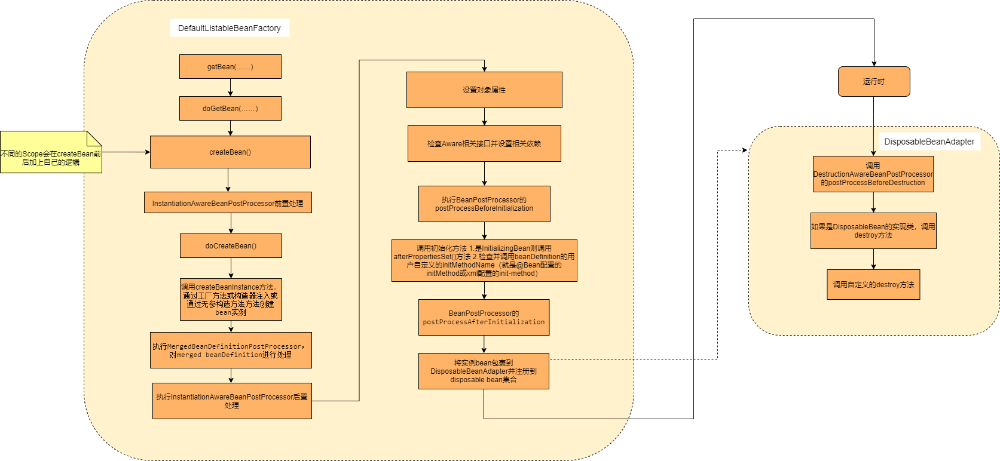

# bean的生命周期

## 介绍

我们知道，Spring IOC容器能够管理对象创建，负责依赖注入，负责管理对象生命周期。这是Spring的基础功能。  
由SpringApplication和ApplicationContext的分析中，我们知道在对象实例化前的Spring应用启动阶段，
Spring做了大量工作，接下来在对象实例化我们提出这些问题，
* 究竟bean在什么时候创建，又是在什么时候销毁的呢？
* 在bean的生命周期中有没有一些拓展点可以供我们拓展呢？

注：源码注释放在附录中。

## 创建、销毁时机和创建过程分析

这是BeanFactory的创建和销毁bean的流程。

### 创建时机

我们可以在Spring应用上下文初始化时或者我们自己创建BeanFactory去实例化bean。

Spring应用上下文在invokeBeanFactoryPostProcessors、finishBeanFactoryInitialization等阶段会实例化bean。  
事实上当通过BeanFactory的getBean()方法来请求对象实例时，
才有可能触发Bean实例化阶段的活动。 

一些概念：
* RequiredAnnotationBeanPostProcessor 是处理@Required注解的逻辑
* AutowiredAnnotationBeanPostProcessor 是处理@Autowired和@Value和@javax.inject.Inject
* CommonAnnotationBeanPostProcessor jsr250注解如javax.annotation.Resource、@PreDestroy、@PostConstruct的处理

<!-- 待添加CustomAutowireConfigurer、QualifierAnnotationAutowireCandidateResolver源码分析-->

### 销毁时机

在beanFactory创建bean时，最后会调用registerDisposableBeanIfNecessary方法。  
* 单例bean 会在Spring应用正常结束时被shutdownhook或手动调用beanFactory的destroySingletons方法去销毁。
* 自定义Scope的bean 需要自实现registerDestructionCallback方法，将DisposableBeanAdapter按照自己的逻辑自行销毁。
* prototype bean spring没有提供销毁逻辑。我们可以通过自实现一个BeanPostProcessor去实现（即通过单例的BeanPostProcessor会在初始化阶段收集prototype bean，销毁则跟随destroySingletons方法触发自实现销毁）。

这是Spring core文档对原型bean自实现销毁提供的思路：
> The client code must clean up prototype-scoped objects and release expensive resources that the prototype beans hold. To get the Spring container to release resources held by prototype-scoped beans, try using a custom bean post-processor, which holds a reference to beans that need to be cleaned up.

### 拓展点

* InstantiationAwareBeanPostProcessor
* MergedBeanDefinitionPostProcessor 对merged beanDefinition进行处理
* BeanNameAware、BeanClassLoaderAware、BeanFactoryAware bean可实现这些接口获取对应资源
* BeanPostProcessor 可以新bean实例化前后做一些自定义操作。
* InitializingBean、DisposableBean、initMethod、destroyMethod 提供给bean的初始化和销毁的感知处理
* BeanDefinitionRegistryPostProcessor 可用于增加额外beanDefinition，在Spring上下文refresh的invokeBeanFactoryPostProcessors时调用。
* SmartInitializingSingleton接口 在所有单例bean都被初始化完成后回调执行，
  以便在常规实例化后执行一些初始化，避免意外的早期初始化带来的副作用（例如，来自ListableBeanFactory.getBeansOfType调用），懒加载的bean不能触发执行。

## 附录：源码分析

这里以AnnotationConfigApplicationContext和DefaultListableBeanFactory为例做分析。  
在ApplicationContext refresh的尾声会调用`finishBeanFactoryInitialization`。
该方法会实例化所有非懒惰的bean。
~~~

	/**
	 * 完成bean工厂的初始化
	 * 实例化所有的单例（非懒惰）bean
	 */
	protected void finishBeanFactoryInitialization(ConfigurableListableBeanFactory beanFactory) {
		// Initialize conversion service for this context.
		// 1.初始化conversionService
		if (beanFactory.containsBean(CONVERSION_SERVICE_BEAN_NAME) &&
				beanFactory.isTypeMatch(CONVERSION_SERVICE_BEAN_NAME, ConversionService.class)) {
			beanFactory.setConversionService(
					beanFactory.getBean(CONVERSION_SERVICE_BEAN_NAME, ConversionService.class));
		}

		// 2.Register a default embedded value resolver if no bean post-processor
		// (such as a PropertyPlaceholderConfigurer bean) registered any before:
		// at this point, primarily for resolution in annotation attribute values.
		if (!beanFactory.hasEmbeddedValueResolver()) {
			beanFactory.addEmbeddedValueResolver(strVal -> getEnvironment().resolvePlaceholders(strVal));
		}

		// Initialize LoadTimeWeaverAware beans early to allow for registering their transformers early.
        // 3.初始化LoadTimeWeaverAware，使得尽早进行注册transformer(运行期织入)
		String[] weaverAwareNames = beanFactory.getBeanNamesForType(LoadTimeWeaverAware.class, false, false);
		for (String weaverAwareName : weaverAwareNames) {
			getBean(weaverAwareName);
		}

		// 4.Stop using the temporary ClassLoader for type matching.
		beanFactory.setTempClassLoader(null);

		// 5.Allow for caching all bean definition metadata, not expecting further changes.
		beanFactory.freezeConfiguration();

		// Instantiate all remaining (non-lazy-init) singletons.
        // 6.初始化所有非懒惰的bean
		beanFactory.preInstantiateSingletons();
	}

~~~

~~~

	public void preInstantiateSingletons() throws BeansException {
		if (logger.isTraceEnabled()) {
			logger.trace("Pre-instantiating singletons in " + this);
		}

		// Iterate over a copy to allow for init methods which in turn register new bean definitions.
		// While this may not be part of the regular factory bootstrap, it does otherwise work fine.
		List<String> beanNames = new ArrayList<>(this.beanDefinitionNames);

		// 3.1Trigger initialization of all non-lazy singleton beans...
		for (String beanName : beanNames) {
            // 3.2获取bean的合并的beandefinition
			RootBeanDefinition bd = getMergedLocalBeanDefinition(beanName);
			if (!bd.isAbstract() && bd.isSingleton() && !bd.isLazyInit()) {
                //3.3判断是否工厂bean
				if (isFactoryBean(beanName)) {
					Object bean = getBean(FACTORY_BEAN_PREFIX + beanName);
					if (bean instanceof FactoryBean) {
						final FactoryBean<?> factory = (FactoryBean<?>) bean;
						boolean isEagerInit;
						if (System.getSecurityManager() != null && factory instanceof SmartFactoryBean) {
							isEagerInit = AccessController.doPrivileged((PrivilegedAction<Boolean>)
											((SmartFactoryBean<?>) factory)::isEagerInit,
									getAccessControlContext());
						}
						else {
							isEagerInit = (factory instanceof SmartFactoryBean &&
									((SmartFactoryBean<?>) factory).isEagerInit());
						}
						if (isEagerInit) {
							getBean(beanName);
						}
					}
				}
				else {
                    //3.4getBean
					getBean(beanName);
				}
			}
		}

		// Trigger post-initialization callback for all applicable beans...
        // 3.5为实现了SmartInitializingSingleton的bean执行afterSingletonsInstantiated方法
		for (String beanName : beanNames) {
			Object singletonInstance = getSingleton(beanName);
			if (singletonInstance instanceof SmartInitializingSingleton) {
				final SmartInitializingSingleton smartSingleton = (SmartInitializingSingleton) singletonInstance;
				if (System.getSecurityManager() != null) {
					Access Controller.doPrivileged((PrivilegedAction<Object>) () -> {
						smartSingleton.afterSingletonsInstantiated();
						return null;
					}, getAccessControlContext());
				}
				else {
					//3.6smartSingleton.afterSingletonsInstantiated();
				}
			}
		}
	}

~~~

我们重点看3.4步getBean方法，
事实上当通过BeanFactory的getBean()方法来请求对象实例时，
才有可能触发Bean实例化阶段的活动。  
注：在前面应用上下文的启动阶段，某些bean（如BeanFactoryPostProcessor）已经通过调用调用该方法实例化过了。

~~~
    //AbstractBeanFactory
	@Override
	public Object getBean(String name) throws BeansException {
		return doGetBean(name, null, null, false);
	}

    //AbstractBeanFactory.doGetBean
	protected <T> T doGetBean(final String name, @Nullable final Class<T> requiredType,
			@Nullable final Object[] args, boolean typeCheckOnly) throws BeansException {
        //3.4.1转换成准确的bean name，去除beanfactory bean的&前缀，获取别名map中真名。
		final String beanName = transformedBeanName(name);
		Object bean;

		// Eagerly check singleton cache for manually registered singletons.
        // 3.4.2查找那些已经通过手动注册了的bean
		Object sharedInstance = getSingleton(beanName);
		if (sharedInstance != null && args == null) {
			if (logger.isTraceEnabled()) {
				if (isSingletonCurrentlyInCreation(beanName)) {
					logger.trace("Returning eagerly cached instance of singleton bean '" + beanName +
							"' that is not fully initialized yet - a consequence of a circular reference");
				}
				else {
					logger.trace("Returning cached instance of singleton bean '" + beanName + "'");
				}
			}
			bean = getObjectForBeanInstance(sharedInstance, name, beanName, null);
		}

		else {
			//3.4.3 Fail if we're already creating this bean instance:
			// We're assumably within a circular reference.
			if (isPrototypeCurrentlyInCreation(beanName)) {
				throw new BeanCurrentlyInCreationException(beanName);
			}

			//3.4.4 查看父beanFactory是否含有该bean的bean definition
			BeanFactory parentBeanFactory = getParentBeanFactory();
			if (parentBeanFactory != null && !containsBeanDefinition(beanName)) {
				// Not found -> check parent.
				String nameToLookup = originalBeanName(name);
				if (parentBeanFactory instanceof AbstractBeanFactory) {
					return ((AbstractBeanFactory) parentBeanFactory).doGetBean(
							nameToLookup, requiredType, args, typeCheckOnly);
				}
				else if (args != null) {
					// Delegation to parent with explicit args.
					return (T) parentBeanFactory.getBean(nameToLookup, args);
				}
				else if (requiredType != null) {
					// No args -> delegate to standard getBean method.
					return parentBeanFactory.getBean(nameToLookup, requiredType);
				}
				else {
					return (T) parentBeanFactory.getBean(nameToLookup);
				}
			}

			if (!typeCheckOnly) {
				markBeanAsCreated(beanName);
			}

			try {
				final RootBeanDefinition mbd = getMergedLocalBeanDefinition(beanName);
				checkMergedBeanDefinition(mbd, beanName, args);

				// Guarantee initialization of beans that the current bean depends on.
                // 3.4.5保证当前beanname声明的@DependsOn或xml的depends-on类的初始化
				String[] dependsOn = mbd.getDependsOn();
				if (dependsOn != null) {
					for (String dep : dependsOn) {
						if (isDependent(beanName, dep)) {
							throw new BeanCreationException(mbd.getResourceDescription(), beanName,
									"Circular depends-on relationship between '" + beanName + "' and '" + dep + "'");
						}
						registerDependentBean(dep, beanName);
						try {
							getBean(dep);
						}
						catch (NoSuchBeanDefinitionException ex) {
							throw new BeanCreationException(mbd.getResourceDescription(), beanName,
									"'" + beanName + "' depends on missing bean '" + dep + "'", ex);
						}
					}
				}

				// Create bean instance.
                // 3.4.6 创建单例bean
				if (mbd.isSingleton()) {
                    // 3.4.6 创建单例bean
					sharedInstance = getSingleton(beanName, () -> {
						try {
							return createBean(beanName, mbd, args);
						}
						catch (BeansException ex) {
							// Explicitly remove instance from singleton cache: It might have been put there
							// eagerly by the creation process, to allow for circular reference resolution.
							// Also remove any beans that received a temporary reference to the bean.
							destroySingleton(beanName);
							throw ex;
						}
					});
					bean = getObjectForBeanInstance(sharedInstance, name, beanName, mbd);
				}

				else if (mbd.isPrototype()) {
					// It's a prototype -> create a new instance.
					Object prototypeInstance = null;
					try {
						beforePrototypeCreation(beanName);
						prototypeInstance = createBean(beanName, mbd, args);
					}
					finally {
						afterPrototypeCreation(beanName);
					}
					bean = getObjectForBeanInstance(prototypeInstance, name, beanName, mbd);
				}

				else {
					String scopeName = mbd.getScope();
					final Scope scope = this.scopes.get(scopeName);
					if (scope == null) {
						throw new IllegalStateException("No Scope registered for scope name '" + scopeName + "'");
					}
					try {
						Object scopedInstance = scope.get(beanName, () -> {
							beforePrototypeCreation(beanName);
							try {
								return createBean(beanName, mbd, args);
							}
							finally {
								afterPrototypeCreation(beanName);
							}
						});
						bean = getObjectForBeanInstance(scopedInstance, name, beanName, mbd);
					}
					catch (IllegalStateException ex) {
						throw new BeanCreationException(beanName,
								"Scope '" + scopeName + "' is not active for the current thread; consider " +
								"defining a scoped proxy for this bean if you intend to refer to it from a singleton",
								ex);
					}
				}
			}
			catch (BeansException ex) {
				cleanupAfterBeanCreationFailure(beanName);
				throw ex;
			}
		}

		// Check if required type matches the type of the actual bean instance.
		if (requiredType != null && !requiredType.isInstance(bean)) {
			try {
				T convertedBean = getTypeConverter().convertIfNecessary(bean, requiredType);
				if (convertedBean == null) {
					throw new BeanNotOfRequiredTypeException(name, requiredType, bean.getClass());
				}
				return convertedBean;
			}
			catch (TypeMismatchException ex) {
				if (logger.isTraceEnabled()) {
					logger.trace("Failed to convert bean '" + name + "' to required type '" +
							ClassUtils.getQualifiedName(requiredType) + "'", ex);
				}
				throw new BeanNotOfRequiredTypeException(name, requiredType, bean.getClass());
			}
		}
		return (T) bean;
	}

~~~

注意3.4.6的代码，会创建一个bean对象

~~~
	public Object getSingleton(String beanName, ObjectFactory<?> singletonFactory) {
		Assert.notNull(beanName, "Bean name must not be null");
		synchronized (this.singletonObjects) {
			Object singletonObject = this.singletonObjects.get(beanName);
			if (singletonObject == null) {
				if (this.singletonsCurrentlyInDestruction) {
					throw new BeanCreationNotAllowedException(beanName,
							"Singleton bean creation not allowed while singletons of this factory are in destruction " +
							"(Do not request a bean from a BeanFactory in a destroy method implementation!)");
				}

                //省略
                
                //3.4.6.1单例bean初始化前做一些检查，检查该bean是否已经在创建
				beforeSingletonCreation(beanName);
				boolean newSingleton = false;
				boolean recordSuppressedExceptions = (this.suppressedExceptions == null);
				if (recordSuppressedExceptions) {
					this.suppressedExceptions = new LinkedHashSet<>();
				}
				try {
                    //3.4.6.2创建实例
					singletonObject = singletonFactory.getObject();
					newSingleton = true;
				}
                //省略

				finally {
					if (recordSuppressedExceptions) {
						this.suppressedExceptions = null;
					}
                    //3.4.6.3检查当前执行状态是否正常
					afterSingletonCreation(beanName);
				}
				if (newSingleton) {
                    //3.4.6.4 添加单例bean到factory的单例bean缓存中
					addSingleton(beanName, singletonObject);
				}
			}
			return singletonObject;
		}
	}

~~~

singletonFactory.getObject()会触发调用核心方法createBean。

~~~

	/**
	 * Central method of this class: creates a bean instance,
	 * populates the bean instance, applies post-processors, etc.
	 * @see #doCreateBean
	 */
    //核心方法，创建bean实例，填充bean实例，执行各种后置处理器
	@Override
	protected Object createBean(String beanName, RootBeanDefinition mbd, @Nullable Object[] args)
			throws BeanCreationException {

		if (logger.isTraceEnabled()) {
			logger.trace("Creating instance of bean '" + beanName + "'");
		}
		RootBeanDefinition mbdToUse = mbd;

		// Make sure bean class is actually resolved at this point, and
		// clone the bean definition in case of a dynamically resolved Class
		// which cannot be stored in the shared merged bean definition.
        //3.4.6.2.1
		Class<?> resolvedClass = resolveBeanClass(mbd, beanName);
		if (resolvedClass != null && !mbd.hasBeanClass() && mbd.getBeanClassName() != null) {
			mbdToUse = new RootBeanDefinition(mbd);
			mbdToUse.setBeanClass(resolvedClass);
		}

		// Prepare method overrides. 
        //3.4.6.2.2更新overloaded标识值
		try {
			mbdToUse.prepareMethodOverrides();
		}
		catch (BeanDefinitionValidationException ex) {
			throw new BeanDefinitionStoreException(mbdToUse.getResourceDescription(),
					beanName, "Validation of method overrides failed", ex);
		}

		try {
			// Give BeanPostProcessors a chance to return a proxy instead of the target bean instance.
			// 3.4.6.2.3执行InstantiationAwareBeanPostProcessor的postProcessBeforeInstantiation
            Object bean = resolveBeforeInstantiation(beanName, mbdToUse);
			if (bean != null) {
				return bean;
			}
		}
		catch (Throwable ex) {
			throw new BeanCreationException(mbdToUse.getResourceDescription(), beanName,
					"BeanPostProcessor before instantiation of bean failed", ex);
		}

		try {
            //3.4.6.2.4实际上创建bean的方法
			Object beanInstance = doCreateBean(beanName, mbdToUse, args);
			if (logger.isTraceEnabled()) {
				logger.trace("Finished creating instance of bean '" + beanName + "'");
			}
			return beanInstance;
		}
		catch (BeanCreationException | ImplicitlyAppearedSingletonException ex) {
			// A previously detected exception with proper bean creation context already,
			// or illegal singleton state to be communicated up to DefaultSingletonBeanRegistry.
			throw ex;
		}
		catch (Throwable ex) {
			throw new BeanCreationException(
					mbdToUse.getResourceDescription(), beanName, "Unexpected exception during bean creation", ex);
		}
	}

~~~

接着我们来看下AbstractAutowireCapableBeanFactory的doCreateBean方法。

~~~

	protected Object doCreateBean(final String beanName, final RootBeanDefinition mbd, final @Nullable Object[] args)
			throws BeanCreationException {

		// Instantiate the bean.
		BeanWrapper instanceWrapper = null;
		if (mbd.isSingleton()) {
			instanceWrapper = this.factoryBeanInstanceCache.remove(beanName);
		}
        //3.4.6.2.4.1 
		if (instanceWrapper == null) {
            // 通过工厂方法或构造器注入或通过无参构造方法方法创建bean实例
            //若 bean 的配置信息中配置了 lookup-method 和 replace-method，则会使用CGLIB增强bean实例
			instanceWrapper = createBeanInstance(beanName, mbd, args);
		} 
		final Object bean = instanceWrapper.getWrappedInstance();
		Class<?> beanType = instanceWrapper.getWrappedClass();
		if (beanType != NullBean.class) {
			mbd.resolvedTargetType = beanType;
		}

		// Allow post-processors to modify the merged bean definition.
		synchronized (mbd.postProcessingLock) {
			if (!mbd.postProcessed) {
				try {
                    //3.4.6.2.4.2 执行MergedBeanDefinitionPostProcessor，
                    //例如对merged beanDefinition做些缓存工作，也可以做属性修改，
                    //例如对@ProConstruct和@PreDestroy注解的读取处理在此处
					applyMergedBeanDefinitionPostProcessors(mbd, beanType, beanName);
				}
				catch (Throwable ex) {
					throw new BeanCreationException(mbd.getResourceDescription(), beanName,
							"Post-processing of merged bean definition failed", ex);
				}
				mbd.postProcessed = true;
			}
		}

		// 饥渴缓存单例bean，以便即使在诸如BeanFactoryAware之类的生命周期接口触发时也能够解析循环引用。
		boolean earlySingletonExposure = (mbd.isSingleton() && this.allowCircularReferences &&
				isSingletonCurrentlyInCreation(beanName));
		if (earlySingletonExposure) {
			if (logger.isTraceEnabled()) {
				logger.trace("Eagerly caching bean '" + beanName +
						"' to allow for resolving potential circular references");
			}
            //3.4.6.2.4.3
			addSingletonFactory(beanName, () -> getEarlyBeanReference(beanName, mbd, bean));
		}

		// Initialize the bean instance.
		Object exposedObject = bean;
		try {
            //3.4.6.2.4.4设置属性
            //1)执行InstantiationAwareBeanPostProcessor的postProcessAfterInstantiation方法
            //2)如果beanDefinition设置了AUTOWIRE_BY_NAME或AUTOWIRE_BY_TYPE，通过名称或类型填充autowired属性
            //3)执行InstantiationAwareBeanPostProcessor的postProcessProperties和postProcessPropertyValues填充属性。
            //     执行RequiredAnnotationBeanPostProcessor（@Required注解处理）、AutowiredAnnotationBeanPostProcessor（通过名称或类型填充@Autowired和@Value和@javax.inject.Inject标注的属性）、CommonAnnotationBeanPostProcessor（jsr250注解如javax.annotation.Resource的处理）
			populateBean(beanName, mbd, instanceWrapper);
            //3.4.6.2.4.5执行后置处理器
            //1)invokeAwareMethods，判断bean是否为BeanNameAware、BeanClassLoaderAware、BeanFactoryAware并执行相关实现方法
			//2)执行BeanPostProcessor的postProcessBeforeInitialization方法
            //3)调用初始化方法 1.是InitializingBean则调用afterPropertiesSet()方法 2.检查并调用beanDefinition的用户自定义的initMethodName（就是@Bean配置的initMethod或xml配置的init-method）
            //4)执行BeanPostProcessor的postProcessAfterInitialization方法
			exposedObject = initializeBean(beanName, exposedObject, mbd);
		}
		catch (Throwable ex) {
			if (ex instanceof BeanCreationException && beanName.equals(((BeanCreationException) ex).getBeanName())) {
				throw (BeanCreationException) ex;
			}
			else {
				throw new BeanCreationException(
						mbd.getResourceDescription(), beanName, "Initialization of bean failed", ex);
			}
		}
        //3.4.6.2.4.6
		if (earlySingletonExposure) {
			Object earlySingletonReference = getSingleton(beanName, false);
			if (earlySingletonReference != null) {
				if (exposedObject == bean) {
					exposedObject = earlySingletonReference;
				}
				else if (!this.allowRawInjectionDespiteWrapping && hasDependentBean(beanName)) {
					String[] dependentBeans = getDependentBeans(beanName);
					Set<String> actualDependentBeans = new LinkedHashSet<>(dependentBeans.length);
					for (String dependentBean : dependentBeans) {
						if (!removeSingletonIfCreatedForTypeCheckOnly(dependentBean)) {
							actualDependentBeans.add(dependentBean);
						}
					}
					if (!actualDependentBeans.isEmpty()) {
						throw new BeanCurrentlyInCreationException(beanName,
								"Bean with name '" + beanName + "' has been injected into other beans [" +
								StringUtils.collectionToCommaDelimitedString(actualDependentBeans) +
								"] in its raw version as part of a circular reference, but has eventually been " +
								"wrapped. This means that said other beans do not use the final version of the " +
								"bean. This is often the result of over-eager type matching - consider using " +
								"'getBeanNamesOfType' with the 'allowEagerInit' flag turned off, for example.");
					}
				}
			}
		}

		// Register bean as disposable.
        //3.4.6.2.4.7
        //调用registerDisposableBean方法，将单例实例bean包裹到DisposableBeanAdapter并放到disposable bean集合中，供容器close时执行销毁操作
        //自定义scope会将实例bean包裹到DisposableBeanAdapter，作为参数调用scope.registerDestructionCallback方法
		try {
			registerDisposableBeanIfNecessary(beanName, bean, mbd);
		}
		catch (BeanDefinitionValidationException ex) {
			throw new BeanCreationException(
					mbd.getResourceDescription(), beanName, "Invalid destruction signature", ex);
		}

		return exposedObject;
	}

~~~

分析DisposableBeanAdapter的destroy方法。

~~~
	public void destroy() {
		if (!CollectionUtils.isEmpty(this.beanPostProcessors)) {
            //调用DestructionAwareBeanPostProcessor的postProcessBeforeDestruction
            //@PreDestroy声明的方法在此时执行
			for (DestructionAwareBeanPostProcessor processor : this.beanPostProcessors) {
				processor.postProcessBeforeDestruction(this.bean, this.beanName);
			}
		}

        //如果是DisposableBean调用bean的destroy方法
		if (this.invokeDisposableBean) {
			if (logger.isTraceEnabled()) {
				logger.trace("Invoking destroy() on bean with name '" + this.beanName + "'");
			}
			try {
				if (System.getSecurityManager() != null) {
					AccessController.doPrivileged((PrivilegedExceptionAction<Object>) () -> {
						((DisposableBean) this.bean).destroy();
						return null;
					}, this.acc);
				}
				else {
					((DisposableBean) this.bean).destroy();
				}
			}
			catch (Throwable ex) {
				String msg = "Invocation of destroy method failed on bean with name '" + this.beanName + "'";
				if (logger.isDebugEnabled()) {
					logger.info(msg, ex);
				}
				else {
					logger.info(msg + ": " + ex);
				}
			}
		}
        //调用自定义的destroy方法（就是@Bean的destroy-method或XML配置的destroy-method）
		if (this.destroyMethod != null) {
			invokeCustomDestroyMethod(this.destroyMethod);
		}
		else if (this.destroyMethodName != null) {
			Method methodToCall = determineDestroyMethod(this.destroyMethodName);
			if (methodToCall != null) {
				invokeCustomDestroyMethod(methodToCall);
			}
		}
	}

~~~

## References

[Spring framework reference|1.3.1. Naming Beans](https://docs.spring.io/spring-framework/docs/5.1.5.RELEASE/spring-framework-reference/core.html#beans-beanname)  
[Spring framework reference|1.8. Container Extension Points](https://docs.spring.io/spring-framework/docs/5.1.5.RELEASE/spring-framework-reference/core.html#beans-factory-extension)

