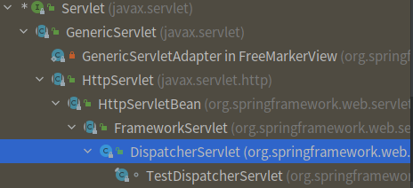

# SpringMVC请求处理及组件分析

## 总览

在[SpringMVC启动分析](spring-mvc-startup.md)一节，
我们聊到DispatcherServlet这一SpringMVC的核心处理器的继承关系。  

DispatcherServlet作为Servlet的一个实现，
我们从Servlet容器（Tomcat、Jetty等）的角度看看他们处理HTTP请求时
是如何调用Servlet实现的。

首先会调用到Servlet的service方法。
~~~
    public void service(ServletRequest req, ServletResponse res)
            throws ServletException, IOException;
            
~~~

DispatcherServlet的父类调用源码不粘贴在此处分析（因为有点累赘），  
实际上，是HttpServlet实现了service方法，并分发到doGet、doPost、doPut、doDelete等方法，  
然后其子类FrameworkServlet实现了这些方法，并最终调用自身的抽象doService方法`protected abstract void doService(HttpServletRequest request, HttpServletResponse response)throws Exception;`  
而DispatcherServlet实现了doService方法，然后来到了SpringMVC的处理逻辑。

doService方法会设置一些框架对象，WebApplicationContext等到request属性中，接着
我们看看核心方法doDispatch:

~~~
	protected void doDispatch(HttpServletRequest request, HttpServletResponse response) throws Exception {
		HttpServletRequest processedRequest = request;
		HandlerExecutionChain mappedHandler = null;
		boolean multipartRequestParsed = false;
        //1 给需要异步处理的请求使用，一般是给SPI使用，不是通用管理器
		WebAsyncManager asyncManager = WebAsyncUtils.getAsyncManager(request);

		try {
			ModelAndView mv = null;
			Exception dispatchException = null;

			try {
		        //2 使用multipartResolver检查并解析出文件数据封装到MultipartFile并加到request属性中
				processedRequest = checkMultipart(request);
				multipartRequestParsed = (processedRequest != request);

				// Determine handler for the current request.
				//3 找到请求处理的HandlerExecutionChain，请求处理链，里面包含了interceptror
                mappedHandler = getHandler(processedRequest);
				if (mappedHandler == null) {
					noHandlerFound(processedRequest, response);
					return;
				}

				// Determine handler adapter for the current request.
				//4 调用HandlerAdapter.supports(handler)方法去找到适合的HandlerAdapter
				HandlerAdapter ha = getHandlerAdapter(mappedHandler.getHandler());

				// Process last-modified header, if supported by the handler.
				String method = request.getMethod();
				boolean isGet = "GET".equals(method);
				if (isGet || "HEAD".equals(method)) {
					long lastModified = ha.getLastModified(request, mappedHandler.getHandler());
					if (new ServletWebRequest(request, response).checkNotModified(lastModified) && isGet) {
						return;
					}
				}
                //5. 调用HandlerExecutionChain的applyPreHandle方法
				if (!mappedHandler.applyPreHandle(processedRequest, response)) {
					return;
				}

				// Actually invoke the handler.
				//6. HandlerAdapter调用HandlerExecutionChain里的handler（一般定义的spring mvc controller的handler类型是InvocableHandlerMethod）
				mv = ha.handle(processedRequest, response, mappedHandler.getHandler());

				if (asyncManager.isConcurrentHandlingStarted()) {
					return;
				}

				applyDefaultViewName(processedRequest, mv);
				//7. 调用HandlerExecutionChain的posthandle，即调用Interceptor的postHandle
				mappedHandler.applyPostHandle(processedRequest, response, mv);
			}
			catch (Exception ex) {
				dispatchException = ex;
			}
			catch (Throwable err) {
				// As of 4.3, we're processing Errors thrown from handler methods as well,
				// making them available for @ExceptionHandler methods and other scenarios.
				dispatchException = new NestedServletException("Handler dispatch failed", err);
			}
			//8. 如果了发生异常，则执行handlerExceptionResolvers集合的resolveException，最后triggerAfterCompletion
			processDispatchResult(processedRequest, response, mappedHandler, mv, dispatchException);
		}
		catch (Exception ex) {
			triggerAfterCompletion(processedRequest, response, mappedHandler, ex);
		}
		catch (Throwable err) {
			triggerAfterCompletion(processedRequest, response, mappedHandler,
					new NestedServletException("Handler processing failed", err));
		}
		finally {
			if (asyncManager.isConcurrentHandlingStarted()) {
				// Instead of postHandle and afterCompletion
				if (mappedHandler != null) {
					mappedHandler.applyAfterConcurrentHandlingStarted(processedRequest, response);
				}
			}
			else {
				// Clean up any resources used by a multipart request.
				if (multipartRequestParsed) {
					cleanupMultipart(processedRequest);
				}
			}
		}
	}

~~~

没错，上面就是SpringMVC的核心主流程了~  
可是我们不禁会问， 
* 我们写的Controller是如何被加载进SpringMVC的又是怎样在HTTP请求中被匹配到的呢？
* Controller方法的参数是如何从HTTP字符串中转换出来的呢？
* 如何自定义参数处理器呢？
* ……

嗯，不急，接下来继续分析。

## DispatcherServlet如何定位和处理Controller

### RequestMappingHandlerMapping初始化（Controller方法是如何被加载？）

`org.springframework.web.servlet.mvc.method.annotation.RequestMappingHandlerMapping`，
看名字它是一个处理@RequestMapping并转换成请求->Handler的mapping的类。
首先，我们来看看该类初始化。

由于该类实现了InitializingBean接口，所以在初始化时会调用`afterPropertiesSet`这个方法。
~~~

	@Override
	public void afterPropertiesSet() {
		initHandlerMethods();
	}
    
    //初始化handlerMethods
	protected void initHandlerMethods() {
		for (String beanName : getCandidateBeanNames()) {
			if (!beanName.startsWith(SCOPED_TARGET_NAME_PREFIX)) {
				processCandidateBean(beanName);
			}
		}
		//这是工厂方法，目前没作用
		handlerMethodsInitialized(getHandlerMethods());
	}
	
	//找到Controller和RequestMapping的标注，作为handler。     
    @Override
	protected boolean isHandler(Class<?> beanType) {
		return (AnnotatedElementUtils.hasAnnotation(beanType, Controller.class) ||
				AnnotatedElementUtils.hasAnnotation(beanType, RequestMapping.class));
	}

~~~

processCandidateBean方法中调用的detectHandlerMethods里面有三步：
* getMappingForMethod(method, Class)  创建RequestMappingInfo，供请求时匹配HandlerMethod
* AopUtils.selectInvocableMethod  过滤能够调用的，排除private、static或Spring代理方法。
* registerHandlerMethod(handler, invocableMethod, mapping)  用MappingRegistry创建HandlerMethod

### RequestMapping方法寻找和controller调用过程

我们来看核心方法AbstractHandlerMethodMapping.lookupHandlerMethod(String lookupPath, HttpServletRequest request)的分析。

~~~

	protected HandlerMethod lookupHandlerMethod(String lookupPath, HttpServletRequest request) throws Exception {
		List<Match> matches = new ArrayList<>();
		//和@RequestMapping定义的没有变量的那些路径，做直接匹配
		List<T> directPathMatches = this.mappingRegistry.getMappingsByUrl(lookupPath);
		if (directPathMatches != null) {
		    //通过RequestMappingInfo.getMatchingCondition，生成能够匹配上的RequestMappingInfo
		    //返回Match对象（匹配结果）
			addMatchingMappings(directPathMatches, matches, request);
		}
		if (matches.isEmpty()) {
			// 所有mapping都调用一遍，看是否能匹配上
			addMatchingMappings(this.mappingRegistry.getMappings().keySet(), matches, request);
		}

		if (!matches.isEmpty()) {
		    //按RequestMappingInfo.compareTo中定义的匹配逻辑去做比对，选出优先级最高的Match对象（RequestMapping）
			Comparator<Match> comparator = new MatchComparator(getMappingComparator(request));
			matches.sort(comparator);
			Match bestMatch = matches.get(0);
			if (matches.size() > 1) {
				if (logger.isTraceEnabled()) {
					logger.trace(matches.size() + " matching mappings: " + matches);
				}
				if (CorsUtils.isPreFlightRequest(request)) {
					return PREFLIGHT_AMBIGUOUS_MATCH;
				}
				Match secondBestMatch = matches.get(1);
				if (comparator.compare(bestMatch, secondBestMatch) == 0) {
					Method m1 = bestMatch.handlerMethod.getMethod();
					Method m2 = secondBestMatch.handlerMethod.getMethod();
					String uri = request.getRequestURI();
					throw new IllegalStateException(
							"Ambiguous handler methods mapped for '" + uri + "': {" + m1 + ", " + m2 + "}");
				}
			}
			request.setAttribute(BEST_MATCHING_HANDLER_ATTRIBUTE, bestMatch.handlerMethod);
			//设置一些成功匹配（mapping）的匹配信息到request Attr中
			handleMatch(bestMatch.mapping, lookupPath, request);
			//返回HandlerMethod
			return bestMatch.handlerMethod;
		}
		else {
			return handleNoMatch(this.mappingRegistry.getMappings().keySet(), lookupPath, request);
		}
	}

~~~

以上就是HandlerMethod的匹配过程，最终在DispatcherServlet中，
HandlerMethod会被包装到HandlerExecutionChain中。

RequestMappingHandlerAdapter将会调用
`public final ModelAndView handle(HttpServletRequest request, HttpServletResponse response, Object handler) throws Exception`

我们来看看核心方法`invokeHandlerMethod`的调用handlerMethod过程。  
重点留意：HandlerMethodArgumentResolver、HandlerMethodReturnValueHandler的调用。

~~~
	protected ModelAndView invokeHandlerMethod(HttpServletRequest request,
			HttpServletResponse response, HandlerMethod handlerMethod) throws Exception {
        //1 封装一个Servlet请求的请求变量
		ServletWebRequest webRequest = new ServletWebRequest(request, response);
		try {
		    //2 获取WebDataBinderFactory这一创建 WebDataBinder 的工厂
			WebDataBinderFactory binderFactory = getDataBinderFactory(handlerMethod);
			//3
			ModelFactory modelFactory = getModelFactory(handlerMethod, binderFactory);
            //4 ServletInvocableHandlerMethod拓展了InvocableHandlerMethod,并支持了HandlerMethodReturnValueHandler的处理，
            // InvocableHandlerMethod支持了HandlerMethodArgumentResolver的处理
			ServletInvocableHandlerMethod invocableMethod = createInvocableHandlerMethod(handlerMethod);
			if (this.argumentResolvers != null) {
                //5 设置HandlerMethodArgumentResolver集合
				invocableMethod.setHandlerMethodArgumentResolvers(this.argumentResolvers);
			}
			if (this.returnValueHandlers != null) {
				//6 设置HandlerMethodReturnValueHandler集合
				invocableMethod.setHandlerMethodReturnValueHandlers(this.returnValueHandlers);
			}
			invocableMethod.setDataBinderFactory(binderFactory);
			invocableMethod.setParameterNameDiscoverer(this.parameterNameDiscoverer);
            //7 初始化ModelAndViewContainer并处理@SessionAttribute和@ModelAttribute的方法（现在前后分离的大环境下，一般很少用到）
			ModelAndViewContainer mavContainer = new ModelAndViewContainer();
			mavContainer.addAllAttributes(RequestContextUtils.getInputFlashMap(request));
			modelFactory.initModel(webRequest, mavContainer, invocableMethod);
			mavContainer.setIgnoreDefaultModelOnRedirect(this.ignoreDefaultModelOnRedirect);

			AsyncWebRequest asyncWebRequest = WebAsyncUtils.createAsyncWebRequest(request, response);
			asyncWebRequest.setTimeout(this.asyncRequestTimeout);

			WebAsyncManager asyncManager = WebAsyncUtils.getAsyncManager(request);
			asyncManager.setTaskExecutor(this.taskExecutor);
			asyncManager.setAsyncWebRequest(asyncWebRequest);
			asyncManager.registerCallableInterceptors(this.callableInterceptors);
			asyncManager.registerDeferredResultInterceptors(this.deferredResultInterceptors);

			if (asyncManager.hasConcurrentResult()) {
				Object result = asyncManager.getConcurrentResult();
				mavContainer = (ModelAndViewContainer) asyncManager.getConcurrentResultContext()[0];
				asyncManager.clearConcurrentResult();
				LogFormatUtils.traceDebug(logger, traceOn -> {
					String formatted = LogFormatUtils.formatValue(result, !traceOn);
					return "Resume with async result [" + formatted + "]";
				});
				invocableMethod = invocableMethod.wrapConcurrentResult(result);
			}
            // 8 invocableMethod处理请求并调用我们标注的对应的requestMapping方法
			invocableMethod.invokeAndHandle(webRequest, mavContainer);
			if (asyncManager.isConcurrentHandlingStarted()) {
				return null;
			}

			return getModelAndView(mavContainer, modelFactory, webRequest);
		}
		finally {
			webRequest.requestCompleted();
		}
	}
~~~

接下来我们来看ServletInvocableHandlerMethod如何处理handlerMethod
~~~
	public void invokeAndHandle(ServletWebRequest webRequest, ModelAndViewContainer mavContainer,
			Object... providedArgs) throws Exception {
        
        //8.1 转换请求参数并调用方法
		Object returnValue = invokeForRequest(webRequest, mavContainer, providedArgs);
		setResponseStatus(webRequest);
		
		//省略

        //8.2 处理并转换返回结果
        this.returnValueHandlers.handleReturnValue(
                returnValue, getReturnValueType(returnValue), mavContainer, webRequest);
                
        //省略

	}

~~~

上面的8.1方法调用中，转换参数会通过HandlerMethodArgumentResolverComposite集合调用HandlerMethodArgumentResolver的各个实现类的两个方法
* `supportsParameter(MethodParameter)`  通过这个方法找到支持转换当前方法参数的HandlerMethodArgumentResolver
* `resolveArgument(MethodParameter, @Nullable ModelAndViewContainer, NativeWebRequest, @Nullable WebDataBinderFactory binderFactory)` 进行请求参数->方法参数对象的转换。

那么我这里列举下常见的不同方法参数的对应HandlerMethodArgumentResolver（handler方法参数解析器）：
* @RequestParam 注解对应的是RequestParamMethodArgumentResolver解析器（作用不止于此）。
* @PathVariable 注解对应的是PathVariableMapMethodArgumentResolver解析器。
* @RequestBody 注解对应的是RequestResponseBodyMethodProcessor解析器。
* 没有注解的model 对应使用ModelAttributeMethodProcessor解析器。
* 带@RequestParam注解的Map 对应使用RequestParamMapMethodArgumentResolver解析器。
* @RequestAttribute 对应的是RequestAttributeMethodArgumentResolver解析器。
* @RequestPart 注解对应的是RequestPartMethodArgumentResolver解析器。

### 结果解析

在上面分析ServletInvocableHandlerMethod的调用中，简单说到
~~~
8.2 处理并转换返回结果
this.returnValueHandlers.handleReturnValue(
    returnValue, getReturnValueType(returnValue), mavContainer, webRequest);

~~~

会通过HandlerMethodReturnValueHandlerComposite集合调用`HandlerMethodReturnValueHandler`的两个方法：
* `supportsReturnType(MethodParameter returnType)` 通过这个方法找到能够处理当前调用返回值的HandlerMethodReturnValueHandler
* `handleReturnValue(@Nullable Object returnValue, MethodParameter, ModelAndViewContainer, NativeWebRequest) throws Exception;`  处理对应returnValue。

同样，我列举下常见的HandlerMethodArgumentResolver（返回值解析器）：
* @ResponseBody 注解对应的是RequestResponseBodyMethodProcessor解析器。

## 异常处理

### 初始化及作用

无论是从DispatcherServlet.properties文件初始化还是通过@EnableWebMvc或者Spring Boot中自加载的WebMvcConfigurationSupport初始化DispatcherServlet
策略对象，一般都会加载这三个默认的HandlerExceptionResolver子类：
* ExceptionHandlerExceptionResolver 处理@ExceptionHandler注解
* ResponseStatusExceptionResolver 处理controller抛出的带@ResponseStatus注解的Exception
* DefaultHandlerExceptionResolver 处理SpringMVC的一些框架异常

一般`ExceptionHandlerExceptionResolver`这一处理器足够我们使用，不过如果我们有定制需求，
可以通过WebMvcConfigurer挂载自己拓展的HandlerExceptionResolver。

### 调用点

在本文开始，分析DispatcherServlet的处理请求中，我们分析到如下语句，做了简单介绍：
~~~
//8. 如果了发生异常，则执行handlerExceptionResolvers集合的resolveException，最后triggerAfterCompletion
processDispatchResult(processedRequest, response, mappedHandler, mv, dispatchException);
~~~

上面的方法里面的实现比较简单，就是按顺序调用DispatcherServlet的HandlerExceptionResolver集合的resolveException方法，如果有返回值就停止调用并返回。

额外说说，ExceptionHandlerExceptionResolver的调用，
1. 调用shouldApplyTo方法看当前ExceptionResolver能否处理当前Handler
2. 调用doResolveHandlerMethodException处理ExceptionHandler
   * 创建ServletInvocableHandlerMethod
        * 寻找当前Handler的@ExceptionHandler方法，不存在的话，寻找@ControllerAdvice（ControllerAdviceBean）
        * 最终都是通过ExceptionHandlerMethodResolver去找到对应的调用方法
        * 把对应方法包装到ServletInvocableHandlerMethod供调用
   * 设置对应的HandlerMethodArgumentResolver和HandlerMethodReturnValueHandler供异常处理方法的入参和出参处理
   * 执行调用

核心方法`ServletInvocableHandlerMethod getExceptionHandlerMethod(HandlerMethod, Exception)`。

## 拓展：Servlet的异常处理

## 调用关系整理

流程图

## 拓展点例子

# reference

[1][Spring MVC中异常处理的类体系结构|赵鑫](https://www.cnblogs.com/xinzhao/p/4902295.html)  

