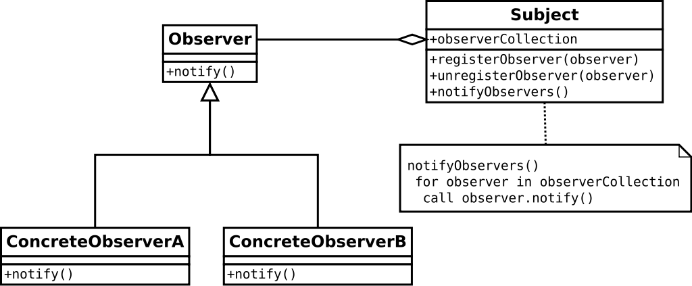
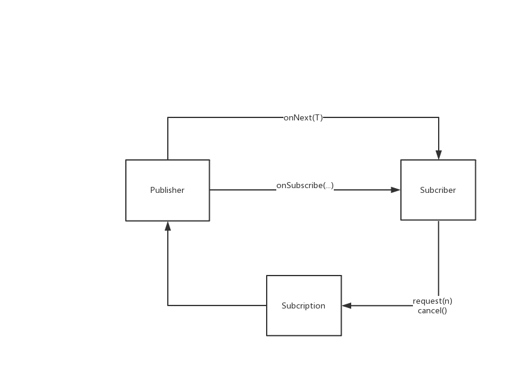

# Project Reactor原理

## 引言

spring cloud gateway目前是基于spring webflux上构建出来的（基于mvc的版本两年过去了还是在snapshot开发的状态下）。 
而spring webflux是一个响应式编程web框架，其中的核心就是基于reactive streams规范开发出来的project reactor(RxJava库也是该规范的实现)。
在编写工作于webflux或spring cloud gateway 的代码时，如果不熟悉Project Reactor很可能会被很多突如其来的Mono、Flux的operator操作搞混的，甚至会写出较为影响性能的代码。

Project Reactor是开发和维护Spring框架的公司Pivotal开发的。

## 响应式编程

由于响应式编程非本文想说重点，本文不打算对其作过多解释。
从模型上看，响应式编程就是观察者模式的实现和扩展。
 

维基百科对于响应式编程的定义：[wikipedia|reactive programming](https://zh.wikipedia.org/wiki/%E5%93%8D%E5%BA%94%E5%BC%8F%E7%BC%96%E7%A8%8B)

## project reactor

project reactor是spring框架的公司编写出来的响应式库，基于[github|reactive streams[3]](https://github.com/reactive-streams/reactive-streams-jvm/)规范。 
btw有兴趣，也可以看下jdk9的flow api。

### 核心模型

#### publisher

~~~
package org.reactivestreams;
 
public interface Publisher<T> {
    public void subscribe(Subscriber<? super T> s);
}
~~~~

相当于观察者模式的观察者Observer。Mono、flux就是实现的Publisher。 这里有规范一些publisher定义。[github|reactive streams common](https://github.com/reactor/reactive-streams-commons)

#### Subscriber
~~~
package org.reactivestreams;
 
public interface Subscriber<T> {
    public void onSubscribe(Subscription s);
    public void onNext(T t);
    public void onError(Throwable t);
    public void onComplete();
}

~~~
相当于观察者模式的Observable。

#### Subscription

~~~

package org.reactivestreams;
 
public interface Subscription {
    public void request(long n);
 
    public void cancel();
}

~~~

Subscription是在一般观察者模式中没有的东西。 java文档有如下解释：
> It is used to both signal desire for data and cancel demand (and allow resource cleanup).

通过分析源码，和reactive streams的java doc可知Subscription的作用，Subscription能通过request方法控制执行流速，也能通过cancel来取消执行。

### 调用关系

上面这些基本模型调用关系如下：

## 运行流程

我以一个简洁的示例执行代码为例作分析(字符串拼接打印)：
~~~
Mono.just("hetl") //@1
    .map(s -> s + "@akulaku.com") //@2
    .filter(s -> s.contains("h")) //@3
    .subscribe(System.out::println); //@4
~~~

### 声明阶段
在操作声明阶段，看步骤@1、@2、@3的源代码，这些方法就是每次将publisher和operator组合成一个新的publisher。

~~~
public static <T> Mono<T> just(T data) {
    return onAssembly(new MonoJust<>(data));
}
 
public final <R> Mono<R> map(Function<? super T, ? extends R> mapper) {
    if (this instanceof Fuseable) {
        return onAssembly(new MonoMapFuseable<>(this, mapper));
    }
    return onAssembly(new MonoMap<>(this, mapper));
}
~~~

### subscribe阶段

>By the act of subscribing, you tie the Publisher to a Subscriber, 
>which triggers the flow of data in the whole chain. This is achieved internally by a single request signal from the Subscriber that is propagated upstream, 
>all the way back to the source Publisher. 
>--- project reactor reference 3.3.4

subscribe最终会调用最后一个publisher的subsribe方法，然后，逐步包装subscriber和具体操作(operation)，
~~~
@Override
@SuppressWarnings("unchecked")
public void subscribe(CoreSubscriber<? super R> actual) {
    if (actual instanceof ConditionalSubscriber) {
 
        ConditionalSubscriber<? super R> cs = (ConditionalSubscriber<? super R>) actual;
        source.subscribe(new FluxMapFuseable.MapFuseableConditionalSubscriber<>(cs, mapper));
        return;
    }
    source.subscribe(new FluxMapFuseable.MapFuseableSubscriber<>(actual, mapper));
}
~~~

最后，到MonoJust （datasource publisher）

~~~
@Override
public void subscribe(CoreSubscriber<? super T> actual) {
    actual.onSubscribe(Operators.scalarSubscription(actual, value));
}
~~~
将actual包装到Subscription中，开始转入onSubscribe。

### onSubscribe阶段

onSubscribe阶段，执行Subscriber的onSubscribe方法，Subscriber这里是，LambdaMonoSubscriber。 
然后，发出request(n)。

~~~
@Override
public final void onSubscribe(Subscription s) {
    if (Operators.validate(subscription, s)) {
        this.subscription = s;
 
        if (subscriptionConsumer != null) {
            try {
                subscriptionConsumer.accept(s);
            }
            catch (Throwable t) {
                Exceptions.throwIfFatal(t);
                s.cancel();
                onError(t);
            }
        }
        else {
            s.request(Long.MAX_VALUE);
        }
 
    }
}
~~~

### request阶段
紧接onSubscribe的代码继续说明。其中较重要的就是Subscription.request()方法。 然后一路request就会到最外层的，并执行Subscriber.onNext，也就到执行阶段。

### 执行阶段
//代码摘自FluxMapFuseable.java
~~~
@Override
public void onNext(T t) {
    if (sourceMode == ASYNC) {
        actual.onNext(null);
    }
    else {
        if (done) {
            Operators.onNextDropped(t, actual.currentContext());
            return;
        }
 
        R v;
 
        try {
            v = Objects.requireNonNull(mapper.apply(t),          //@1
                    "The mapper returned a null value.");
        }
        catch (Throwable e) {
            onError(Operators.onOperatorError(s, e, t, actual.currentContext()));
            return;
        }
 
        actual.onNext(v);  //@2
    }
}
~~~

看@1、@2，各Subscriber会一直执行onNext并触发执行所声明的操作，最后触发下一步操作。

## 总结

基于上面 核心模型->[调用关系](#调用关系)一节的分析，融合以上流程，然后，可得出如下整体流程图：

## references
[1] [project reactor reference](https://projectreactor.io/docs/core/release/reference/index.html)  
[2] [小马哥|Reactive programming 一种技术 各自表述](https://mercyblitz.github.io/2018/07/25/Reactive-Programming-%E4%B8%80%E7%A7%8D%E6%8A%80%E6%9C%AF-%E5%90%84%E8%87%AA%E8%A1%A8%E8%BF%B0/)  
[3] [github|reactive streams jvm](https://github.com/reactive-streams/reactive-streams-jvm/)  
[4] [github|reactive streams common](https://github.com/reactor/reactive-streams-commons)  

