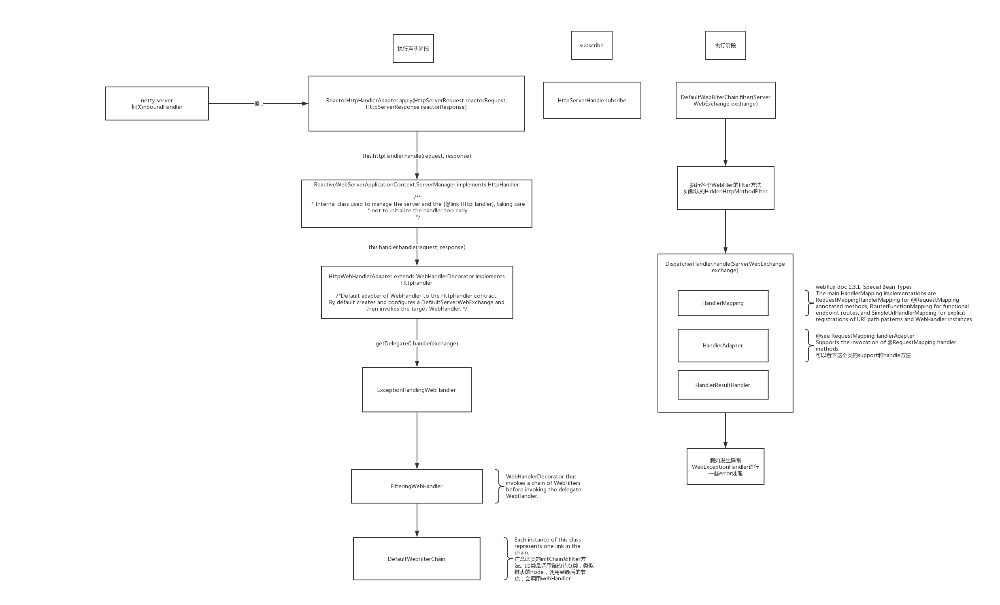
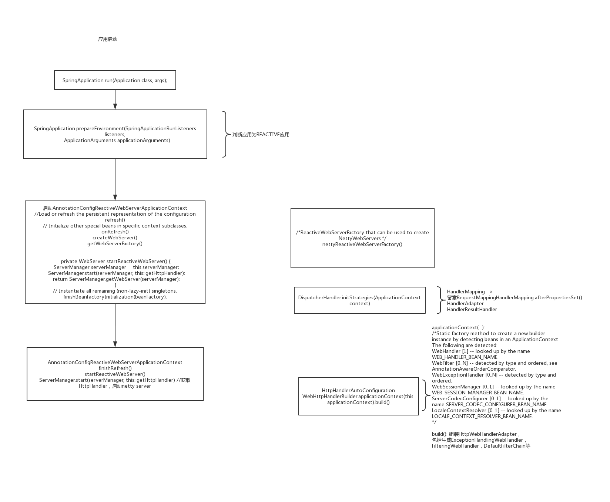

# WebFlux原理

## 前言

Spring 5的发布中有一个新特性，就是和Spring MVC同级的Spring WebFlux。这是一个支持反应式编程模型的新Web框架体系。
顺便一提，Spring Cloud Gateway在实现上是对Spring WebFlux的拓展。

本文主要分这两部分:
* 处理请求的调用链
* Webflux应用的启动

## 请求处理调用链

请求处理梳理如下： 

如图上，已经做了一些描述，对一些处理请求的重要模型和接口再说下：

### 核心模型

看完源码回过头来看文档，发现DispatcherHandler的介绍文档就说明了这些比较重要的组件了。
> Spring WebFlux, similarly to Spring MVC, is designed around the front controller pattern, where a central WebHandler, the DispatcherHandler, 
>provides a shared algorithm for request processing, while actual work is performed by configurable, delegate components.

spring webflux 类似于Spring MVC，围绕前端controller模式————a central WebHandler，即DispatcherHandler(对请求提供一系列通用计算处理方式，并让一些相关职责的可配置组件执行处理) 。
>Spring configuration in a WebFlux application typically contains:
>* **DispatcherHandler** with the bean name, webHandler
>* **WebFilter** and **WebExceptionHandler** beans
>* DispatcherHandler **special beans**
>* Others

#### DispatcherHandler
默认核心WebHandler。 核心方法:
~~~
public Mono<Void> handle(ServerWebExchange exchange) {
    if (this.handlerMappings == null) {
        return createNotFoundError();
    }
    return Flux.fromIterable(this.handlerMappings)
            .concatMap(mapping -> mapping.getHandler(exchange))
            .next()
            .switchIfEmpty(createNotFoundError())
            .flatMap(handler -> invokeHandler(exchange, handler))
            .flatMap(result -> handleResult(exchange, result));
}

~~~

* **HandlerMapping** 匹配请求与handler的关系，根据请求获得对应处理handler
* **HandlerAdapter** 执行Handler，返回HandlerResult
* **HandlerResultHandler** 处理HandlerResult

举例说下，具体到常用的注解声明的@RequestMapping，
首先，会在requestMapping中找到对应的HandlerMethod（可关注下该方法AbstractHandlerMethodMapping.lookupHandlerMethod(ServerWebExchange exchange)）  
然后，通过对应的能支持HandlerMethod的HandlerAdapter执行具体方法处理，得到HandlerResult  
最后，匹配到能处理该HandlerResult的HandlerResultHandler，结果处理

#### HttpHandler
   
一般用来组合出ServerWebExchange类，默认实现HttpWebHandlerAdapter还做了执行目标webHandler（DispatcherHandler）的操作。

## webflux应用启动
webflux应用启动简单流程整理，列出了reactive applicationContext相关的启动流程，及几个重要的bean的初始化。 图中做了一些辅助性解释，可对照上面请求执行流程看下。 

## 线程模型

TBD，会在reactor-netty库的分析中来归纳webflux的。

这是stackoverflow上对WebFlux线程模型的解答。[stackoverflow|Threading model of Spring WebFlux and Reactor](https://stackoverflow.com/questions/45019486/threading-model-of-spring-webflux-and-reactor)

## 后记

本文举出请求处理的实现类例子，基本是注解方式的，并没介绍函数式声明方式的（大同小异）。

## reference

[1] [spring framework|Web on Reactive Stack](https://docs.spring.io/spring/docs/current/spring-framework-reference/web-reactive.html#webflux)  
[2] [spring framework|Web on Servlet Stack](https://docs.spring.io/spring/docs/current/spring-framework-reference/web-reactive.html#webflux)   
[3] [stackoverflow|Threading model of Spring WebFlux and Reactor](https://stackoverflow.com/questions/45019486/threading-model-of-spring-webflux-and-reactor)  